# The war for the vault

Imagine that someone wants your passwords.

Not one password. **All of them.**

Most security pages answer that by listing what a product has: this algorithm,
that certification, a row of logos. This page does something more interesting.

**Let's attack it.**

## Round 0 — The rules

Two players. Both are serious. Only one of them has to be lucky.

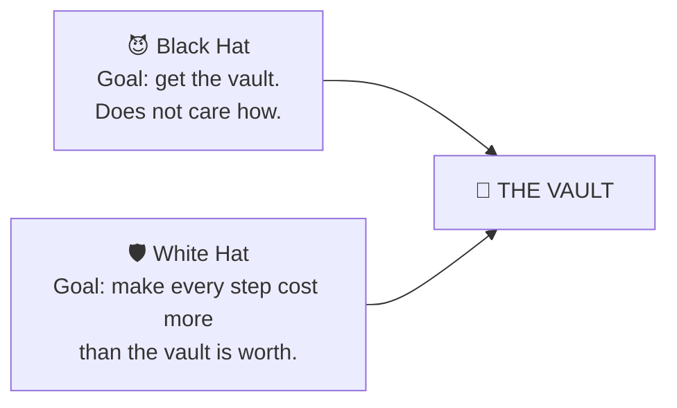

**Black Hat may use anything.** Guess your password. Steal your Google account.
Breach the servers. Sit on your network. Take your phone. Root it. Watch your
screen. Watch your keyboard. Steal your backup. Hand you a counterfeit app. Read
your memory while you work.

**White Hat is not trying to build an impossible wall.** That is not a thing
that exists, and claiming it is how security pages lose the reader who knows
better. The goal is narrower and far more useful:

> **We don't promise an impossible wall.
> We build an increasingly expensive staircase.**

Ten floors. Watch the price climb.

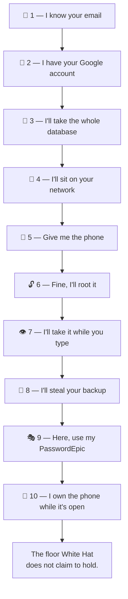

---

## Floor 1 — "I know your email"

> 😈 **Black Hat.** *"I don't need your phone. I don't need your computer. I
> don't even need to know who you are. Your address is in a breach dump, next to
> a password you used somewhere else in 2019. I'll try it here. And nine
> thousand variations. Across ten thousand accounts. It costs me an evening."*

He is right that it costs him almost nothing. That is exactly why everyone
starts here.

> 🛡️ **White Hat.** *"Try it."*

Sign-in attempts are scored invisibly for automated abuse and rate-limited on
top of that. You never see any of it unless something looks wrong.

And here is the part that matters more than the rate limit:

> **A successful login is not vault access.**

Even if he guesses correctly, he has not reached anything. He has reached
Floor 2.

**The bill so far:** an evening.

---

## Floor 2 — "I have your Google account"

> 😈 *"Fine. I didn't guess it — I stole it. Phishing, session token, whatever
> you like. I have your Google account. I'll just install PasswordEpic on my own
> phone and sign in as you."*

He installs it. He signs in. It loads.

> 🛡️ **DENIED.**

On the paid tiers your account is bound to one device — and identity here is not
a device ID that an app can simply claim to have. It is possession of a key
generated *inside your phone's security chip*, which cannot be exported.

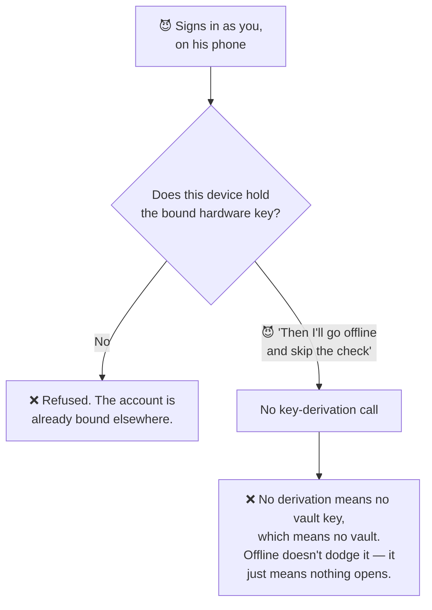

> **He has your identity. He does not have your device.**

What he gets is an empty vault of his own. Your entries were never on a server
for his session to load, and the key that would decrypt them cannot be assembled
on a device that does not hold Shard 1.

**The bill so far:** a stolen Google account — and it bought him nothing.

---

## Floor 3 — "Then I'll take the whole database"

> 😈 *"Forget the phone. I'm coming for you instead. Your servers, your
> database, everything. Assume I win completely."*

Let's assume he does. Total breach. Every record.

Most people expect the story to end here. Here is the actual haul:

```
HE HAS:                      HE DOES NOT HAVE:
✓ Account records            ✗ A single vault entry
✓ Shard 2, encrypted         ✗ Shard 1
                             ✗ Your passcode
                             ✗ Any vault key
```

> 🛡️ *"He compromised the server. He still doesn't have the vault."*

Vault entries are encrypted on your phone and never uploaded, so there is
nothing of yours in there to take. What about the Shard 2 he did get?

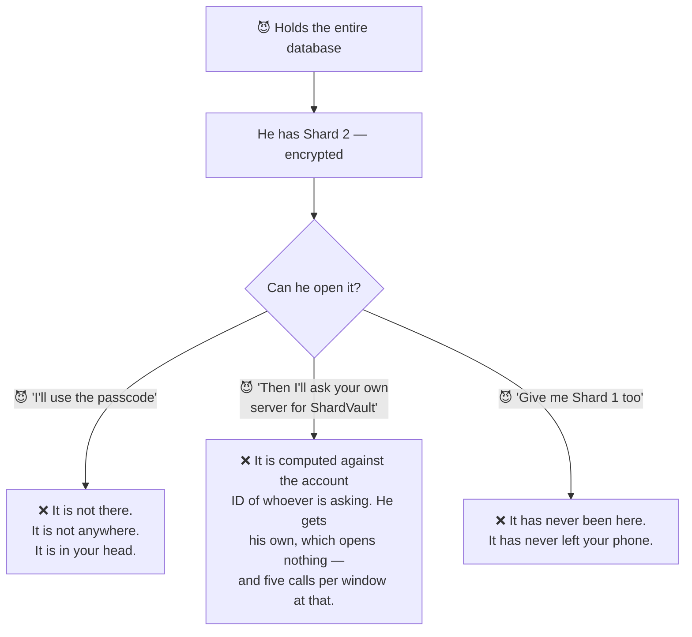

**The bill so far:** total compromise of a company's infrastructure — for
account records and a piece of ciphertext.

That is the difference between a service that **promises not to look** and one
that **cannot**.

---

## Floor 4 — "I'll sit on your network"

> 😈 *"New plan. I don't need the server if I can be the server. A workplace
> profile. A root certificate I talked you into installing. A hostile café
> Wi-Fi. I'll read the call that hands you part of your key."*

This is a real attack, and against most apps it works, because most apps trust
whatever certificate the phone trusts.

> 🛡️ *"Even if your phone trusts an extra certificate, PasswordEpic doesn't
> have to."*

On Platinum and Titanium, the call that returns part of your vault key accepts
**only a fixed set of Google's own root certificates**. Anything else is refused
— including certificates the device itself considers perfectly valid.

**And here is the part a marketing page would leave out.** Certificate pinning
can break your own app. If the certificate authority rotates its roots and you
have not kept up, your users cannot connect and no update from inside the app
can save them. So the pin set is verified against the live endpoints before
every release rather than assumed.

> A defence nobody audits is a defence that eventually locks out the people it
> was built for.

**The bill so far:** network position — and a refusal.

---

## Floor 5 — "Give me the phone"

Notice what has just happened to his budget. Everything until now could be done
from anywhere on earth. Not any more.

> 😈 *"Then I'll take the phone. It's locked? Fine. I'll brute-force the
> passcode. I have all the time in the world and I don't have to be quiet about
> it."*

> 🛡️ *"Go ahead. Let's price it."*

Turning your passcode into a key costs **128 MiB of memory and real computation
— every single time.** You pay that once, when you unlock. He pays it per guess.

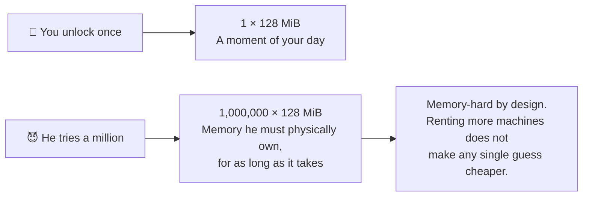

The app also refuses to let you *set* a passcode below 45 bits of entropy, so
there is no trivially short target waiting for him.

**The bill so far:** physical possession of your phone, plus real hardware
running for a long time, **per victim**. This attack does not scale. That is the
entire point of a memory-hard function.

---

## Floor 6 — "Fine. I'll root it"

> 😈 *"Enough guessing. I own this device now. Root. Debugger attached. Frida
> hooked in. I'll read PasswordEpic's storage directly and take the key out."*

> 🛡️ *"Read whatever you like. Shard 1 isn't in storage."*

Shard 1 was generated **inside** the security chip, and that chip has no
operation that returns it. Not to the app. Not to root. Not to anyone. You can
ask it to *use* the key; you cannot ask it for the key.

> **Root gives him control of the operating system.
> It does not give him Shard 1.**

On Platinum and Titanium, root, repackaging, attached debuggers and the common
hooking frameworks are also detected — and key operations refuse to run at all.

**The bill so far:** your phone, a working root for that exact model — and a
chip that will not answer the question.

---

## Floor 7 — "Then I'll take it while you type"

Here Black Hat changes strategy, and it is the smartest move he makes.

> 😈 *"I've been attacking the wrong thing. I don't need to break the
> encryption. I don't need the server. I'll take the passcode out of your hands
> before any of that even starts. **I'll attack the human.**"*

| 😈 He tries | 🛡️ What answers |
| --- | --- |
| A fake passcode pad drawn exactly over the real one | ❌ Anything drawn over the pad halts the unlock |
| An invisible layer harvesting your taps | ❌ Same guard — this is "tapjacking" |
| An app with accessibility permission reading the screen | ❌ Key operations stop while one is active |
| A screenshot | ❌ Refused outright, for the whole screen |
| A screen recording of the app | ❌ Comes out black — app and keyboard alike |
| A recording while autofill sits over another app | ❌ Passcode entry refused entirely (Android 15+) |
| **A keyboard that logs every keystroke** | ⚠️ **Only a warning** |

Read that last row again.

> 🛡️ *"This is where I don't claim victory."*

A keyboard is handed your keystrokes **directly**, before anything is drawn on a
screen, so no amount of screen protection reaches it. PasswordEpic tells you when
the active keyboard did not ship with your phone. That is genuinely all it can
do.

Why say so, when the rest of the row is all ❌?

> **Because security engineering is not about pretending every attack can be
> stopped.** A page that claims a clean sweep here is a page that has either not
> looked, or is hoping you won't.

**The bill so far:** getting malware onto your phone, or persuading you to
install a keyboard.

---

## Floor 8 — "I'll steal your backup"

> 😈 *"You back up to Google Drive. I'm already in your Google account —
> remember Floor 2. I'll just download the backup file and open it at home,
> where nothing you built can reach me."*

He gets the file. It is genuinely your vault. And it is a brick.

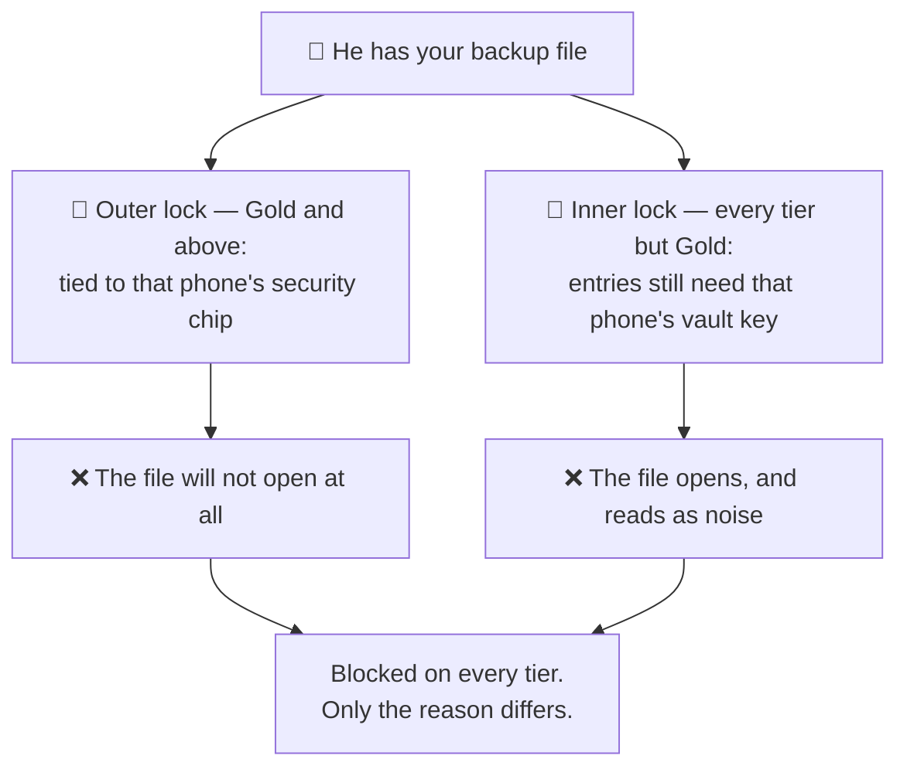

And now the honest half:

> **The same mechanism that protects your backup is what makes moving to a new
> phone impossible.**

We are not going to pretend that is a feature and not a cost. It is both.

> 🛡️ *"Security always has a price. Ours is that we cannot rescue you either."*

**The bill so far:** your Drive — for an encrypted file that opens nowhere.

---

## Floor 9 — "Here, use my PasswordEpic"

> 😈 *"Clever plan: I'll stop attacking your app and start being your app. Same
> icon. Same screens. Sideloaded, or from a third-party store you found because
> the real one wasn't available in your country. You'll type your passcode
> straight into me."*

This is the most dangerous idea on the page, because **every floor above assumes
the app is the app.**

> 🛡️ *"Then don't take the app's word for it."*

Before key operations, our server asks Google whether this is the genuine,
unmodified app running on a genuine device. The verdict is checked **on the
server**, not on the phone.

That distinction is the whole defence:

> **Never trust the client to tell you the client is trustworthy.**

A patched app can delete a check it performs on itself. It cannot forge Google's
signed answer to somebody else.

**The bill so far:** a convincing counterfeit — which the server declines to
serve.

---

## Floor 10 — "I own the phone while the vault is open"

No more remote tricks. This is the boss fight, and Black Hat arrives holding
everything:

```
✓ Your physical device
✓ Root on it
✓ A live, unlocked session
✓ The ability to read memory as you work
```

> 😈 *"You have to decrypt eventually. The moment you do, it's in RAM. And I'm
> already in RAM."*

He is right.

> 🛡️ *"I cannot make a compromised operating system safe."*

That is the honest sentence, and it is on this page on purpose.

**What White Hat does instead — shrink the window until it is nearly nothing:**

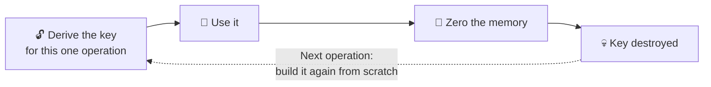

- The vault key is derived fresh for **every single operation** and zeroed
  immediately after. Never cached. Never written to disk. Never logged.
- Entries are decrypted **one at a time**, for one fill or one view.
- On Titanium the values that matter live in a Rust core, which can overwrite
  memory and be certain it is gone.

**What it cost him to get here:** your physical device, a working root for it,
*and* either your passcode or a live unlocked session — all at once, for one
person. It is not remote. It does not scale. There is no script for it.

---

## The final question

At this point the question is no longer *"can PasswordEpic be broken?"* Of
course it can, under the right conditions. Everything can.

The question is the one the whole staircase was built to force:

> ## How much does it cost to get there?

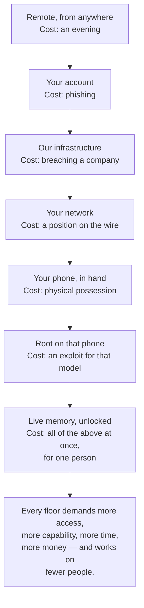

Floor 1 scales to millions of people for the price of an evening. Floor 10
scales to **one**, and only if that one is worth the budget.

> **Not impossible to attack.
> Increasingly expensive to defeat.**

---

## 🎁 A free gift: point it at a phone you are about to buy \{#used-phone-gift}

Everything above exists to protect your vault. But look at what it is made of —
Google's own integrity check, root detection, tamper detection, bootloader
verification. All of that is aimed at answering one question:

> **Is this device what it claims to be?**

That question is worth money to you in a completely different situation: **when
you are buying a second-hand phone.**

So use us. You do not have to pay, subscribe, or keep the app afterwards.

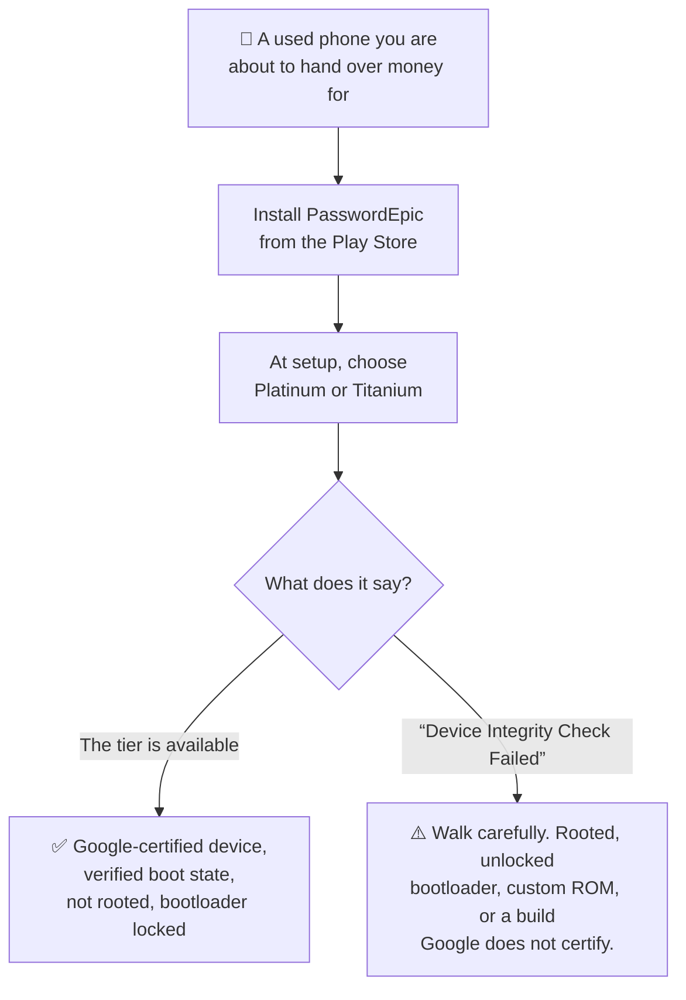

**Install it from the Play Store, not from a file.** A sideloaded build cannot
obtain a passing verdict no matter how healthy the phone is, so a "fail" on a
copied APK tells you nothing at all.

### What a pass actually proves

- The phone is a **Google-certified device** — not a clone, not an emulator.
- It booted a **verified, unmodified system**.
- It is **not rooted**, and the bootloader is **locked**.
- The app on it has not been tampered with.

That is a genuinely useful set of answers for a few minutes of work, and most
buyers have no way to check any of it.

### What a pass does not prove

We are not going to oversell a free tip:

- **Nothing about whether the phone is stolen.** Check the IMEI separately.
- **Nothing about the hardware.** Replaced screens, counterfeit parts and a
  worn-out battery all pass an integrity check happily.
- **Nothing about what the seller installed** before locking it back up.

It answers *"has this device's software been tampered with?"* — precisely, and
only that.

> 🛡️ *"We built this to decide whether to trust a phone with your passwords.
> You may as well use it to decide whether to trust one with your money."*

---

## Why OPAQUE?

Every design decision on this page exists to answer a specific move. Here is the
one OPAQUE answers.

> 😈 *"Give me the stored verifier. I don't need to beat it here — I'll take it
> home and grind it offline, forever, with no rate limit and nobody watching."*

That is the attack against every system that keeps *something* which can check a
password. Even wrapped, even encrypted: if it exists, it can be stolen, and an
offline attack has infinite patience.

On Silver, Gold and Platinum, a stored value unwraps your vault. It is wrapped
under your passcode — but it exists on disk.

**On Titanium there is nothing to take.**

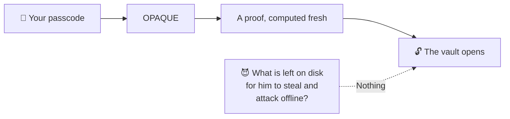

> 🛡️ *"OPAQUE is here because I don't want anything to exist that can simply be
> stolen and attacked at leisure."*

---

## Why Rust?

Floor 10 is entirely a question about **how long a secret lives in memory**. So
the language that holds the secret is not a matter of taste.

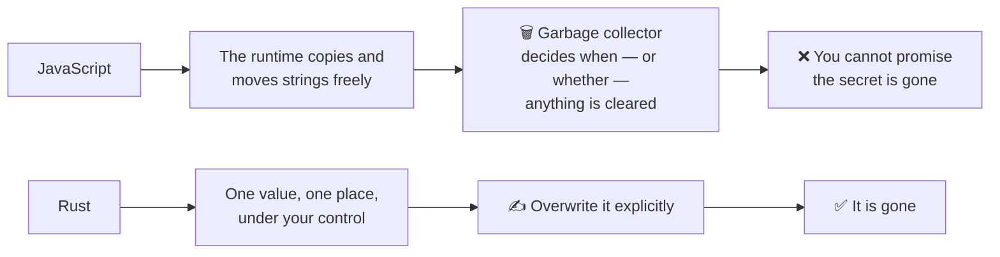

> 🛡️ *"Rust isn't here because Rust is fashionable. Rust is here because I care
> how long a secret lives in memory."*

---

## And if you think someone saw you type

> 😈 *"I stood behind you in a queue. I have a camera. I have patience."*

Shoulder-surfing needs no exploit and no budget at all, so the defence should be
just as cheap.

**Changing your passcode is fast, and it re-encrypts nothing.** It re-wraps the
machine-generated secret; the vault key itself does not change, so not one of
your stored passwords is touched and your existing backups stay valid.

> 🛡️ *"Recovering from a passcode someone may have seen should be cheap. So it
> is."*

See [Your passcode](./your-passcode.md#changing-it).

---

## Your half of the deal

Every floor above is White Hat's side of the bargain. This is yours, and none of
it is optional.

Because White Hat can build all of this —

```
StrongBox · Play Integrity · OPAQUE · Rust · Argon2id
anti-overlay · anti-tapjacking · capture protection
device binding · rate limiting · server-side verification
two-layer backups · per-operation keys · memory zeroing
```

— and it protects **nothing** if the passcode is `123456`, or the same one you
use on ten other sites, or written on a note stuck to the phone.

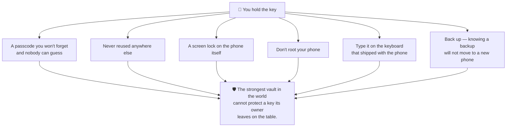

**The real world works exactly the same way.**

You can build the strongest safe ever made. Steel doors, alarms, cameras,
guards. But if you leave the key on the table, nobody needs to break the safe.

They just take the key.

Password security is not different. PasswordEpic can protect the vault. **You
still have to protect the key.**

---

## How to judge any password manager, including this one

We are not going to tell you PasswordEpic beats products we have not audited.
That claim would be worth exactly as much as the ones you have already read on
other sites.

Ask these instead — of us, and of everyone else:

1. **Can they reset your password and still give your data back?** If yes, they
   can read it. There is no third answer.
2. **Where does the key live, and can they name the place?** "Encrypted at rest"
   describes their disk, not your key.
3. **What happens if you lose the phone?** A service that can restore your vault
   out of nothing never needed you in the first place.
4. **If their servers were breached tomorrow, what would the attacker hold?**
   Make them be specific.
5. **What if the app itself were modified?**
6. **What if an attacker had the physical device?**
7. **Do they publish what they cannot protect?**

Our answers to all seven are on this page. The seventh is Floor 7 and Floor 10,
and neither is buried.

## Read next

- [How it works](./how-it-works.md) — the four places the key comes from
- [What these words mean](./plain-words.md) — every term above, in plain words
- [Security tiers](./security-tiers.md) — which floors your tier defends
- [Your passcode](./your-passcode.md) — the one part that is yours to get right
