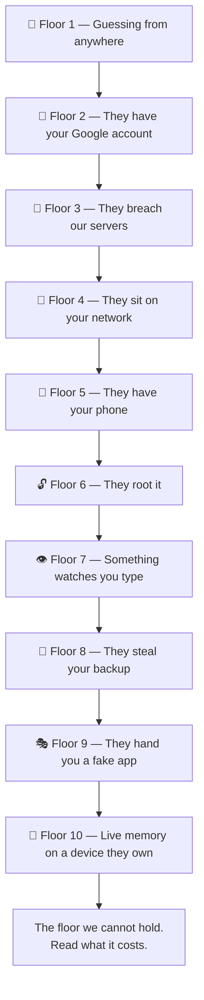
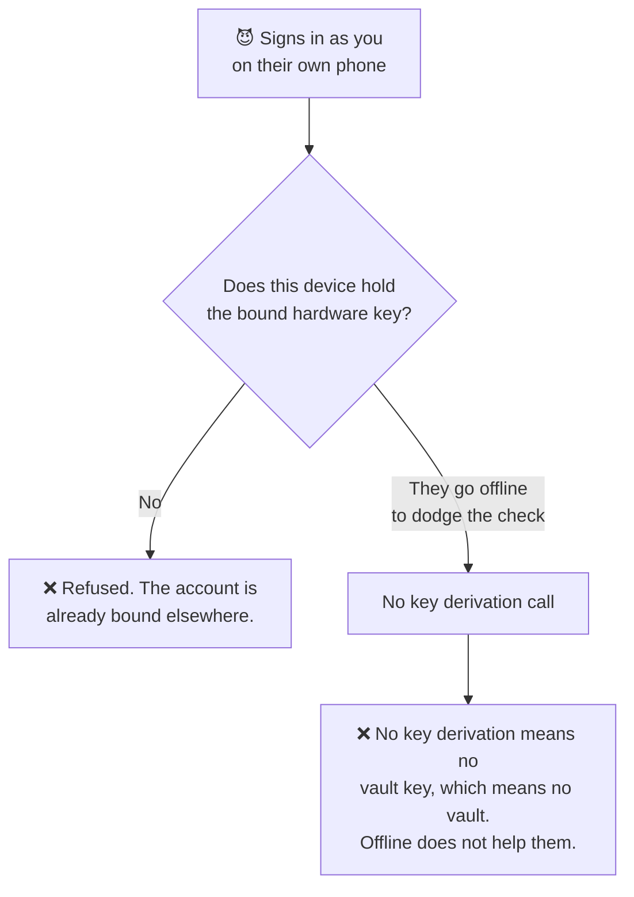
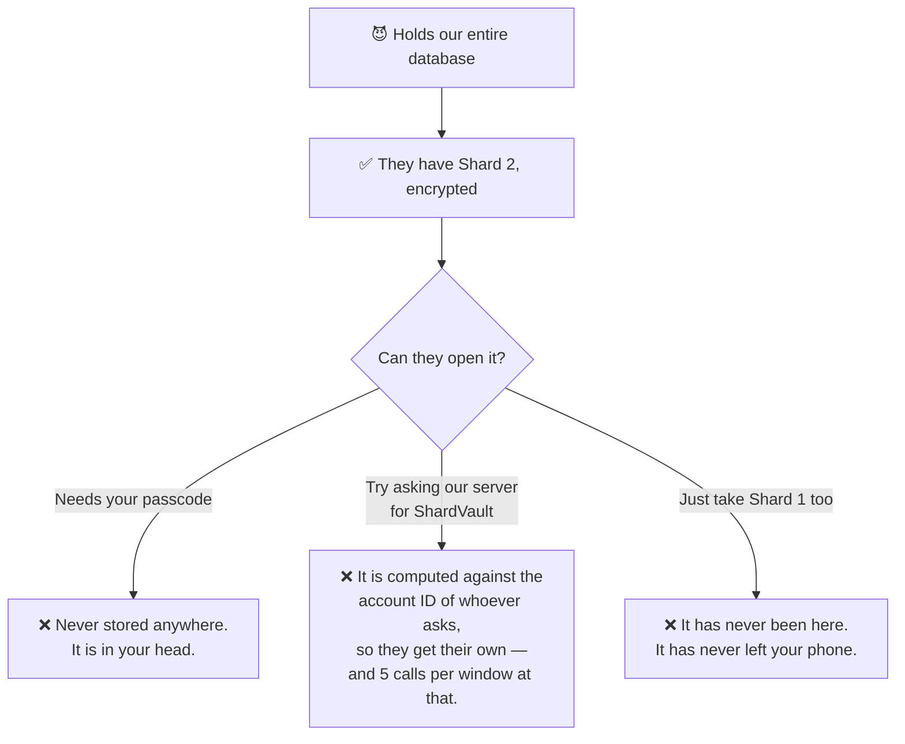
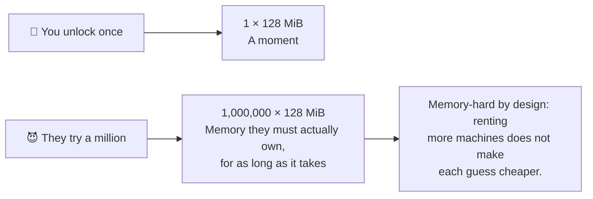
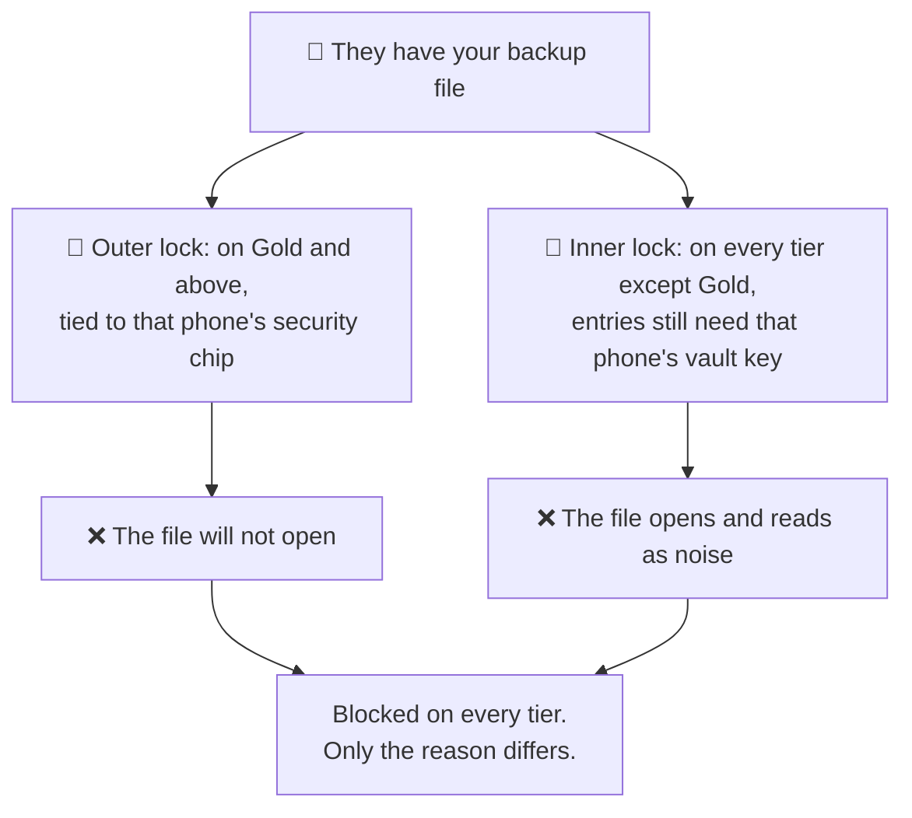
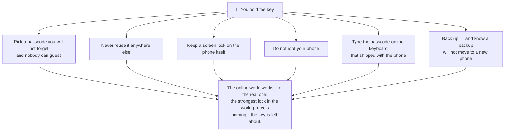

# If someone came after your vault

Most security pages list what a product has. This one does the opposite: it puts
an attacker at the front door and walks them upwards, floor by floor. At each
floor — what they try, what stops them, and what it costs them to keep going.

The building has a top floor we cannot hold. That one is on this page too, along
with what reaching it would actually take. A page that claimed otherwise would
not be worth reading.

## Floor 1 — Guessing, from anywhere in the world

**What they try.** Your email address turns up in a breach dump with a password
you used somewhere else. A script tries it here, and a few thousand variations,
across a few thousand accounts.

**What stops them.** Sign-in attempts are scored invisibly for automated abuse,
and rate-limited on top of that. You see nothing unless something looks wrong.

**What it costs them.** Almost nothing to attempt, and it yields almost nothing.
Even a successful sign-in only gets them to Floor 2 — where there is no vault
waiting.

## Floor 2 — They are signed in as you

**What they try.** They have your Google account. They install PasswordEpic on
their own phone and sign in.

**What stops them.** On the paid tiers your account is bound to one device, and
identity is not a device ID the app could simply claim — it is possession of a
key generated inside *your* phone's security chip, which cannot be exported. The
second sign-in is refused outright.

**What they get.** An empty vault of their own. Your entries were never on any
server for their session to load, and the key that would decrypt them cannot be
built on a device that does not hold Shard 1.

## Floor 3 — They breach us completely

**What they try.** Not your phone — us. They take the entire database.

**What they get.** Account records, and Shard 2 in encrypted form. That is the
whole haul. Vault entries are encrypted on your phone and are never uploaded, so
there is nothing of yours in there to take.

**What stops them going further.** Three things, and they need all three:

**What it costs them.** Total compromise of our infrastructure — and it yields
nothing that opens a single vault. That is the difference between a service that
promises not to look and one that cannot.

## Floor 4 — They sit between you and us

**What they try.** A workplace profile, an installed root certificate, a hostile
Wi-Fi network. Anything that lets them present a certificate your phone will
trust, and read the call that returns part of your key.

**What stops them.** On Platinum and Titanium, that call accepts **only a fixed
set of Google's own root certificates**. A certificate your phone has been told
to trust is refused anyway.

**A note on honesty.** Certificate pinning is a defence that can break your own
app if the certificate authority rotates and you have not kept up. Ours is
verified against the live endpoints before every release rather than assumed —
because a pin nobody checks is a pin that eventually locks out the people it was
meant to protect.

## Floor 5 — They have your phone, and it is locked

**What they try.** The passcode. Millions of guesses, offline, at their leisure.

**What stops them.** Every single guess costs 128 MiB of memory and real time,
because that is exactly what it costs you when you unlock. The app also refuses
to let you set a passcode below 45 bits of entropy, so there is no trivially
short target to aim at.

**What it costs them.** Real hardware, running for a long time, per victim.
That is the point of a memory-hard function — it cannot be made cheap by buying
more of it.

## Floor 6 — They root the phone

**What they try.** Remove the phone's restrictions and read PasswordEpic's
storage directly.

**What stops them.** Shard 1 was generated *inside* the security chip and there
is no operation that returns it. Not to the app, not to root, not to anyone.
Root gets them the phone; it does not get them that shard.

On Platinum and Titanium, root, repackaging, debuggers and the common hooking
toolkits are also detected, and key operations refuse to run at all.

**What it costs them.** Physical possession, plus a working root for that exact
device — and it still ends at a chip that will not answer the question.

## Floor 7 — Something is watching while you type

This floor is different. It skips the encryption entirely by getting to your
passcode *as you type it*, before any of the above applies.

| What they try | What stops it |
| --- | --- |
| A fake passcode pad drawn over the real one | Anything drawn over the pad halts the unlock |
| An invisible layer collecting your taps | The same guard — this is "tapjacking" |
| An app with the accessibility permission reading the screen | Key operations stop while one is active |
| A screenshot | Refused outright, for the whole screen |
| A screen recording of the app | Comes out black — the app and the keyboard over it |
| A recording while the autofill dialog is over another app | Passcode entry is refused entirely (Android 15+) |
| **A keyboard that logs your keystrokes** | **We can only warn you** |

That last row is not a gap we are hiding. A keyboard is handed your keystrokes
directly, before anything is drawn on screen, so no amount of screen protection
reaches it. The app tells you when the active keyboard did not ship with your
phone, and that is genuinely all it can do.

## Floor 8 — They steal your backup file

**What they try.** Your backup is in your Google Drive. They get into your Drive
and take it.

**What stops them.** Two locks, and which one catches them depends on your tier:

**What it costs them.** Nothing they can spend usefully. The same property is
why *you* cannot move a vault to a new phone — the cost is paid by both sides.

## Floor 9 — They hand you a fake app

**What they try.** A modified build of PasswordEpic, sideloaded or from a
third-party store. Everything above assumes the app is the app; this attacks
that assumption directly.

**What stops them.** Before key operations, our server asks Google whether this
is the genuine, unmodified app on a genuine device. The verdict is checked **on
our server**, not on the phone — a patched app can skip a check it runs on
itself, but it cannot forge Google's signature to somebody else.

## Floor 10 — Live memory, on a device they control

Here is the floor we cannot hold.

**What they try.** Root on your phone *while you are using it*, and read the
decrypted values out of memory in the moment they exist.

**What we do about it.** Shrink that moment to as close to nothing as we can:

- The vault key is derived fresh for every single operation and zeroed
  immediately after. It is never cached, never written to disk, never logged.
- Entries are decrypted one at a time, for one fill or one view.
- On Titanium the values that matter live in a Rust core, which can overwrite
  memory and be certain it is gone.

**What we cannot do.** Make a compromised operating system safe. If an attacker
owns the device while it is unlocked, they are inside the trust boundary that
every one of the floors below depends on. No app can fix that from inside.

**What reaching this floor actually costs.** It is not a remote attack and it
does not scale. It needs your physical device, a working root for it, and either
your passcode or a live unlocked session — all at once, for one person. That is
targeted-attacker work, at targeted-attacker prices.

Which leads to the only honest question left: **is your vault worth that budget
to somebody?** For almost everyone the answer is no, and the floors below are
what actually matter. For a few people the answer is yes, and those people
should know that no password manager on any platform changes it.

## Why OPAQUE, and why Rust

Both exist because of Floor 10, and neither is decoration.

**OPAQUE** removes the thing an attacker would otherwise steal and attack at
leisure. On the other tiers, a stored value unwraps your vault; it is wrapped
under your passcode, but it exists on disk. On Titanium there is nothing to
take — the proof is recomputed from your passcode and never written down in any
form.

**Rust** exists because JavaScript cannot promise a secret is gone. Its runtime
copies and moves strings around, and there is no reliable way to overwrite them.
Rust puts the value in one place you control, so it can be erased. When the whole
question is *how long does a secret live in memory*, that is not a language
preference.

## Your half of the deal

Every floor above is our side. This is yours, and none of it is optional —
holding the key is a job.

One more, and it is the cheapest defence on this page: **changing your passcode
is fast and free.** It re-wraps the machine-generated secret without touching a
single stored password, so if you ever suspect somebody watched you type, change
it and everything above still holds. See
[Your passcode](./your-passcode.md#changing-it).

## How to judge any password manager, including this one

We are not going to tell you we beat products we cannot audit. Here is what to
ask instead — of us, and of anyone else:

1. **Can they reset your password and still give your data back?** If yes, they
   can read it. There is no third answer.
2. **Where does the key live, and can they name the place?** "Encrypted at rest"
   describes their disk, not your key.
3. **What happens if you lose the phone?** A service that can restore your vault
   from nothing is a service that never needed you.
4. **What do they admit they cannot do?** A security page with no limits section
   is a marketing page.

Our answers are on this site, including the last one — it is Floor 10, and it is
above.

## Read next

- [How it works](./how-it-works.md) — the four places the key comes from
- [What these words mean](./plain-words.md) — every term here, in plain words
- [Your passcode](./your-passcode.md) — the one part that is yours to get right
- [Security tiers](./security-tiers.md) — which floors your tier defends
