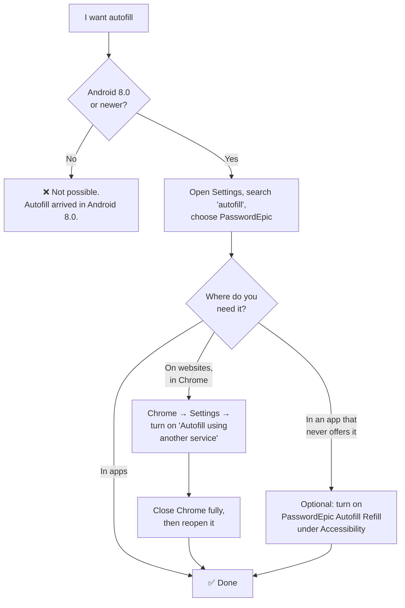
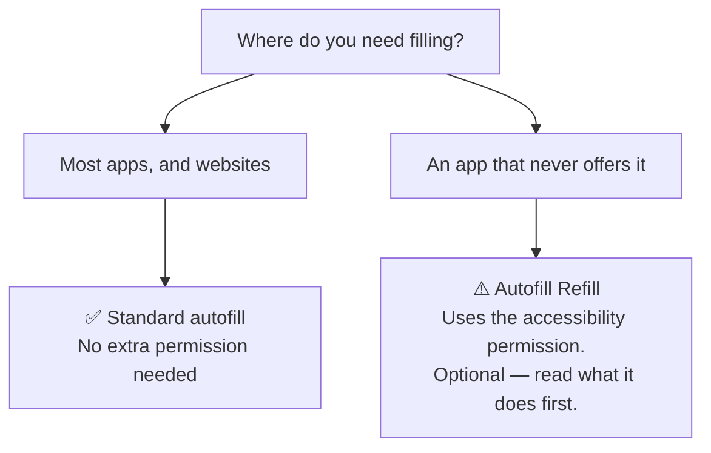
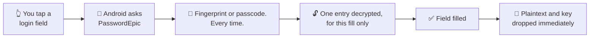

# Setting up autofill

PasswordEpic fills logins through Android's own autofill framework. It does not
watch your screen, and the basic setup does not need an accessibility
permission.

**Autofill needs Android 8.0 or newer.** On anything older the option will not
appear at all — that is Android, not the app.

## The short version

The app can take you straight there: **Settings → Autofill Management → Enable
Autofill**. That opens the right system screen on most phones.

If it opens the wrong screen, or nothing happens, use the manual path for your
brand below. This is worth knowing anyway, because Android moved this setting
several times and every manufacturer renamed it.

## Where the setting actually lives

<h3 id="samsung">Samsung</h3>

**Settings → General management → Language and input → Autofill service →
PasswordEpic**

:::caution Samsung Pass gets in the way

Samsung phones ship with Samsung Pass set as the autofill service. You may have
to select **None** first, then choose PasswordEpic. If PasswordEpic does not
appear in the list, back out to the previous screen and go in again.

:::

<h3 id="huawei">Huawei and Honor</h3>

**Settings → System → Languages &amp; input → More input settings → Autofill
service → PasswordEpic**

<h3 id="pixel">Pixel and stock Android</h3>

**Settings → Passwords &amp; accounts → Autofill service → PasswordEpic**

On Android 14 and newer this is often **Settings → Passwords, passkeys &amp;
accounts → Additional providers**.

<h3 id="other">Xiaomi, Oppo, Vivo, and anything else</h3>

The name of the screen changes, the words "Autofill service" do not. Open
Settings, use the **search box at the top**, and type `autofill`. That is far
faster than guessing the menu tree.

If you would rather navigate, one of these two usually works:

- **Settings → System → Languages &amp; input → Autofill service**
- **Settings → Apps → Default apps → Autofill service**

## Making it work in Chrome

This is the step most people miss, and the reason autofill often works in apps
but not on websites.

**Chrome has its own password manager, and by default it will not hand web forms
to anyone else.** Setting PasswordEpic as your phone's autofill service is not
enough on its own.

1. Set PasswordEpic as the system autofill service first, using the steps above.
2. Open **Chrome → ⋮ (three dots) → Settings**.
3. Find **Autofill services** and turn on **"Autofill using another service"**.
4. Confirm, then **fully close Chrome and reopen it**. Chrome only picks the
   change up on a restart.

:::note The menu name moves between Chrome versions

Depending on your Chrome version this setting sits under **Autofill services**,
under **Passwords**, or inside **Autofill and passwords**. The wording to look
for is *"Autofill using another service"* or *"Use another service"*.

If you cannot find it anywhere, Chrome is on a version that keeps web forms to
Google Password Manager, and no third-party manager will be offered on websites.

:::

Other browsers — Firefox, Samsung Internet, Brave — mostly use the system
autofill service directly and need no extra step.

## When an app refuses autofill entirely

Some apps opt out of the autofill framework. That is their decision and no
password manager can override it.

For those, PasswordEpic offers a **separate, optional** service called
**PasswordEpic Autofill Refill**, which uses Android's accessibility permission
to fill forms the standard framework cannot reach.

**Settings → Accessibility → PasswordEpic Autofill Refill → On**

:::warning This one deserves a moment's thought

Accessibility is a powerful permission — it is exactly the permission this site
warns you about elsewhere, because malware abuses it to read screens.

What the app does with it: reads on-screen fields only to find login forms and
fill credentials you saved, always after a fingerprint or passcode check.
Everything happens on your device; the contents of your screen are never
collected, stored or transmitted.

It is **optional**. If the standard autofill covers the apps you use, leave this
off. You can turn it off at any time from the same screen.

:::

## What happens each time it fires

1. You tap a login field in another app or a website.
2. **Android** — not PasswordEpic — notices the field and asks the selected
   autofill service for suggestions.
3. PasswordEpic asks you to confirm with a **fingerprint or your passcode**.
   Every time, without exception.
4. The one entry being filled is decrypted, for that fill only. The rest of the
   vault stays encrypted.
5. The plaintext and the key are released as soon as the field is filled.

There is no window during which fills happen unattended, and no "unlock for five
minutes" mode.

## What a screenshot or a recording can capture

These are two different things and Android treats them differently. One is
fully handled; the other is not, and that difference is the whole reason the
app behaves the way it does.

### Screenshots are refused outright

While a PasswordEpic screen is in front of you — the app itself, or the autofill
dialog over another app — Android will not take a screenshot at all. You get
"Couldn't capture screenshot due to app policy" and no image: not of the app,
not of the keyboard, not of anything else on screen at that moment.

### Recordings are handled window by window

A screen recording is not refused. Instead each window is treated separately:
the app's own windows — including the autofill dialog — come out **black**.

**The keyboard is not one of those windows.** It is drawn by whichever keyboard
app you use, in its own process, and no app can extend that protection to
another app's window. So a recording shows a blacked-out dialog with a fully
visible keyboard beneath it.

### Which is why the app stops you typing

On **Android 15 and newer** the app can tell that a recording is capturing its
windows, and it uses that to clear the passcode field and refuse entry until the
recording stops — in the app and in the autofill dialog alike.

Detection alone would achieve nothing. Refusing input is the part that helps: by
the time you have finished typing, a recorded keyboard has already seen it.

Below Android 15 there is no reliable way to detect a recording, and the app
does not pretend there is.

Two more things are worth knowing:

- **Key-preview bubbles are the real leak.** Keyboards suppress the little
  letter that pops up above each key only for password fields — so the passcode
  field stays in password mode permanently, even when you tap the eye to reveal
  what you typed. Revealing the text inside a protected window is safe; taking
  the keyboard out of password mode is not.
- **Touch positions are not recorded** unless you have turned on the "Show taps"
  developer option.

The residual exposure is small, but it is not zero. Eliminating it entirely
would require an in-app keypad, which would mean giving up passcodes that
contain letters and symbols.

:::caution Your keyboard can read what you type

This is true in every app, not just this one. A keyboard you install sees every
keystroke you give it.

If that matters to you, use the keyboard that shipped with your phone.
PasswordEpic warns you when the active keyboard did not.

:::

## Turning it off

**Settings → Autofill Management → Disable Autofill**, or go back to the same
system screen you used above and choose **None** or another service.

Signing out of PasswordEpic also revokes autofill immediately — the service stops
answering requests rather than continuing with a stale session.

## Read next

- [Common problems](./faq.md) — autofill not appearing, error messages, and what they mean
- [Your passcode](./your-passcode.md) — what you will be asked for on each fill
- [How it works](./how-it-works.md) — what has to happen before an entry can be decrypted
