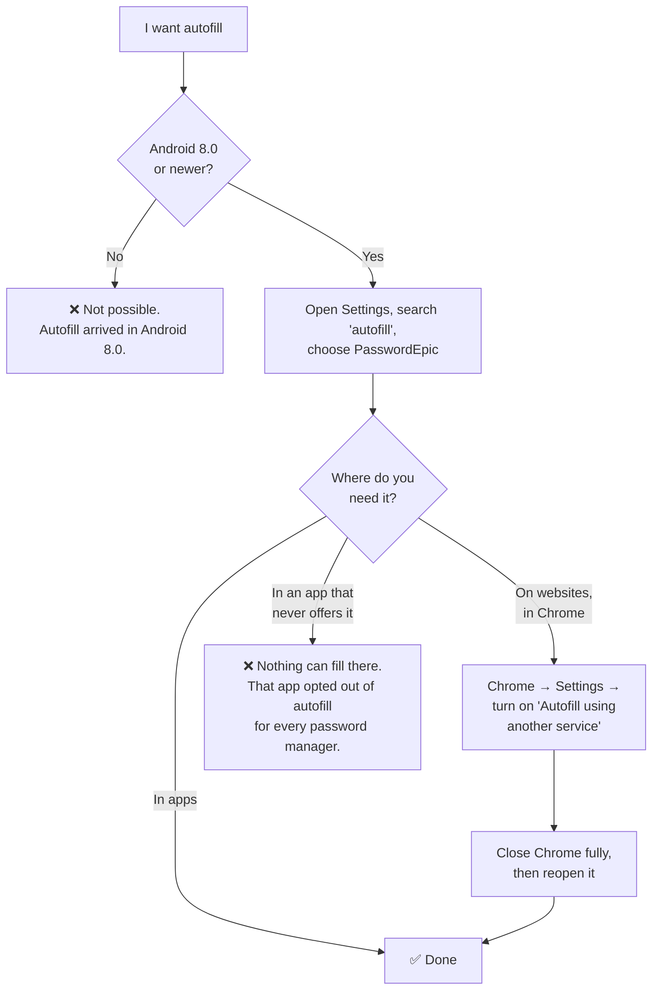
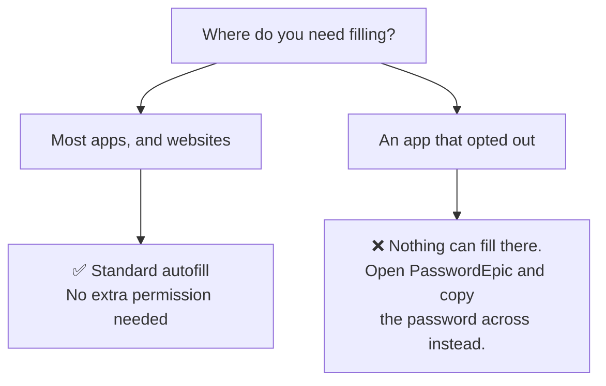
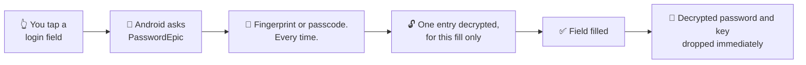

# Setting up autofill

PasswordEpic fills logins through Android's own autofill framework. It does not
watch your screen, and the basic setup does not need an accessibility
permission.

**Autofill needs Android 8.0 or newer.** On anything older the option will not
appear at all — that is Android, not the app.

## The short version

The app can take you straight there: **Settings → Autofill Management → Enable
Autofill**. That opens the right system screen on most phones.

If it opens the wrong screen, or nothing happens, use the manual path for your
brand below. This is worth knowing anyway, because Android moved this setting
several times and every manufacturer renamed it.

## Where the setting actually lives

Wherever the menu path leads, the screen you are looking for is this one — a
list of every app that can fill passwords, with a single dot to award:

Note what else is on that list. Only one service can be preferred at a time, so
choosing PasswordEpic means un-choosing Samsung Pass or Google.

<h3 id="samsung">Samsung</h3>

**Settings → General management → Language and input → Autofill service →
PasswordEpic**

:::caution Samsung Pass gets in the way

Samsung phones ship with Samsung Pass set as the autofill service. You may have
to select **None** first, then choose PasswordEpic. If PasswordEpic does not
appear in the list, back out to the previous screen and go in again.

:::

<h3 id="huawei">Huawei and Honor</h3>

**Settings → System → Languages &amp; input → More input settings → Autofill
service → PasswordEpic**

<h3 id="pixel">Pixel and stock Android</h3>

**Settings → Passwords &amp; accounts → Autofill service → PasswordEpic**

On Android 14 and newer this is often **Settings → Passwords, passkeys &amp;
accounts → Additional providers**.

<h3 id="other">Xiaomi, Oppo, Vivo, and anything else</h3>

The name of the screen changes, the words "Autofill service" do not. Open
Settings, use the **search box at the top**, and type `autofill`. That is far
faster than guessing the menu tree.

If you would rather navigate, one of these two usually works:

- **Settings → System → Languages &amp; input → Autofill service**
- **Settings → Apps → Default apps → Autofill service**

## Making it work in Chrome

This is the step most people miss, and the reason autofill often works in apps
but not on websites.

**Chrome has its own password manager, and by default it will not hand web forms
to anyone else.** Setting PasswordEpic as your phone's autofill service is not
enough on its own.

1. Set PasswordEpic as the system autofill service first, using the steps above.
2. Open **Chrome → ⋮ (three dots) → Settings**.
3. Find **Autofill services** and turn on **"Autofill using another service"**.
4. Confirm, then **fully close Chrome and reopen it**. Chrome only picks the
   change up on a restart.

:::note The menu name moves between Chrome versions

Depending on your Chrome version this setting sits under **Autofill services**,
under **Passwords**, or inside **Autofill and passwords**. The wording to look
for is *"Autofill using another service"* or *"Use another service"*.

If you cannot find it anywhere, Chrome is on a version that keeps web forms to
Google Password Manager, and no third-party manager will be offered on websites.

:::

Other browsers — Firefox, Samsung Internet, Brave — mostly use the system
autofill service directly and need no extra step.

## When an app refuses autofill entirely

Some apps opt out of the autofill framework. That is their decision and no
password manager can override it.

There is no way around it, and you should be suspicious of any password manager
that claims otherwise.

:::note Why we do not work around it

The usual trick is an **accessibility service** — the Android permission that
lets an app read every field on screen. It would work, and PasswordEpic
deliberately does not ship one.

Google does not permit the accessibility API to be used this way, and the
reason is sound: it is the single most abused permission on Android, which is
why this site warns you about it elsewhere. A password manager asking for it
is asking you to grant the exact capability that credential-stealing malware
needs.

For an app that refuses autofill, open PasswordEpic, copy the password, and
paste it. Slower, and honest.

:::

## The notice you see the first time

Before autofill starts, the app tells you what the permission actually grants:
the ability to read the input fields on screen. It also tells you the limits —
processing stays on the device, and nothing from other apps is collected, stored
or transmitted.

Read it rather than tapping past it. It is the one permission in this app that
touches other apps, and you should know what you are agreeing to.

## What happens each time it fires

1. You tap a login field in another app or a website.
2. **Android** — not PasswordEpic — notices the field and asks the selected
   autofill service for suggestions.
3. PasswordEpic asks you to confirm with a **fingerprint or your passcode**.
   Every time, without exception.
4. The one entry being filled is decrypted, for that fill only. The rest of the
   vault stays encrypted.
5. The decrypted password and the key are released as soon as the field is
   filled.

There is no window during which fills happen unattended, and no "unlock for five
minutes" mode.

### The same three steps, on a real login

You tap the field; the saved username appears above the keyboard with the
PasswordEpic icon beside it. Nothing has been decrypted yet — that row is a
label, not a password.

Choosing it asks for your passcode, and names the app it is about to fill —
*Autofill for `fi.hsl.app`*. Check that name. It is how you catch a fill aimed
at something that only looks like the app you wanted.

Then both fields are filled at once, and the key is gone again.

## What a screenshot or a recording can capture {#screen-capture}

These are two different things and Android treats them differently. One is
fully handled; the other is not, and that difference is the whole reason the
app behaves the way it does.

### Screenshots are refused outright

While a PasswordEpic screen is in front of you — the app itself, or the autofill
dialog over another app — Android will not take a screenshot at all. You get
"Couldn't capture screenshot due to app policy" and no image: not of the app,
not of the keyboard, not of anything else on screen at that moment.

### Recordings of the app come out black

A screen recording is not refused outright. What it captures while PasswordEpic
is in front of you is **black** — the app itself and the keyboard over it. There
is nothing in the frame to read.

### The autofill dialog is the case that needs more

That dialog appears over a *different* app, and that app is being recorded
normally. So this is where a recording could catch something.

On **Android 15 and newer** the app detects that a recording is running and
refuses passcode entry entirely: the field is cleared and disabled, the keyboard
is dismissed, and everything comes back when the recording stops.

Detection alone would achieve nothing. Refusing input is the part that helps —
by the time you have finished typing, it is too late.

Below Android 15 there is no reliable way to detect a recording, and the app
does not pretend there is. If that matters to you, fill from inside the app on
an older phone rather than through the autofill dialog.

Two more things are worth knowing about that older-Android gap:

- **Key-preview bubbles would be the leak.** Keyboards suppress the little
  letter that pops up above each key only for *password* fields — so the
  passcode field stays in password mode permanently, even when you tap the eye
  to reveal what you typed. Revealing the text inside a protected window is
  safe; taking the keyboard out of password mode would not be.
- **Touch positions are not recorded** unless you have turned on the "Show taps"
  developer option.

So even in that case there is little to read. It is not nothing, though, which
is why the refusal exists on the versions that can support it.

:::caution Your keyboard can read what you type

This is true in every app, not just this one. A keyboard you install sees every
keystroke you give it.

If that matters to you, use the keyboard that shipped with your phone.
PasswordEpic warns you when the active keyboard did not.

:::

## Inside Autofill Management

**Settings → Autofill Management** has three tabs.

**Service** is the on/off switch and a plain-language explanation. The one line
worth carrying away: *your passwords are encrypted and require biometric
authentication before being filled.*

**Domains** is the trusted-domain list, and it does not start empty — the app
ships with several hundred pre-approved domains already verified as safe, so
common sites work on day one. You can search it, add your own, and remove any of
them.

**Stats** counts what has actually happened: total fills, when it last fired and
for which app, plus per-domain performance and service health.

This is more useful than it sounds. Autofill is a feature you stop noticing when
it works, so a count that stays at zero is the fastest way to find out it never
started.

## Turning it off

**Settings → Autofill Management → Disable Autofill**, or go back to the same
system screen you used above and choose **None** or another service.

Signing out of PasswordEpic also revokes autofill immediately — the service stops
answering requests rather than continuing with a stale session.

## Read next

- [Common problems](./faq.md) — autofill not appearing, error messages, and what they mean
- [Your passcode](./your-passcode.md) — what you will be asked for on each fill
- [How it works](./how-it-works.md) — what has to happen before an entry can be decrypted
