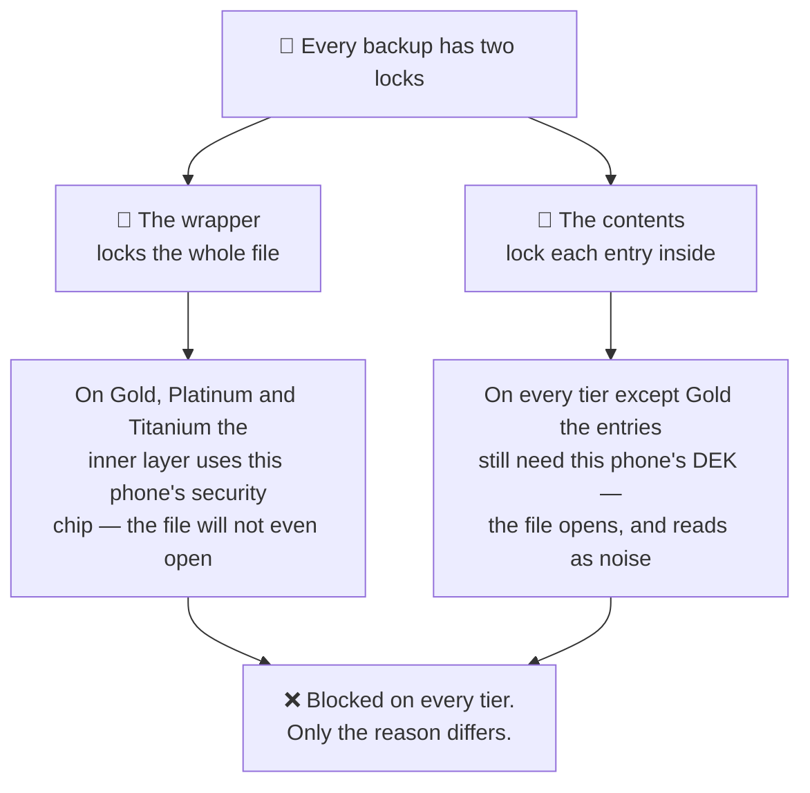
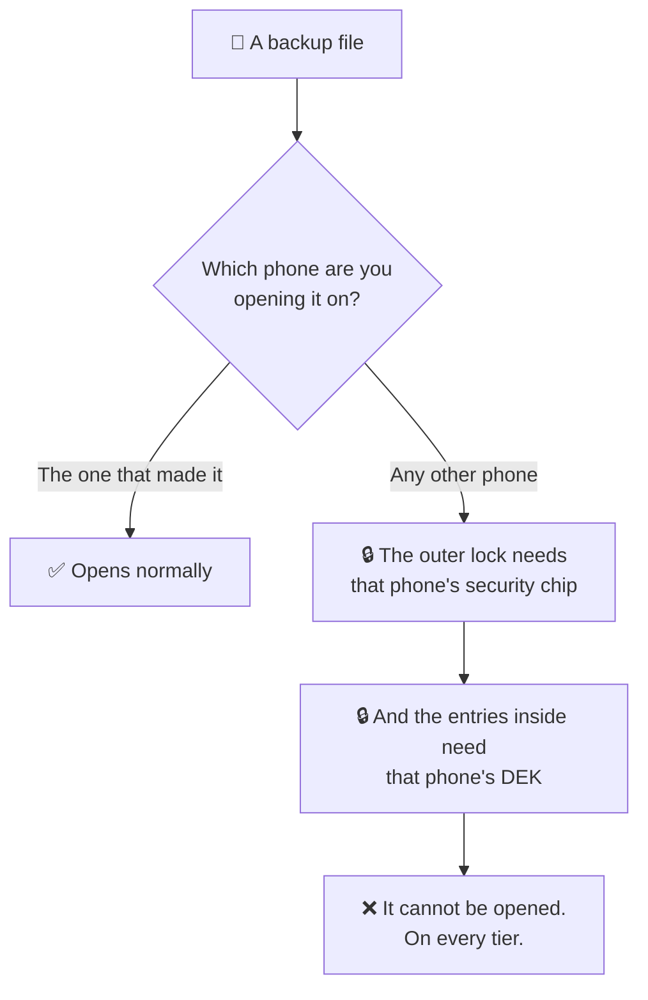
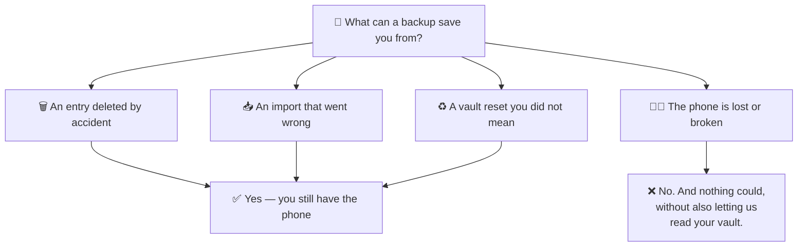

# Backups and exports

One sentence governs this page, and it is the one people most often assume is
not true:

:::danger No backup or export can be opened on a device other than the one that
wrote it

On any tier. There is no device-migration path in this product.

:::

If you are looking for a way to move your vault to a new phone, there isn't one.
Reading the rest of this page is worth doing anyway, because the *reason* is the
same reason your passwords are safe.

## Why files do not travel

A file has a **wrapper** — the encryption over the whole file — and **contents**,
the entries inside it. Both can be tied to a device, and which one does the
tying depends on your tier.

**The wrapper.** On Gold, Platinum and Titanium, files are written with two
layers of encryption. The outer layer is derived from your passcode. The inner
one uses a key held in that phone's StrongBox or TEE. Decryption unwraps the
device layer *first*, so without that phone's secure hardware the file cannot
even be opened.

**The contents.** On every tier except Gold, the entries inside the file stay
encrypted with your DEK — which needs Shard 1, which never leaves the
device.

| Tier | Wrapper | Entries | Opens elsewhere? |
| --- | --- | --- | --- |
| 🥈 Silver | Portable | Encrypted with the DEK | ❌ contents are unreadable |
| 🥇 Gold | Device-bound | Decrypted | ❌ wrapper cannot be opened |
| 💎 Platinum | Device-bound | Encrypted with the DEK | ❌ both |
| 🛡️ Titanium | Device-bound | Encrypted with the DEK | ❌ both |

Every tier is blocked. Only the reason differs — which is exactly why partial
readings of this keep producing confident, wrong conclusions.

## What backups are actually for

They protect you against **losing data on the phone you still have**:

- an entry deleted by accident
- an import that went wrong
- a vault reset you did not mean to do

They do not protect you against losing the phone. Nothing in this product does,
and nothing could without also giving us the ability to read your vault.

## Backups go to your Google Drive

If you enable backup, files are written to **your own** Google Drive account, not
to us. We never receive them and could not read them if we did.

Specifically, a backup goes to a **private area of your Drive that only this app
can open** — it is not listed among your files, so you cannot rename it by
accident or share it by mistake. An *export* is different: there you choose
between the phone's storage, your visible My Drive, or that same private area.

The app asks Google for two narrow permissions — its own private folder, and
files it created itself. Neither lets it see the rest of your Drive.

## What to do instead of relying on migration

Since a new phone starts an empty vault, plan for that up front:

- **Keep your passcode somewhere you will still have it in a year.** Losing the
  phone and the passcode together is unrecoverable; losing only the phone still
  means starting fresh.
- **Do not make PasswordEpic the only copy of something you cannot lose.** For a
  handful of genuinely critical credentials — the recovery codes for your email,
  say — keep a second copy somewhere else.
- **Back up regularly anyway.** It is still the answer for every failure that is
  not "the phone is gone".

We would rather say this plainly than let you discover it after losing a device.

## Read next

- [How it works](./how-it-works.md) — why Shard 1 cannot leave the phone
- [One device per account](./your-device.md) — moving to a new phone, and what support can do
- [Security tiers](./security-tiers.md) — which tier writes which kind of file
