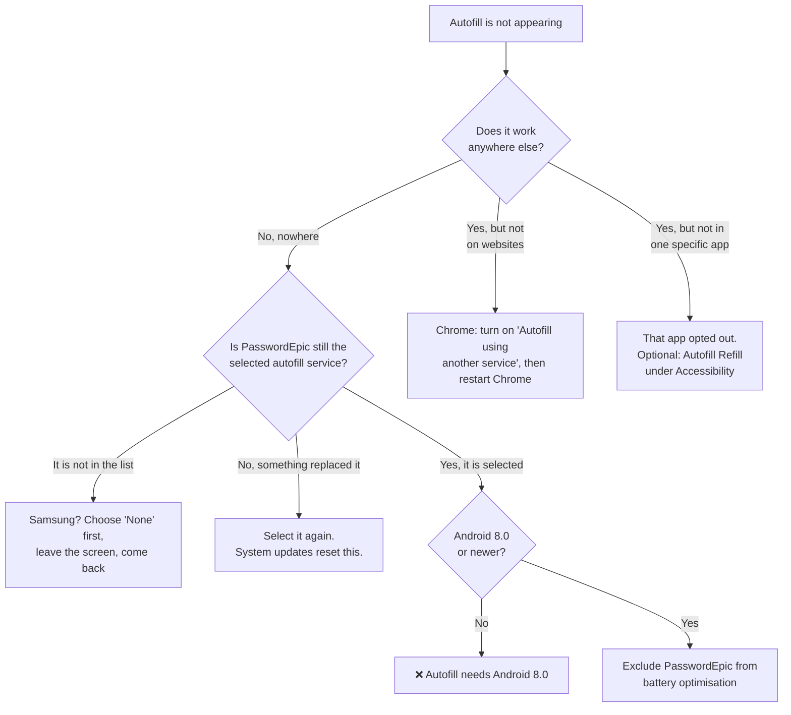
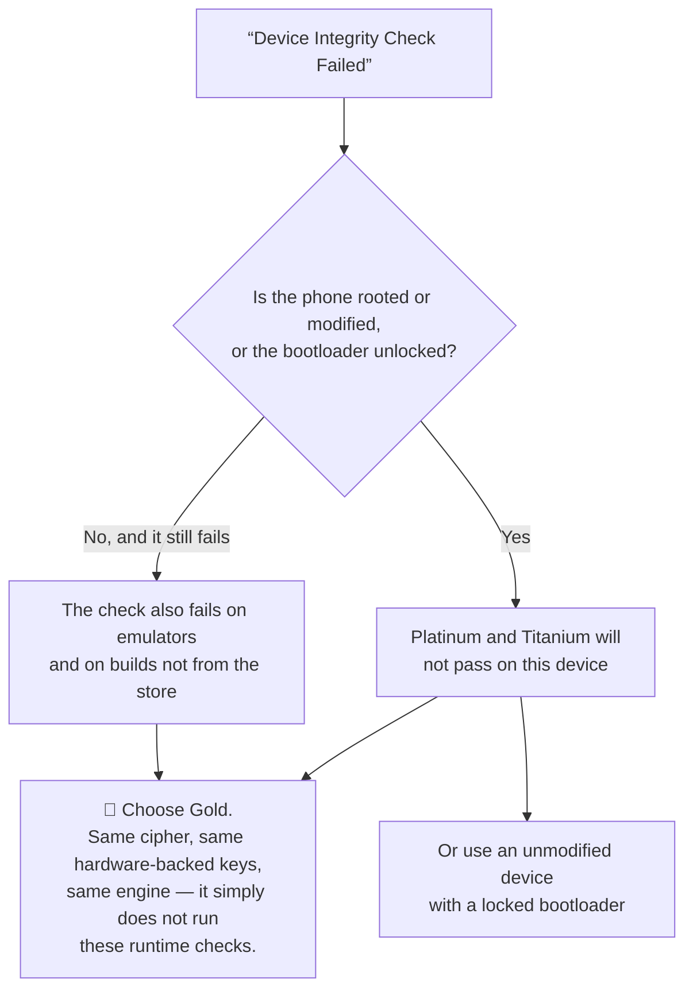
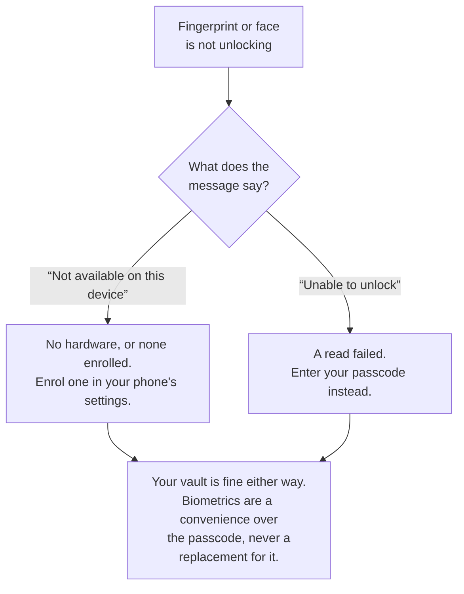

# Common problems

Grouped by where you hit them. Several of these are not faults — they are the
app refusing to do something unsafe, and the entry says which.

If none of this covers it, email
[support@passwordepic.com](mailto:support@passwordepic.com) and include the email
address you sign in with. That is what we look up.

## Autofill

### Autofill does not appear at all

Work through these in order — the first two account for most cases.

1. **Is PasswordEpic actually selected as the autofill service?** Setting it once
   is not permanent: a system update, or another password manager being
   installed, can quietly replace it. Check with the paths in
   [Setting up autofill](./autofill.md#where-the-setting-actually-lives).
2. **Are you on Android 8.0 or newer?** Autofill did not exist before that. The
   app will tell you which Android version you are running.
3. **Is battery optimisation restricting the app?** The autofill dialog is a
   separate window, and an aggressively restricted app cannot open it. Exclude
   PasswordEpic from battery optimisation.
4. **Did you sign out?** Signing out revokes autofill on purpose.

### It works in apps but not on websites

You are almost certainly in Chrome, and Chrome keeps web forms to its own
password manager until you tell it otherwise.

Turn on **"Autofill using another service"** in Chrome's own settings, then
restart Chrome. Full steps are in
[Making it work in Chrome](./autofill.md#making-it-work-in-chrome).

### "Autofill Not Supported"

Your phone is on Android 7 or older. Autofill is an Android 8.0 feature and
there is nothing the app can do about it. Everything else in PasswordEpic still
works — you copy and paste instead.

### "Failed to open autofill settings"

The app tried to jump you straight to the right system screen and your phone
refused. Harmless, and the manual route works: open Settings, search for
`autofill`, and select PasswordEpic. See
[the per-brand paths](./autofill.md#where-the-setting-actually-lives).

### PasswordEpic is not in the list of autofill services

Usually Samsung, where **Samsung Pass** holds the slot. Select **None** first,
leave the screen, come back, and PasswordEpic should now be listed.

### One particular app never offers autofill

Some apps opt out of the autofill framework entirely. That is their choice and
no password manager can override it.

The optional **PasswordEpic Autofill Refill** accessibility service exists for
exactly these cases. Read
[what it does first](./autofill.md#when-an-app-refuses-autofill-entirely) — it is
a powerful permission and worth understanding before you turn it on.

### The suggestion appears but the wrong entry is offered

Autofill matches on domain. Check the entry's saved website address — a login
saved for `example.com` will not be offered on `example.org`, and by default
subdomains like `mail.example.com` match only if subdomain matching is on
(**Settings → Autofill Management**).

## Signing in and your device

### "Account is active on another device"

Your account is bound to one phone at a time on the paid tiers. This is seat
licensing, not a fault.

- **You still have the old phone:** open PasswordEpic on it and choose
  **Settings → Reset Account**. That erases the data on that device and frees
  the account.
- **You no longer have it:** email us and we will release it. This is the one
  situation where support genuinely is the only way forward, because releasing a
  device normally needs that device's own hardware signature.

:::warning Releasing an account does not bring the old vault with it

You start fresh on the new phone. The old vault stays encrypted with a key that
existed only inside the old phone. See
[Backups and exports](./backups.md).

:::

### "Device Integrity Check Failed"

Platinum and Titanium require the app to prove it is genuine and unmodified,
running on a device that has not been tampered with. Something in that check did
not pass — a locked bootloader is a common requirement, and a rooted or modified
device will not pass at all.

Two ways forward: use an unmodified device with a locked bootloader, or **select
the Gold tier**, which has exactly the same encryption and does not run these
runtime checks.

Gold is not a downgrade in cryptography. It is the same engine, the same
hardware-backed keys, the same cipher. See
[Security tiers](./security-tiers.md).

### "Rooted Device Detected"

The app has detected that your phone's built-in restrictions have been removed.
On a rooted phone, other apps can read this app's memory — including your
passcode as you type it, and the vault key while it is in use.

The hardware-backed key itself is still protected, but everything around it is
not. The paid tiers refuse key operations here on purpose.

### Biometric unlock is not working

- **"Biometric authentication is not available on this device"** — no fingerprint
  or face hardware, or none enrolled. Enrol one in your phone's settings.
- **"Unable to unlock with biometrics"** — a read failed. Enter your passcode
  instead; biometrics are a convenience over the passcode, never a replacement
  for it.

Note that changing your phone's screen lock can invalidate enrolled biometrics
at the OS level. Your vault is unaffected — you unlock with your passcode and
re-enrol.

### "The credentials you entered do not match"

The passcode was wrong. There is no lockout that destroys your vault, so try
again carefully.

If you genuinely cannot remember it, there is no recovery — read
[Your passcode](./your-passcode.md#choosing-one-you-will-not-forget) before you
set the next one.

## Warnings you might see

These are the app telling you something about your environment. None of them
mean the app is broken.

### "Screen recording detected. Passcode entry is locked"

Something is recording your screen, and the app has locked passcode entry until
it stops.

This is deliberate. The app's own windows record as black, but **the keyboard
belongs to another app** and cannot be hidden — so your passcode would be visible
in the recording even though the app content is not. Stop the recording and try
again.

Available on Android 15 and above. On older versions the app cannot detect a
recording at all, and does not claim to.

### "Third-party keyboard: …"

The keyboard you are using did not ship with the phone. Any keyboard sees every
key you give it, in every app.

This is a **dismissible warning, never a block** — installing Gboard or SwiftKey
from the Play Store is completely ordinary. If you would rather not take the
risk while typing your passcode, switch to the keyboard that came with the phone
for that moment.

The app deliberately keeps no list of "approved" keyboards, because an app can
claim any name it likes and a name is not proof of identity.

### An overlay or accessibility warning stops you unlocking

Something is drawn over the passcode pad, or an accessibility service is active.
Both can capture your passcode as you type it, before any encryption is
involved.

Close the app that is drawing over the screen — screen dimmers, chat heads and
screen recorders are common causes — or turn off the accessibility service
temporarily, then try again.

If you turned on PasswordEpic's own **Autofill Refill** service, that is an
accessibility service too, and the app knows to ignore its own.

## Backups and restore

### "This backup cannot be restored on another device"

Correct, and true on every tier. Backups carry a layer of encryption tied to the
secure hardware of the phone that wrote them.

They protect you against losing data **on the phone you still have** — an
accidental delete, a bad import, a vault reset. They are not a migration path,
and no setting makes them one. See [Backups and exports](./backups.md).

### My backup restored but the entries are unreadable

Same cause. The file opened because you had the passcode, but the entries inside
are still encrypted with a vault key that needs the original phone's hardware.

### I want to move to a new phone

There is no way to bring the vault across. Release the account from the old
device (or ask us to), sign in on the new one, and re-enter your passwords.

We would rather say this plainly than let you discover it after losing a device.

## Deleting everything

**Settings → Reset Account.** Immediate, no queue, no retention window, no
support ticket. It erases the vault and your account data from our servers.

It cannot be undone, and we cannot bring it back afterwards — that is the same
property that stops anyone else reading your vault.

## Read next

- [Setting up autofill](./autofill.md) — the full setup guide
- [Your passcode](./your-passcode.md) — choosing one you will not lose
- [What these words mean](./plain-words.md) — every technical term, in plain words
- [Support](/support) — how to reach a human
