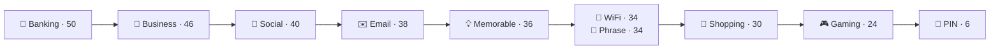
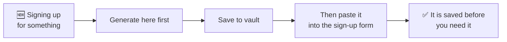

# Generating passwords

The **Generate** tab makes passwords you do not have to remember — which is the
whole reason a password manager is worth having. You only ever remember one
secret, and it is not any of these.

## The screen

Three parts, top to bottom:

1. **The preview box.** Before you press anything it says *Tap Generate to
   create a secure password*, and its heading names the template in force —
   *Generated Custom Template* until you pick one.
2. **Generate New Password.** Press it as often as you like. Each press is a
   fresh draw, and nothing is kept unless you save it.
3. **Choose Template**, then **Settings**.

## The ten templates

A template is not a different generator. It is a **saved set of the settings
below it** — length and which character types are in play — chosen for a
particular kind of account.

| Template | Length | A–Z | a–z | 0–9 | !@# | Notes |
| --- | --- | --- | --- | --- | --- | --- |
| 🏦 **Banking** | 50 | ✓ | ✓ | ✓ | ✓ | Look-alike characters removed |
| 💼 **Business** | 46 | ✓ | ✓ | ✓ | ✓ | Look-alike characters removed |
| 👥 **Social** | 40 | ✓ | ✓ | ✓ | — | Pronounceable |
| ✉️ **Email** | 38 | ✓ | ✓ | ✓ | ✓ | Look-alike characters removed |
| 💡 **Memorable** | 36 | ✓ | ✓ | ✓ | — | Word combinations |
| 📶 **WiFi** | 34 | ✓ | ✓ | ✓ | ✓ | Look-alike characters removed |
| 📄 **Phrase** | 34 | ✓ | ✓ | ✓ | — | Like `BlueSky2024Fast` |
| 🛒 **Shopping** | 30 | ✓ | ✓ | ✓ | ✓ | |
| 🎮 **Gaming** | 24 | ✓ | ✓ | ✓ | — | |
| 🔢 **PIN** | 6 | — | — | ✓ | — | Digits only |

Read that table as a ladder rather than a menu. **The length is the real
difference**, and it runs from 50 down to 6.

### How to choose without thinking about it

The names are about **what has to happen to the password**, not about how
precious the account is:

- **Nobody ever types it** → Banking, Business, Email, Shopping. Symbols on,
  long. Autofill does not care how ugly it is.
- **A human has to read or say it** → WiFi, Phrase, Memorable, Social. These
  drop symbols or use words, because a guest typing your Wi-Fi key into a
  television has to get it right first time.
- **A keypad, not a keyboard** → PIN. Six digits, because that is what a card or
  a SIM will accept.

Where the two pull in different directions, pick the longer one. A password you
never type has no cost.

:::tip The templates that remove look-alikes

Banking, Business, Email and WiFi drop the characters people misread —
`l` `1` `I`, `0` `O`. It costs a little entropy and buys back much more the
first time somebody has to read one aloud or copy it off a screen.

:::

Note the naming: the **PIN** template makes a numeric PIN for *a bank card or a
SIM*. It is not related to your PasswordEpic passcode, which is
[a different thing entirely](./your-passcode.md) and is not limited to digits.

## Settings

Picking a template fills these in. You can then move them, which is what makes
the preview heading say **Custom**.

| Control | What it does |
| --- | --- |
| **Length** | The slider. Longer is better, and costs you nothing when you never type it. |
| **A–Z** · **a–z** · **0–9** · **!@#** | Which character sets are drawn from. |

### When to turn a character type off

Almost never — every box you clear makes the password weaker. There is one
honest exception: **a site that rejects symbols.** Some still do. Clear `!@#`
and push the length slider up to compensate.

That trade is close to fair. Dropping symbols costs roughly the same as
shortening the password by four characters, so add five and you are ahead.

## After you generate

The generated password is not saved anywhere on its own. What you do with it:

- **Copy** — onto the clipboard, for pasting into a sign-up form.
- **Save to Vault** — creates an entry with the password already filled in.
- **History** — everything you have generated, newest first, with **Favorites**
  and **Recent**, and a **Use** button on each. **Clear History** empties it and
  cannot be undone.

History exists for one specific moment: you generated a password, pasted it into
a sign-up form, and the form failed. Without history that password is gone and
the account is in limbo. With it, you tap **Use** and carry on.

## The habit worth building

Save it **before** you submit the form, not after. It takes the same number of
taps, and it is the difference between a password you have and a password you
had.

## Read next

- [Your vault](./guide-vault.md) — where the generated password ends up
- [Your passcode](./your-passcode.md) — the one secret you *do* remember
- [Settings](./guide-settings.md) — every switch in the app
