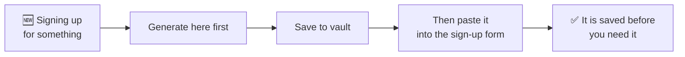

# Generating passwords

The **Generator** tab makes passwords you do not have to remember — which is the
whole reason a password manager is worth having. You only ever remember one
secret, and it is not any of these.

## The screen

| Control | What it does |
| --- | --- |
| **Generate** | Makes a new password with the current settings. Tap it as often as you like. |
| **Length** | The slider. Longer is better, and costs you nothing when you never type it. |
| **Uppercase (A–Z)** | |
| **Lowercase (a–z)** | |
| **Numbers (0–9)** | |
| **Symbols (!@#)** | |
| **Exclude ambiguous** | Drops the characters people misread — `l` `1` `I`, `0` `O`. |
| **Copy** | Puts it on the clipboard. |
| **Save to vault** | Creates an entry with this password already filled in. |

### When to turn character types off

Almost never — every switch you turn off makes the password weaker. There is one
honest exception: **a site that rejects symbols.** Some still do. Turn symbols
off and add a few characters of length to compensate.

**Exclude ambiguous** is different. It costs you very little and it is worth
turning on for any password you might one day have to read aloud, type on a TV
remote, or dictate over the phone.

## The six presets

Presets set all the switches at once. They exist because the right password for
your bank is not the right password for the Wi-Fi you read out to guests.

| Preset | Looks like | Reach for it when |
| --- | --- | --- |
| **Strong** | `K7#mQ2$vX9!pL4` | Anything that matters — email, bank, anything that can reset other accounts. **The default answer.** |
| **Memory** | Pronounceable | You will have to type it by hand sometimes. |
| **PIN** | `483920` | A card PIN, a SIM, a door code. Digits only. |
| **Phrase** | `BlueSky2024Fast` | You need to remember or say it, but still want length. |
| **WiFi** | `HomeNet2024` | Something guests will type on a TV or a games console. |
| **Basic** | Simple | Low-risk throwaway accounts. Use it sparingly. |

:::tip One preset, one job

**Strong** for anything you sign into. **Phrase** or **Memory** only where a
human has to reproduce it. **PIN** and **WiFi** are for the two specific things
they are named after.

If you find yourself picking **Basic** for a real account, the account is
probably more important than it feels — the accounts people underestimate are
the ones that turn out to hold a password-reset link.

:::

Note the naming: the **PIN** preset makes a numeric PIN for a *bank card or SIM*.
It is not related to your PasswordEpic passcode, which is
[a different thing entirely](./your-passcode.md) and is not limited to digits.

## History

Everything you generate lands in **History**, split into **Favourites** and
**Recent**, with a timestamp.

This exists for one specific moment: you generated a password, pasted it into a
sign-up form, and the form failed. Without history the password is gone and the
account is in limbo. With it, you tap **Use** and carry on.

**Clear History** empties it, and cannot be undone.

## The habit worth building

Save it **before** you submit the form, not after. It takes the same number of
taps, and it is the difference between a password you have and a password you
had.

## Read next

- [Your vault](./guide-vault.md) — where the generated password ends up
- [Your passcode](./your-passcode.md) — the one secret you *do* remember
- [Settings](./guide-settings.md) — every switch in the app
