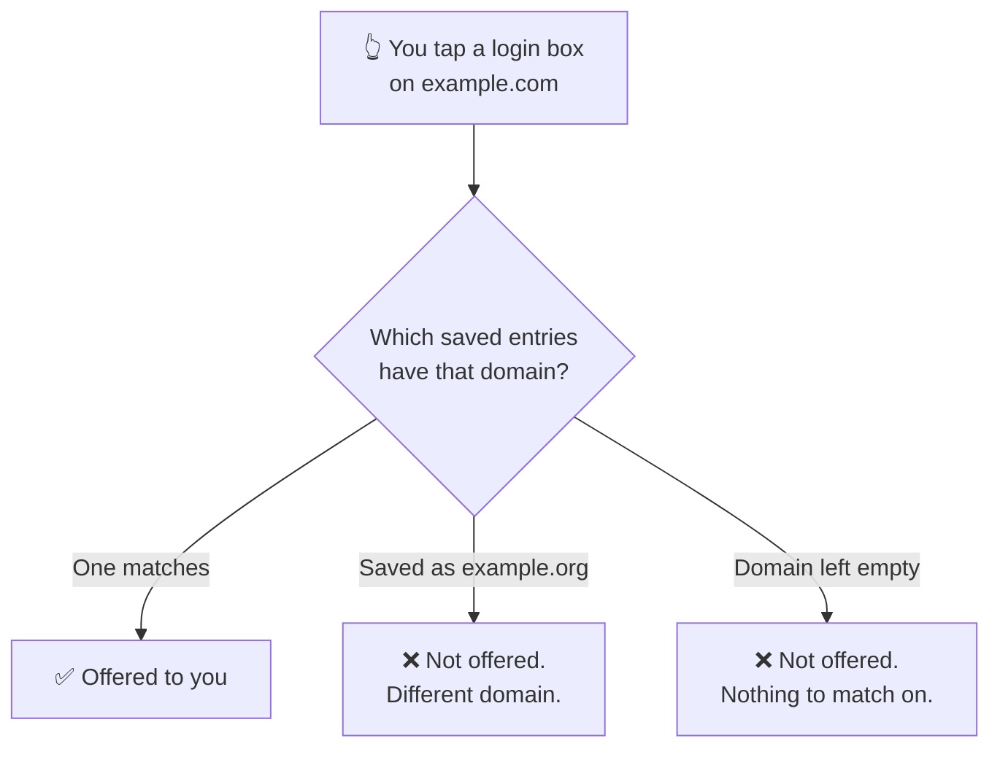
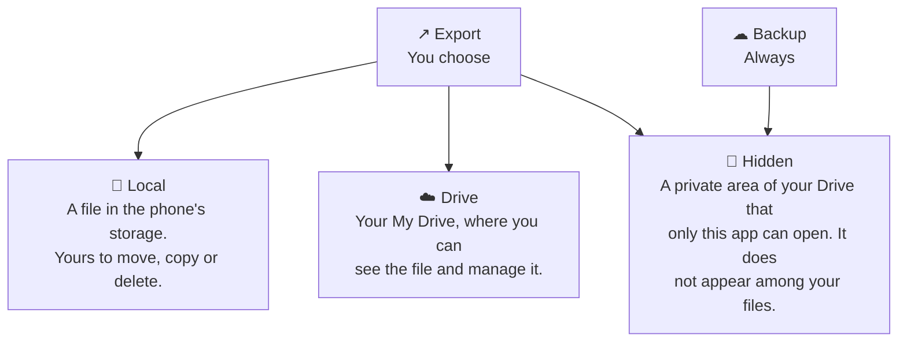

# Your vault

**Vault** is the first screen you land on, and one of three tabs along the
bottom: **Passwords**, **Generate**, **Settings**. Everything you have saved
lives here.

Before you add anything it says so plainly, with the one button worth pressing.

## The eight buttons

They sit at the top right in **two rows of four**, and the order is the order
you will use them in.

| Row | | | | |
| --- | --- | --- | --- | --- |
| **Top** | 🔍 Search | ⇅ Sort | ▽ Filter | ➕ **Add** |
| **Bottom** | ↗ Export | ⭳ Import | ☁ Backup | ✓✓ Select |

**Add** is the only one drawn in solid purple. That is deliberate: it is the
button you want on your first visit, and the other seven only start to matter
once there is something in the list.

| # | Button | What it does |
| --- | --- | --- |
| 1 | 🔍 **Search** | Opens a search box above the list. |
| 2 | ⇅ **Sort** | Changes the order of the list. |
| 3 | ▽ **Filter** | Narrows the list to weak, favourite, or a category. |
| 4 | ➕ **Add** | Creates a new entry. |
| 5 | ↗ **Export** | Writes your entries to a file — on the phone, or to your Drive. |
| 6 | ⭳ **Import** | Reads entries back in, from any of the same three places. |
| 7 | ☁ **Backup** | Backs up to, or restores from, a private area of your own Drive. |
| 8 | ✓✓ **Select** | Selection mode, for deleting several entries at once. |

Two of them deserve a warning before you use them, and it is at the end of this
page: [export and backup files never open on another phone](./backups.md).

## An entry in the list

Everything is on the card — there is no separate detail screen to open.

| On the card | |
| --- | --- |
| Category icon and name | Set when you created the entry |
| ❤️ Heart | Filled if you marked it a favourite |
| 👤 Username, 🌐 domain | Each with its own **copy** button |
| 🔒 Password | Masked, with an **eye** to reveal and a copy button |
| Time | When it last changed — "Just now" |
| Strength badge | A score out of 100 and a word: **86 Strong** |
| ✏️ / 🗑️ | Edit and delete |

The strength badge is a **number, not a five-step word scale**. It judges the
password itself, not how important the account is — that part is yours to weigh.

## Search

Button **1** opens a box above the list. It matches titles, usernames and
domains as you type, and the ✕ clears it.

## Sort

Five entries, and the first four are the sort itself:

| Option | Use it when |
| --- | --- |
| **Name (A–Z)** | You know what the entry is called |
| **Date** | You are looking for something you added recently |
| **Categories** | You want everything of one kind together |
| **Password Strength** | **Start here for a clean-up** — the weakest float to the top |
| **Refresh** | Not a sort. Re-reads the list from storage |

Each sort has a reverse: choosing the one already active flips it, so **Name**
gives you A–Z then Z–A, and **Date** gives you newest then oldest.

## Filter

Filters are how you find *work to do* rather than a specific entry:

- **Weak Passwords** — the ones worth regenerating first.
- **Favorites** — your own shortlist.
- **Categories** — the section below the line lists only the categories you
  have actually used, so it grows with your vault rather than showing you a menu
  of empty boxes.

They combine, and **Clear All** resets everything.

## Adding an entry

**Title** and **Password** are required — they carry the ✱. Everything else is
optional, but one of them changes how well the app works for you.

The password field carries three controls: an **eye** to reveal what you typed,
a **↻** to regenerate, and a **⚡** for a quick generated password without
leaving the form.

Under it, the strength bar does something more useful than colouring itself
green. It tells you *why*:

> • Built around the common word "test". Wordlists try it with every ordinary
> prefix and suffix, so those characters add almost nothing.

That verdict sat under a password the bar still rated **Strong**. Read the
sentence, not the colour.

| Field | Notes |
| --- | --- |
| **Title** ✱ | What you will search for later. "Gmail", not "Google account 2019". |
| **Username / Email** | What gets filled into the username box. |
| **Password** ✱ | Type it, or generate one — see [Generating passwords](./guide-generator.md). |
| **Domain Type** | **Web** or **Mobile App**. This is the important one. |
| **Website domain** | For Web: `example.com`. |
| **Select App** | For Mobile App: pick from the apps installed on your phone. |
| **Category** | For organising, and for the category filter. |
| **Add to Favorites** | Pins it to the Favorites filter. |
| **Notes** | Anything else. Encrypted like the rest of the entry. |

### Why the domain field matters more than it looks

Autofill matches on **domain**. If the domain is wrong or missing, the app has
no way to know the entry belongs to the login box you are looking at, and it
will not offer it.

Two habits save a lot of confusion later:

- **Fill the domain in when you create the entry**, not when autofill fails.
- For an app rather than a website, use **Mobile App** and pick it from the
  list. The app then writes the identifier for you and shows you what it chose —
  *Domain will be set to: `fi.hsl.app`*. Typing that by hand is how it ends up
  subtly wrong.

Subdomains like `mail.example.com` only match if subdomain matching is on, in
**Settings → Autofill Management**.

### Saving asks for your passcode

Writing to the vault means encrypting, and encrypting means building the key —
so the app asks for the passcode at the moment you save, not once per session.

There is no "unlocked for five minutes" mode. That is the same property that
makes the vault worth having.

## Deleting several at once

Button **8** turns on selection mode. The bar that appears offers **Select All**
and **Delete**, with a running count of what you have ticked.

That is the whole of it — selection mode is for deletion. Re-filing entries into
a category, or changing favourites, is done one entry at a time from the card.

:::danger Deleting cannot be undone

There is no bin to recover from. On a vault only you can open, a deleted entry
is gone from our side too.

:::

## Export, import and backup

Buttons **5**, **6** and **7** — and the one thing you must know about all three:

:::danger A backup or export only opens on the phone that wrote it

On every tier. These files protect you against losing data **on the phone you
still have** — a deletion by accident, a bad import, a vault reset. They are not
a way to move to a new phone, and no setting makes them one.

Read [Backups and exports](./backups.md) before you rely on one.

:::

### Export

You name the file and choose one of three places. The name is filled in for you
as `PasswordEpic_<date>_<time>.json`, with the date part selected so you can
type over it.

| Destination | Who can see the file |
| --- | --- |
| **Local** | You, and anything on the phone with storage access |
| **Drive** | You, in My Drive, like any other file you own |
| **Hidden** | Only this app. It is not listed in your Drive |

### Import

The same three places, so a file you exported anywhere can be brought back the
same way.

### Backup and restore

Backup does not ask where to put the file — it always uses the hidden area, and
names it `PasswordEpic_<date>_<time>.bak`. **What's Included** is not a set of
choices but a statement of scope:

All passwords · Categories & tags · Metadata & notes · Attachments · Change
history.

**Restore** shows you the file it is about to use — name, date, size — with
**Change** to pick a different one, and the same list under **Will Restore** so
there is no ambiguity about what is about to be written over what.

**We never receive any of these files.** They go to *your* Google account, not
ours. The app asks Google for two narrow permissions only — its own private
folder, and *files it created itself*. Neither one lets it look at the rest of
your Drive.

The hidden area is the default for backups because a backup is not a document —
it is not something you want to trip over in a folder listing, rename by
accident, or share by mistake.

## If something is missing

An entry that will not open, or a list that looks wrong, is covered in
[Common problems](./faq.md).

## Read next

- [Generating passwords](./guide-generator.md) — the ten templates, and which to use
- [Settings](./guide-settings.md) — every switch, and what it changes
- [Setting up autofill](./autofill.md) — so you stop typing passwords entirely
