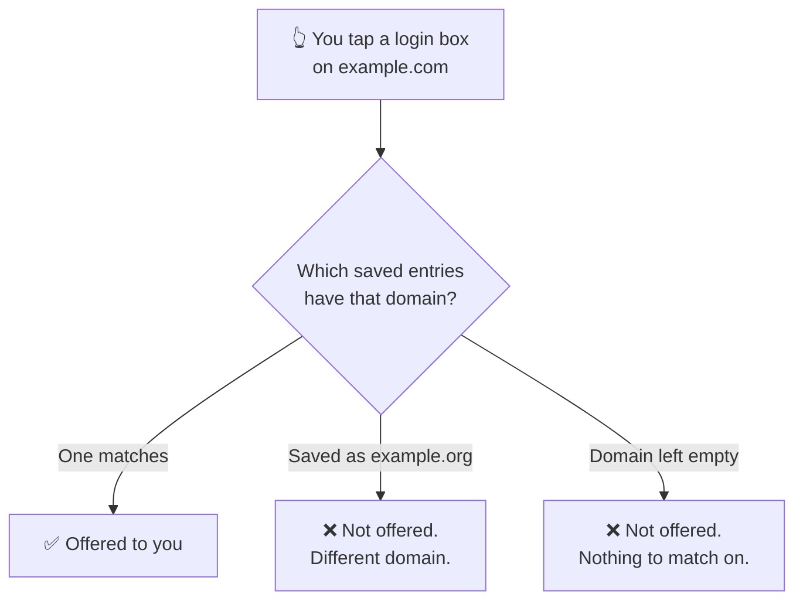

# Your vault

**Vault** is the first screen you land on. Everything you have saved lives here,
and everything you can do to it starts from the eight buttons across the top.

## The eight buttons

Left to right:

| # | Button | What it does |
| --- | --- | --- |
| 1 | 🔍 **Search** | Opens a search box. Matches titles, usernames and websites. |
| 2 | ⇅ **Sort** | Name A–Z or Z–A, newest or oldest, recently used, or by password strength. |
| 3 | ▽ **Filter** | Narrow the list: weak, reused, old, no 2FA, breached, favourites, or by category. |
| 4 | ➕ **Add** | Create a new entry. |
| 5 | ↗ **Export** | Write your entries to a file. |
| 6 | ⭳ **Import** | Read entries in from a file on this phone. |
| 7 | ☁ **Backup** | Back up to, or restore from, your own Google Drive. |
| 8 | ☑ **Select** | Selection mode, for doing one thing to several entries at once. |

Two of those deserve a warning before you use them, and they are covered further
down: [export and backup files never open on another phone](./backups.md).

### 2 · Sort

| Option | Use it when |
| --- | --- |
| Name (A–Z) / (Z–A) | You know what the entry is called |
| Date (newest) / (oldest) | You are looking for something you added recently |
| Recently used | The handful of logins you actually use daily |
| Password strength | **Start here for a clean-up** — the weakest float to the top |

### 3 · Filter

Filters are how you find work to do rather than a specific entry:

- **Weak passwords** — the ones worth regenerating first.
- **Reused passwords** — one breach anywhere becomes a breach everywhere. These
  are usually more urgent than the merely weak ones.
- **Old passwords** — not automatically a problem, but worth a look.
- **No 2FA** — accounts where a stolen password is the whole story.
- **Breached** — appeared in a known breach.
- **Favourites** and **Categories** — your own organisation.

You can combine them, and **Clear All** resets everything.

## Adding an entry

**Title** and **Password** are required. Everything else is optional, but one of
them changes how well the app works for you — see the next section.

| Field | Notes |
| --- | --- |
| **Title** ✱ | What you will search for later. "Gmail", not "Google account 2019". |
| **Username / Email** | What gets filled into the username box. |
| **Password** ✱ | Type it, or generate one — see [Generating passwords](./guide-generator.md). |
| **Domain type** | **Web** or **Mobile App**. This is the important one. |
| **Website domain** | For Web: `example.com`. |
| **Select app** | For Mobile App: pick from the apps installed on your phone. |
| **Category** | For organising, and for the category filter. |
| **Add to favourites** | Pins it to the Favourites filter. |
| **Notes** | Anything else. Encrypted like the rest of the entry. |

### Why the domain field matters more than it looks

Autofill matches on **domain**. If the domain is wrong or missing, the app has
no way to know the entry belongs to the login box you are looking at, and it
will not offer it.

Two habits save a lot of confusion later:

- **Fill the domain in when you create the entry**, not when autofill fails.
- For an app rather than a website, use **Mobile App** and pick it from the
  list. The app writes the right identifier for you; typing it by hand is how
  it ends up subtly wrong.

Subdomains like `mail.example.com` only match if subdomain matching is on, in
**Settings → Autofill Management**.

## Opening an entry

Tap any entry to open it. To **reveal** the password you will be asked for your
fingerprint or your passcode — every time, on purpose. There is no "unlocked for
five minutes" mode.

From an open entry you can:

- **Copy** the username, the password or the website.
- **Reveal** the password on screen (after authenticating).
- **Favourite** it with the star.
- **Edit** or **Delete** it.

The strength bar under each entry runs **Weak → Fair → Good → Strong → Very
strong**. It judges the password itself, not how important the account is —
that part is yours to weigh.

## Doing several at once

Button **8** turns on selection mode. Tick the entries you want, then:

| Action | Notes |
| --- | --- |
| **Move to category** | Re-file several entries in one go. |
| **Manage tags** | Add tags, or remove existing ones. |
| **Add / remove favourites** | |
| **Export** | Just the selected entries. |
| **Delete** | Asks for confirmation, and **cannot be undone**. |

## Export, import and backup

Buttons **5**, **6** and **7**, and the one thing you must know about all three:

:::danger A backup or export only opens on the phone that wrote it

On every tier. These files protect you against losing data **on the phone you
still have** — a deletion by accident, a bad import, a vault reset. They are not
a way to move to a new phone, and no setting makes them one.

Read [Backups and exports](./backups.md) before you rely on one.

:::

- **Export** writes a file you choose the contents of: metadata, categories,
  tags, notes, history, attachments.
- **Import** reads entries back in from a file on this phone.
- **Backup** uses **your own** Google Drive. We never receive the file.

## If something is missing

An entry that will not open, or a list that looks wrong, is covered in
[Common problems](./faq.md).

## Read next

- [Generating passwords](./guide-generator.md) — the generator, and which preset to use
- [Settings](./guide-settings.md) — every switch, and what it changes
- [Setting up autofill](./autofill.md) — so you stop typing passwords entirely
