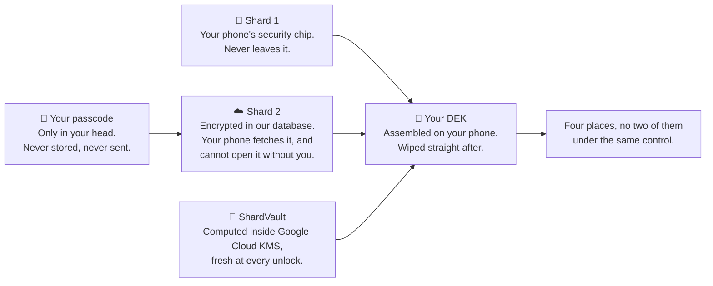
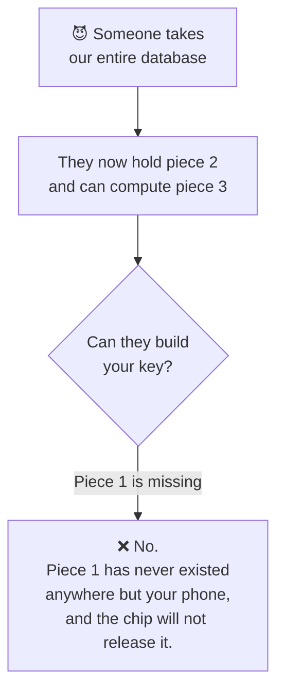
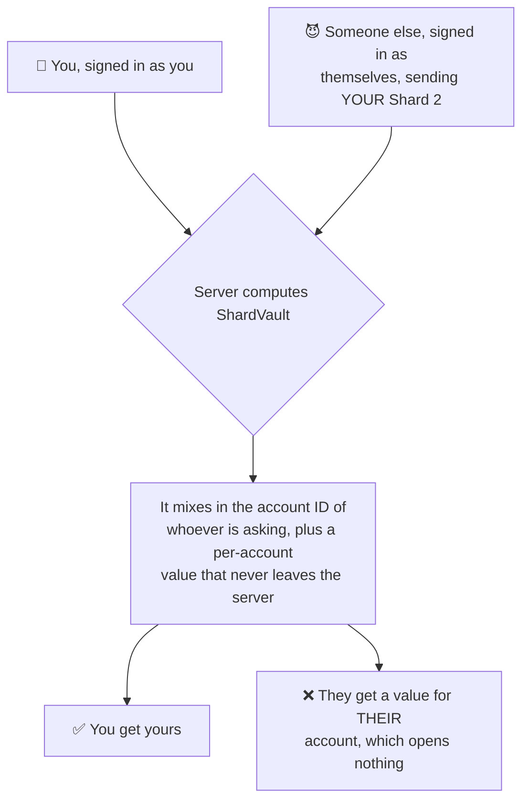
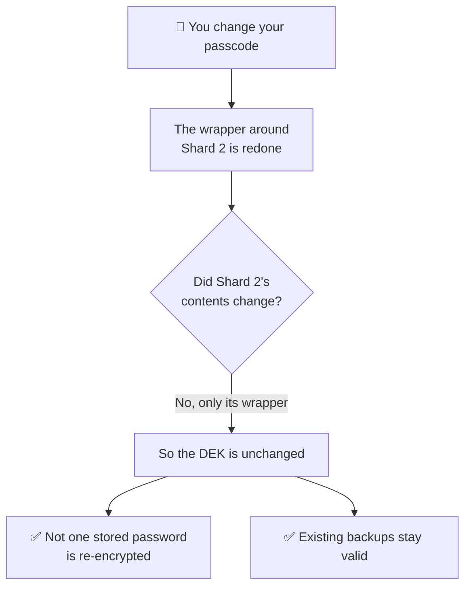

# How it works

Every password manager says only you can read your data. This page describes the
structure that makes it true here, so you can judge the claim instead of
trusting it.

## The key is never stored

The key that decrypts your vault — the **DEK**, for *data encryption key* — is
not saved
anywhere. Not on your phone, not on our servers, not in a backup. It is rebuilt
from separate pieces each time you unlock, used for one operation, and wiped
from memory immediately after.


The app opens with the same claim this page is about to unpack — *your key is
built on this device and stays here*. What follows is how that is arranged so
that it is true rather than promised.

Those pieces are called **shards**, and they live in four different places.



| Piece | Where it lives | Can it leave? |
| --- | --- | --- |
| **Your passcode** | Your memory, and nowhere else | It is never stored or transmitted at all |
| **Shard1** | Inside your phone's StrongBox or TEE | **No.** Non-exportable by hardware design |
| **Shard2** | Encrypted in our database. Your phone fetches it | Only as ciphertext, and alone it opens nothing |
| **Pepper** | A Google Cloud KMS hardware security module | **Never** — not even in a reply to our own servers |
| **Shard4** | Google Cloud Secret Manager | Never reaches your phone |

Notice what that list really is: **four separate places, and no two of them
under the same control.** Your memory, your phone's hardware, our database, and
Google's key service. Taking any one of them is not enough.

The pepper and Shard4 are never handed over. Our server uses them to compute a
third value, **ShardVault**, and returns only that. Then, on your device, in
native code:

```
DEK = Shard 1  ⊕  Shard 2  ⊕  ShardVault
```

Miss any one of the three and there is no key.

## Why that structure matters

We hold two of the three. We can compute ShardVault, and we hold Shard 2 as
ciphertext. **We still cannot open your vault**, because Shard 1 has never
existed anywhere but inside your phone's secure hardware, and the hardware will
not export it — not for us, not for you, not for an attacker holding your
account.

That is the whole argument. It rests on hardware behaviour rather than on our
good intentions, which is the only version of this claim worth making.



## What our servers actually handle

Being precise here matters more than sounding absolute.

- **Your passcode is never transmitted.** On Titanium it never even exists in a
  form a server could test: the OPAQUE protocol proves you know it without
  revealing anything that could be attacked offline.
- **Your passwords are encrypted before they are stored, and are never uploaded
  to our database.** Backups go to *your* Google Drive.
- **Shard 2 is handled by our server** during key derivation, and a copy is
  stored encrypted. On its own it opens nothing.
- **ShardVault is computed for you, per unlock.** The pepper it is keyed with
  stays inside the Cloud KMS hardware module and is never in a response.
- We store what an account needs to exist: your email, your security tier, your
  device's model name and public key, and security events such as sign-ins and
  device changes.

### ShardVault is bound to your account

The server does not compute ShardVault from Shard 2 alone. It mixes in your
account ID and a per-account value that never leaves the server, so a signed-in
user cannot post someone *else's* Shard 2 and be handed that person's
ShardVault.

This matters because Shard 2 is the shard that can travel. Without that binding,
anyone who obtained a copy of your Shard 2 could have asked our own server to
turn it into two thirds of your key.



## Changing your passcode does not re-encrypt anything

A passcode change re-wraps the value that unlocks Shard 2. Shard 2's *contents*
do not change, so ShardVault does not change, so the DEK does not change.

Practically: changing your passcode is fast, it never touches your stored
passwords, and existing backup files stay valid.



## Why we cannot help if you forget the passcode

We have nothing to check a passcode against, and no path to the key without your
device. There is no reset link, no recovery question, and no internal override —
which also means there is no override that can be demanded of us.

That is the trade. **A service able to restore your vault is a service able to
read it.**

## Where the honest limits are

- **Backups and exports open only on the device that created them.** They carry
  a layer of encryption tied to that phone's secure hardware, so copying the
  file to another phone does not help. See [Backups and exports](./backups.md).
- **Screen capture is handled, with one gap.** A screenshot is refused outright
  while a PasswordEpic screen is showing, and a recording of the app comes out
  black — keyboard included. The gap is the autofill dialog, which sits over a
  different app that is being recorded normally; the app refuses passcode entry
  there while a recording runs, but detecting one needs Android 15.
- **A keyboard you install can read what you type**, in any app. If that matters
  to you, use the keyboard that shipped with your phone; PasswordEpic warns you
  when the active one did not.
- **Silver, the free tier, is software-only.** It encrypts with AES-256-CTR plus
  a separate authentication tag, in JavaScript, without hardware key storage.
  See [Security tiers](./security-tiers.md).

## What you can do at any time

- **Settings → Reset Account** erases the vault and your account data from our
  servers immediately.
- Back up to **your own** Google Drive, or not at all.
- On paid tiers, see which device currently holds the account, and release it
  from that device.

## Read next

- [Security tiers](./security-tiers.md) — what each tier actually changes
- [Your passcode](./your-passcode.md) — the one secret you type, and how strong it must be
- [Backups and exports](./backups.md) — what they protect you against, and what they do not
- [One device per account](./your-device.md) — how it is enforced, and what it is not
