# What these words mean

Security products hide behind vocabulary. This page is the opposite: every term
used anywhere on this site, in plain words and in a diagram, with what it
actually buys you and where it stops.

If something here is still unclear, that is our fault rather than yours — write
to [support@passwordepic.com](mailto:support@passwordepic.com) and we will fix
the wording.

## The basics

### Passcode

The one secret you type. Not a PIN and not a master password — those were two
separate things in an older version of the app, and combining them into one was
a security improvement rather than a simplification. See
[Your passcode](./your-passcode.md).

### Vault

Everything you have saved in the app. When this site says "we cannot open your
vault", it means exactly that and not "we promise not to".

### Vault key

The key that decrypts your saved passwords. It is never stored anywhere — not on
your phone, not on our servers. It is rebuilt each time you unlock, used once,
and wiped.

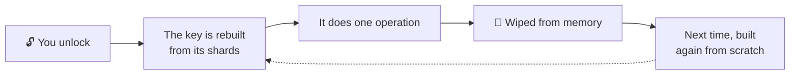

### DEK

The technical name for the vault key: **data encryption key**. It is what you
will see in the app's own developer documentation, and in the formula itself:

```
DEK = Shard 1 ⊕ Shard 2 ⊕ ShardVault
```

There is one key here under two names. These pages say **vault key**, because
that is what it does. The acronym is written down here so that meeting `DEK`
somewhere else does not send you looking for a second key that does not exist.

The **⊕** is XOR, a way of combining values with two properties that matter
here: every input is required to get the result back, and holding some of the
inputs tells you nothing at all about the rest.

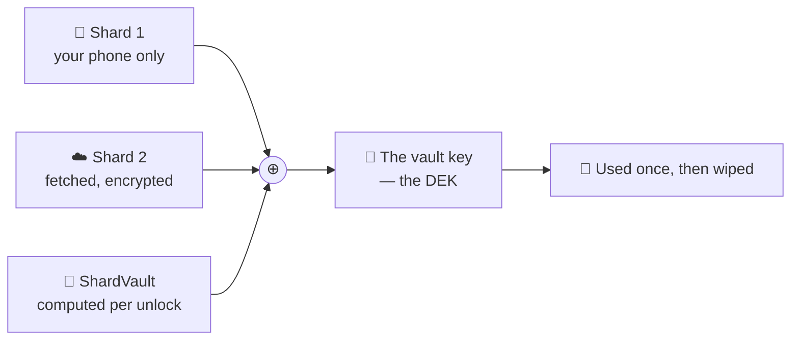

### Shard

One piece of the vault key. The key is split into pieces that live in different
places, so no single place — including ours — holds enough to rebuild it.

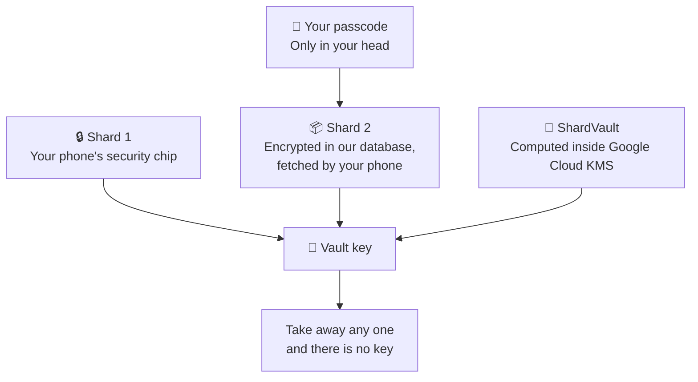

All three are needed. See [How it works](./how-it-works.md).

You may notice there is no "Shard 3" in that picture. There is one — it is the
**pepper** — and it is not drawn because it never travels. It stays inside
Google's hardware and is what ShardVault gets computed *with*. See
[Cloud KMS and the pepper](#pepper).

### ShardVault

The third piece of the vault key, and the only one that is not stored anywhere —
because between unlocks it does not exist.

Shard 1 and Shard 2 are values that sit somewhere and get fetched. ShardVault is
not fetched. It is **computed**, from scratch, every time you unlock, inside a
Google Cloud hardware module, from your Shard 2 and the pepper.

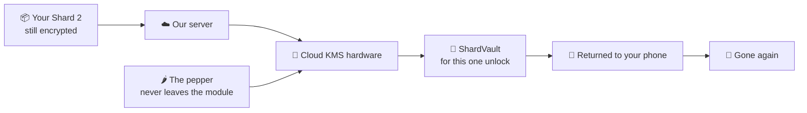

Two things follow from that:

- **There is nothing to steal between unlocks.** A value that does not exist
  cannot be copied out of a database.
- **It is tied to your account, not just to your Shard 2.** Someone who somehow
  obtained your encrypted Shard 2 and asked our server to process it would get a
  different value back, because who is asking is mixed into the calculation. See
  [How it works](./how-it-works.md).

### Zero-knowledge

A system built so the people running it genuinely cannot read what you store,
rather than one where they can and have promised not to.

There is a simple test, and it works on any service:

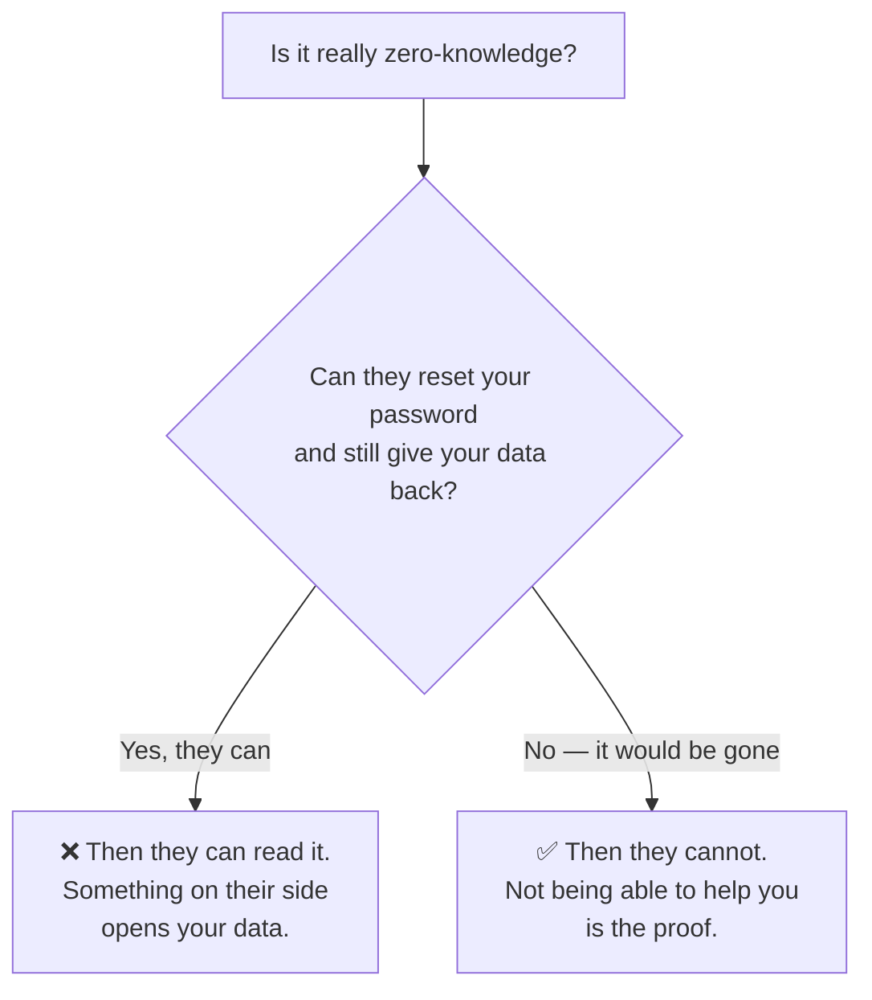

## On your phone

### StrongBox and TEE

Two names for the same idea: **a separate, locked-down chip inside your phone
that stores keys and refuses to hand them out.**

A key created inside it can be *used* — you can ask the chip to encrypt or
decrypt something — but there is no command that says "give me the key itself".

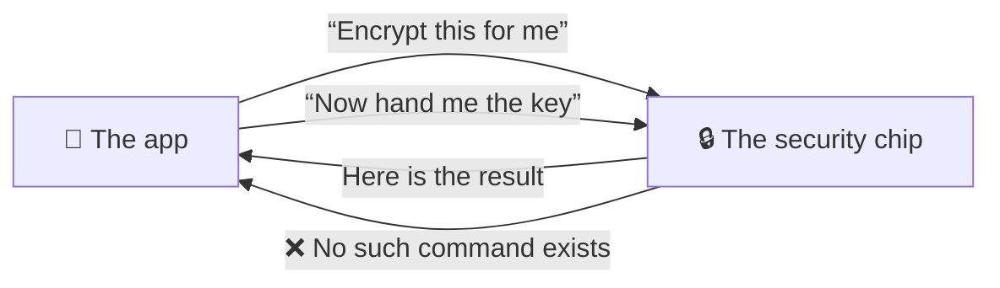

Not for the app, not for us, not for someone who has rooted the phone.

**TEE** (Trusted Execution Environment) is a protected area inside the main
processor. **StrongBox** is a physically separate chip, which is stronger. Your
phone has one, the other, or neither, depending on the model. It is the single
thing everything else on this site rests on.

### Argon2id

A deliberately slow, deliberately memory-hungry way of turning your passcode
into a key. The point is the cost, and who pays it:

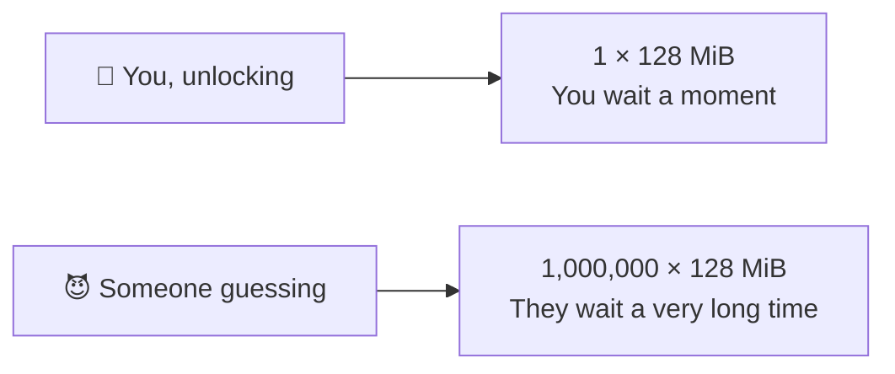

You pay it once, when you unlock. Someone guessing your passcode pays it *on
every guess* — which is what turns "millions of guesses per second" into
something far slower and far more expensive.

### Entropy, and "45 bits"

A way of measuring how hard a passcode is to guess that accounts for the
alphabet you chose, not just the length.

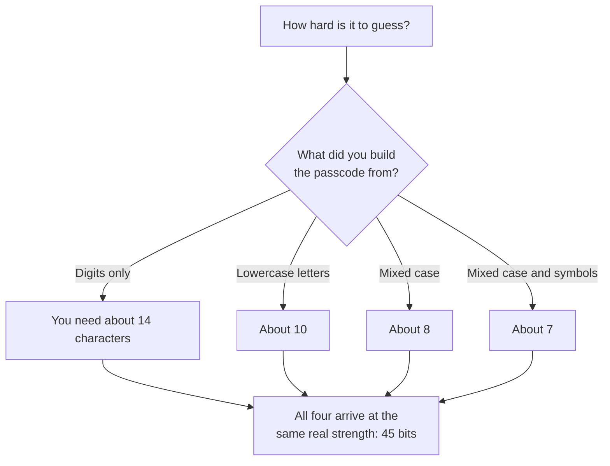

Eight digits and eight mixed-case characters with symbols are not remotely
comparable — the second has roughly 40 million times more possibilities.
Counting characters cannot express that; counting bits can. See
[Your passcode](./your-passcode.md).

### Screen capture protection

Android lets an app mark its own windows as protected. What that means depends
entirely on *how* the screen is being captured, and the two cases are not alike:

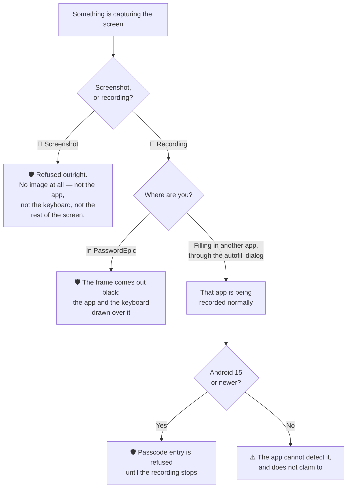

A **screenshot** taken while a protected screen is showing is refused for the
whole display — you get a message from Android and no image.

A **recording** is not refused, but while you are in the app there is nothing in
it to read: the frame is black, keyboard included. The case that needs more is
the autofill dialog, which sits over a *different* app that is being recorded
normally — which is why the app refuses to let you type a passcode at all while
a recording is running.

### Keyboard trust

The app checks whether the keyboard you are using came with the phone or was
installed later, and warns you if it was installed later.

**What that is worth, exactly:** a keyboard that shipped with the phone is not
automatically safe, and one you installed from the Play Store is almost
certainly fine. It is a nudge, not a verdict — a warning you can dismiss, never
a block. The app deliberately keeps no list of "approved" keyboards, because an
app can claim any name it likes and a name is not proof of identity.

### Overlay and tap-hijacking

An **overlay** is a window one app draws on top of another. Used honestly it is
a chat head or a screen dimmer. Used dishonestly:

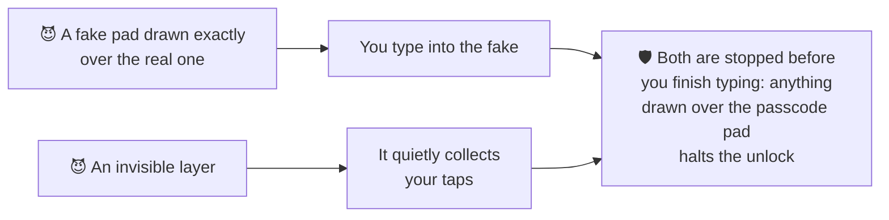

That second one is **tap-hijacking**, or "tapjacking". Both skip encryption
completely, by getting to your secret while you are typing it.

### Accessibility services

An Android permission built for screen readers and similar tools.

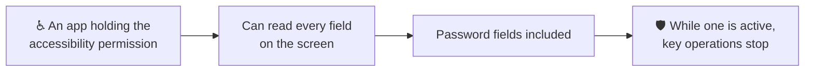

Plenty of legitimate apps ask for it, which is exactly why it is such a popular
thing for malware to abuse.

### Root, tampering and hooking

Three different ways the app can stop being the app you installed:

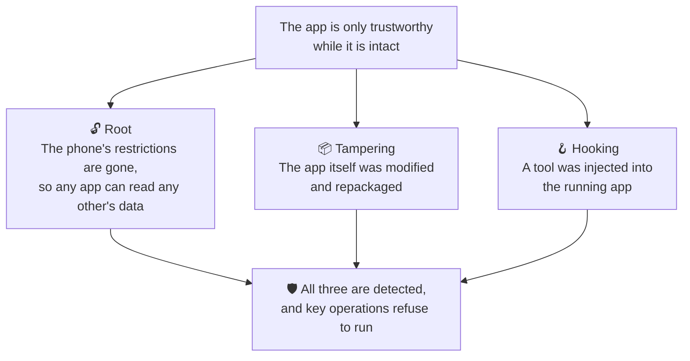

## Between your phone and us

### Certificate pinning

Normally your phone accepts any website certificate signed by any authority it
trusts — including certificates a workplace profile or an installed root has
added. That is exactly how connections get intercepted.

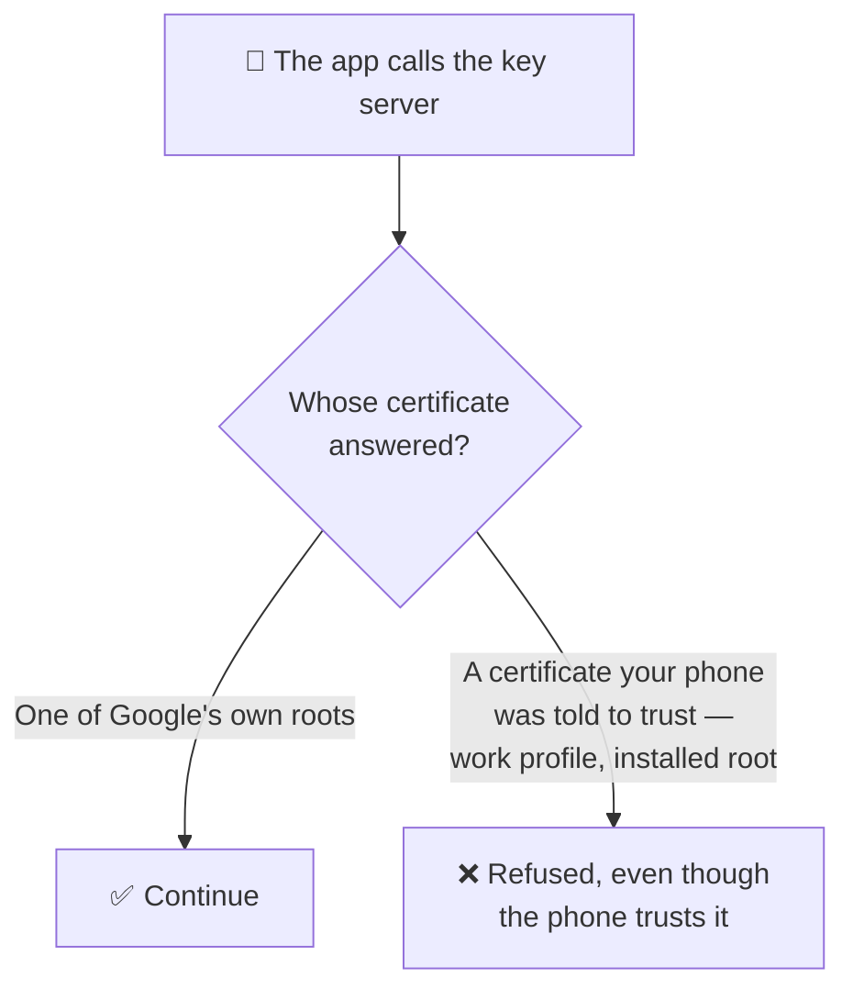

Pinning narrows it: the call that returns part of your vault key accepts **only
a fixed set of Google's own root certificates**.

### TLS 1.3

The current version of the encryption used by every `https://` connection.
Worth naming only because "we use HTTPS" is not a security feature in 2026 — it
is the floor.

### Google Play Integrity

A Google service that answers one question: *is this the genuine, unmodified
app, running on a genuine, uncompromised Android device?*

The answer is checked **on our server**, not on the phone — and that is the
whole point:

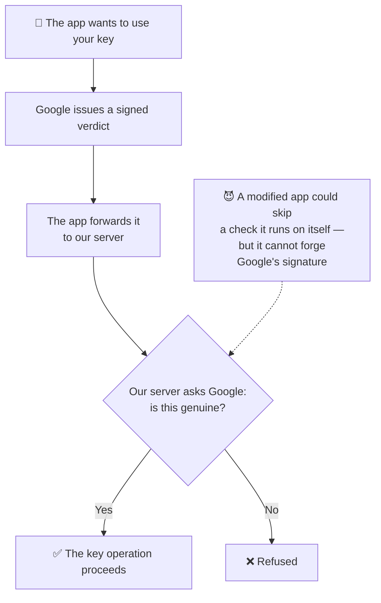

### Bot scoring on sign-in

An invisible check on each sign-in that scores how likely the attempt is to be
automated. You see nothing at all unless something looks wrong. It exists to
make mass, automated attacks against accounts expensive.

It runs as a Google service, so its use falls under
[Google's privacy policy](https://policies.google.com/privacy) as well as ours.

## On our side

### Cloud KMS and the "pepper" {#pepper}

**Cloud KMS** is Google's key management service. Part of it runs inside a
**hardware security module** — the server-side twin of your phone's security
chip, and it behaves the same way:

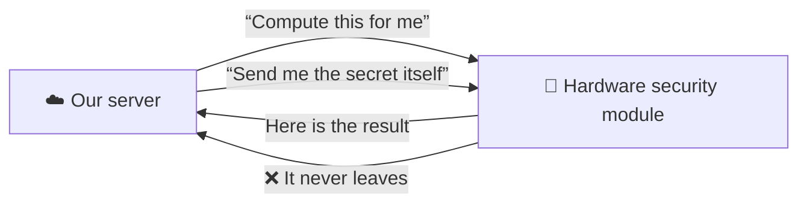

The **pepper** is a secret held inside one of those modules — it is Shard 3.
Our server uses it to compute **ShardVault**, the third piece of your vault key. The pepper itself never leaves
the module, and never appears in a reply — not even to our own code.

### Firestore

The Google database our servers use.

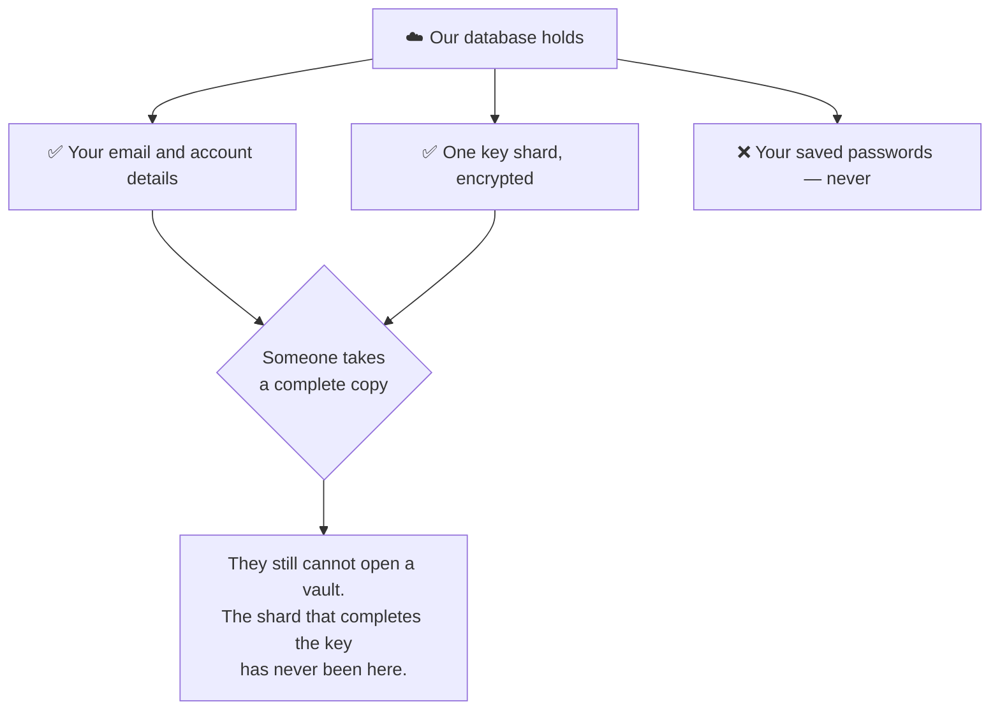

### OPAQUE

A way of proving you know a password without the other side ever learning
anything it could test guesses against, even offline.

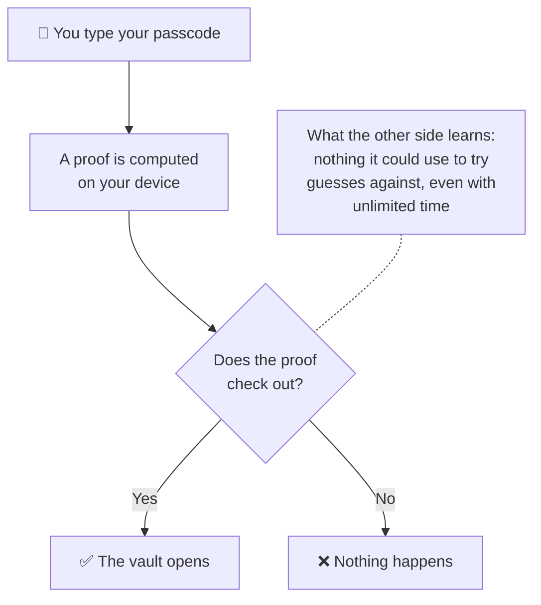

On the Titanium tier this replaces the stored value that unwraps your vault, so
nothing capable of opening it is written to disk in any form. See
[Security tiers](./security-tiers.md).

### Rust crypto core

Part of the app is written in the Rust language, for one specific reason: it can
**erase secrets from memory** and be certain they are gone.

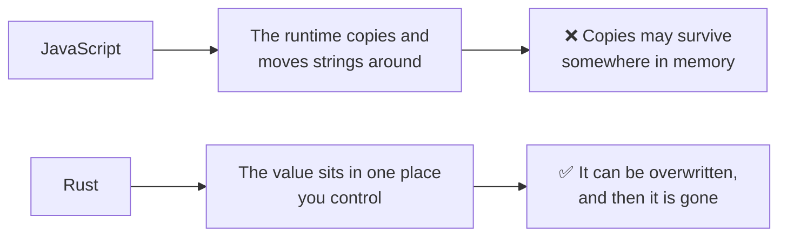

## Read next

- [How it works](./how-it-works.md) — the shards, and why the split matters
- [Security tiers](./security-tiers.md) — which of these apply to which tier
- [Your passcode](./your-passcode.md) — the one secret you actually type
- [Common problems](./faq.md) — the messages the app can show you
