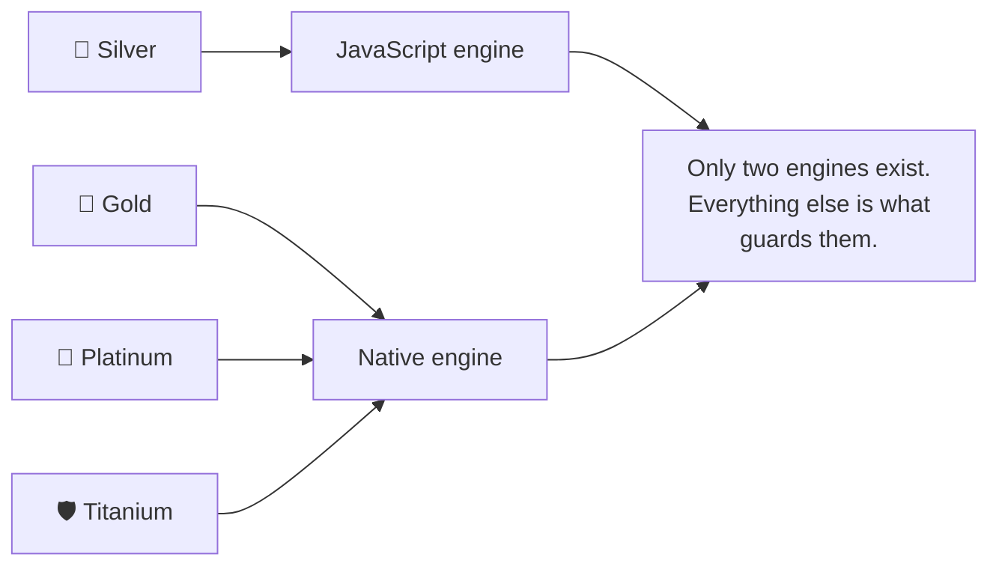
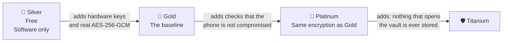
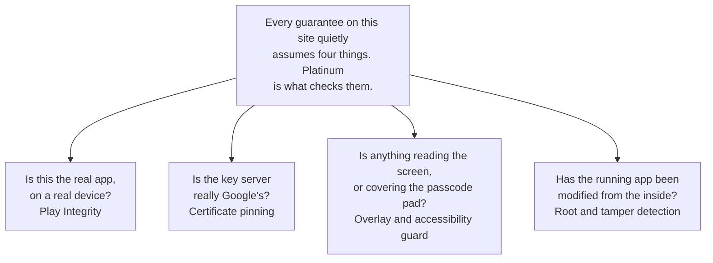
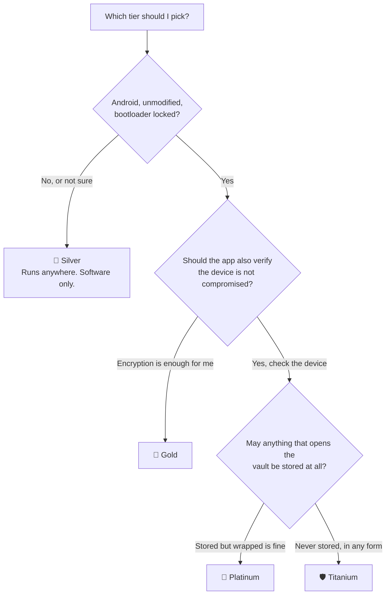

# Security tiers

PasswordEpic ships four tiers. Each one is the tier below it **plus a delta** —
they are not four separate products, and reading them that way is the fastest
route to a wrong conclusion.

Two things are true across all four, and knowing them first saves reading the
rest twice.

1. **You type one secret — the passcode.** On every tier. Whatever unlocks the
   rest of the chain is machine-generated and never shown to anyone. See
   [Your passcode](./your-passcode.md).
2. **There are only two crypto engines.** Silver runs in JavaScript. Gold,
   Platinum and Titanium all run the same native engine, and differ only in what
   *guards* it or what *unwraps* the key.

## At a glance

| | 🥈 Silver | 🥇 Gold | 💎 Platinum | 🛡️ Titanium |
| --- | --- | --- | --- | --- |
| **Engine** | JavaScript | Native (Kotlin) | Same as Gold | Same as Gold |
| **Vault cipher** | AES-256-CTR + HMAC-SHA256 | AES-256-GCM | Same as Gold | Same as Gold |
| **Shard 1 stored in** | Encrypted app storage | StrongBox / TEE | Same as Gold | Same as Gold |
| **Shard 2 unwrapped by** | Vault secret | Vault secret | Vault secret | **OPAQUE export key** |
| **Cloud KMS shard** | ✗ | ✓ | ✓ | ✓ |
| **Key wiped from memory after use** | ✗ | ✓ | ✓ | ✓ |
| **Runtime hardening** | ✗ | ✗ | ✓ | ✓ |
| **Rust crypto core** | ✗ | ✗ | ✗ | ✓ |
| **Devices per account** | Unlimited | One | One | One |
| **Requires Android** | ✗ | ✓ | ✓ | ✓ |

## 🥈 Silver — the free tier

The only tier that works without the Android native module, and the fallback
when nothing else is possible.

- Encryption runs in **JavaScript**: AES-256-CTR with a separate HMAC-SHA256
  authentication tag.
- Shard 1 lives in encrypted app storage rather than in a hardware module.
- The vault key is `Shard 1 ⊕ Shard 2`. There is no Cloud KMS shard and no
  network call to unlock.
- Unlimited devices.

:::caution What Silver does not have

**No hardware key storage** and **no guarantee the key is wiped from memory** —
JavaScript strings cannot be reliably erased. These are accepted trade-offs for
a free tier that must run anywhere, not defects. But they are real, and Silver
should never be described as hardware-backed or as AES-256-GCM.

:::

## 🥇 Gold — the security baseline

The recommended tier, and where the design's actual guarantees begin. Everything
cryptographic moves into native code.

- **AES-256-GCM**, in a native engine rather than in JavaScript.
- **Shard 1 is generated inside StrongBox or the TEE** and is non-exportable by
  hardware design.
- A **third shard is computed inside Google Cloud KMS**, keyed by a value that
  never leaves the hardware security module.
- The vault key is **derived fresh per operation and zeroed straight after** —
  never cached, never written to disk, never logged.
- One device per account. See [One device per account](./your-device.md).

## 💎 Platinum — proving the device deserves Gold

Platinum is **cryptographically identical to Gold**. There is no separate
Platinum cipher, no stronger key, no extra shard. If you are looking for one, it
does not exist.

That does not make it cosmetic. Every guarantee on this site assumes the app is
the real app, running unmodified, on a device that has not been rooted, hooked
or overlaid. Platinum is what turns that assumption into something checked:

- **Play Integrity**, verified on our server rather than in the app — a
  client-side verdict would be trivially patched out by exactly the attacker it
  targets.
- **Certificate pinning** on the call that returns part of your key, so a
  device-trusted certificate cannot be used to intercept it.
- **Overlay and accessibility guards** — something drawing over the passcode pad,
  or reading the screen, stops key operations.
- **Tamper and root detection.**

## 🛡️ Titanium — nothing that opens the vault is ever stored

Titanium keeps the entire Gold engine and changes exactly one thing: what
unwraps Shard 2.

On Silver, Gold and Platinum that is a **vault secret** — 256 random bits, stored
wrapped under your passcode. On Titanium it is an **OPAQUE export key**,
re-derived from your passcode each time and never written to disk in any form,
not even wrapped.

It also adds a **Rust crypto core**, which is what lets those values be zeroed in
native memory — something JavaScript cannot do at all.

## Which one you get

- **Silver** is always available.
- **Gold, Platinum and Titanium** require Android and the native module.

On a supported Android device you choose your tier rather than having one
detected for you.

:::warning There is no iOS version

There is no iOS build, and the hardware tiers have no iOS equivalent to be
ported to. Android 7.0 and above.

:::

## Read next

- [How it works](./how-it-works.md) — the shards, and why the split matters
- [Your passcode](./your-passcode.md) — the single credential on every tier
- [Backups and exports](./backups.md) — why files never move between devices
