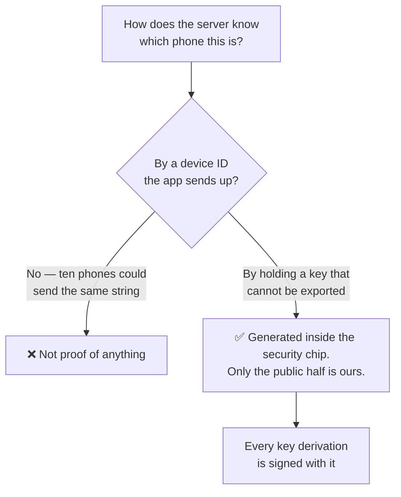
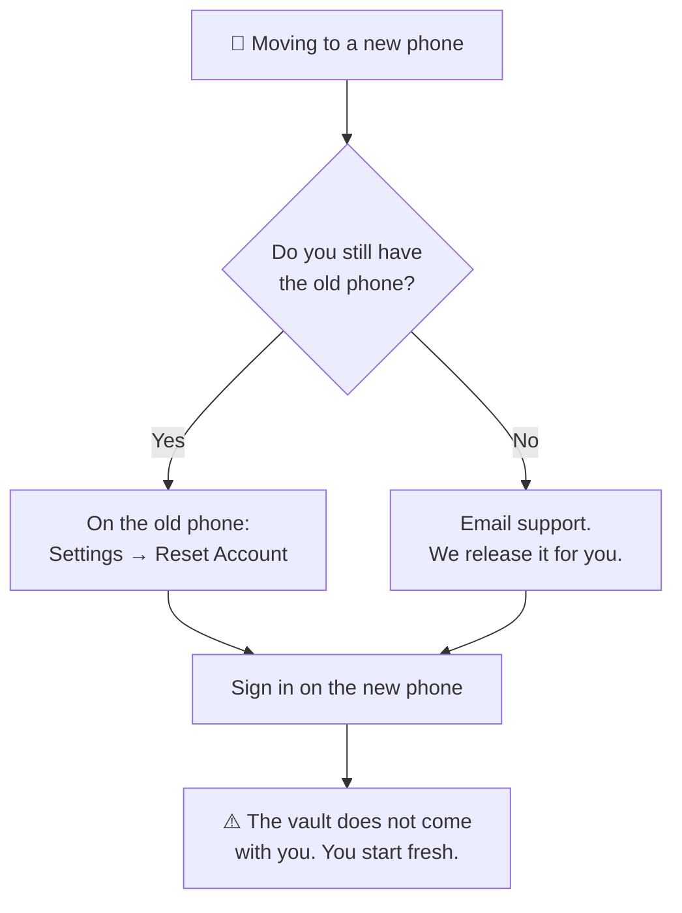

# One device per account

On **Gold, Platinum and Titanium**, an account runs on exactly one device at a
time. **Silver is exempt** — unlimited devices on the free tier is a product
decision, not an oversight.

## What this is, and what it is not

It is **seat licensing**: one subscription cannot be spread across ten phones.

It is **not** what keeps your passwords secret. Shard 1 lives in your phone's
secure hardware and never leaves it, so a second device could never decrypt the
first device's vault regardless — it would only ever get an empty vault of its
own.

What the rule adds is that the second device gets **no working vault at all**,
and that the account visibly belongs to one named phone. Calling it a
confidentiality control would be overselling it, and would take credit away from
the thing that actually provides that.

## How it is enforced

Not by a device ID. A device ID is just a string the app sends, and ten phones
could send the same one.

Instead, your phone proves its identity by **holding a key it cannot export** —
generated inside StrongBox or the TEE, with only the public half known to our
servers. Each key derivation is signed with it.



The enforcement point is the same call that returns part of your DEK. On
the paid tiers:

```
no successful key derivation  =  no DEK  =  no vault
```

That closes the usual escape hatch for this kind of check. Going offline does not
bypass it; it just means no vault either.

## Moving to a new phone



:::warning Releasing an account does not carry the vault across

It lets you start fresh on the new device. The old vault stays encrypted with a
key that existed only inside the old phone's secure hardware. See
[Backups and exports](./backups.md).

:::

**If you still have the old phone:** open PasswordEpic on it and choose
**Settings → Reset Account**. That erases the data on that device and frees the
account. Then sign in on the new phone.

**If you no longer have it:** email
[support@passwordepic.com](mailto:support@passwordepic.com) from — or mentioning
— the email address you sign in with, and we will release it for you.

This is the one case where contacting support is genuinely the only way forward:
releasing a device normally requires that device's own hardware signature, so
when the phone is gone, we are what remains.

## "Account is active on another device"

That message means the account is currently bound to a different phone. Follow
the steps above to release it.

A second sign-in is refused outright rather than quietly allowed and then
half-working — the failure is visible on purpose.

## Read next

- [Backups and exports](./backups.md) — why the old vault does not come with you
- [Security tiers](./security-tiers.md) — which tiers the rule applies to
- [Support](/support) — how to reach a human
