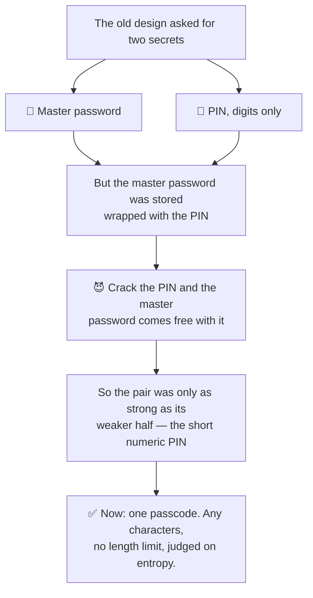
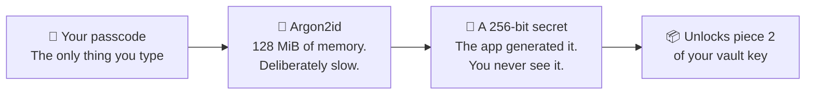
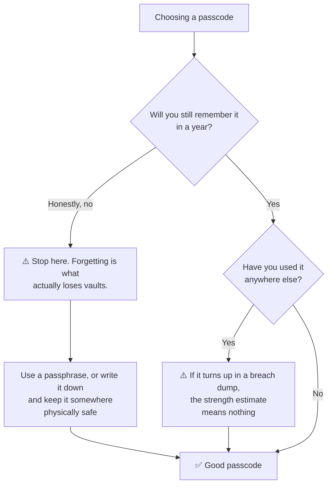

# Your passcode

> **You know exactly one secret. Everything else is machine-generated.**

That sentence governs this whole page. There is no master password *and* a PIN,
no recovery phrase, no security questions. One passcode, on every tier.

## Why one secret and not two

The app used to ask for two: a master password and a PIN. That looked like two
factors. It was not.

The master password was stored **wrapped with the PIN** — so anyone who cracked
the PIN got the master password for free. Its length and complexity contributed
nothing to an offline attack. The pair had exactly the strength of its weaker
half, and the weaker half was a short numeric PIN.

Collapsing it to one secret removed the illusion and raised the ceiling:

| | Before | Now |
| --- | --- | --- |
| Secrets you type | 2 | **1** |
| Alphabet | PIN was digits only | **Any characters** |
| Length limit | 12 | **None** |
| Strength ceiling | The weaker of the two | Your passcode, governed by an entropy rule |

What used to be the master password did not disappear — it stopped being
something a human chooses. It is now 256 random bits the app generates, that you
never see and never type.



## What your passcode actually does

```
your passcode  →  Argon2id  →  a 256-bit secret  →  unwraps Shard 2
```

**Argon2id** is a deliberately expensive function: **128 MiB of memory and 10
passes** for a single evaluation. You pay that once, when you unlock. An
attacker who has stolen your phone pays it *on every guess*, which is what turns
a modest passcode into a genuinely slow target.

On Titanium the middle step is an OPAQUE export key instead, derived the same
expensive way but never stored at all. See
[Security tiers](./security-tiers.md).



## Strength is measured in bits, not characters

A "minimum 8 characters" rule cannot express that eight digits and eight mixed
characters are nothing alike:

| Passcode | Possible values | Rough time to exhaust |
| --- | --- | --- |
| 8 digits | 100 million | Hours |
| 8 lowercase letters and digits | 2.8 trillion | Years |
| 8 mixed case with symbols | 4.3 quadrillion | Thousands of years |

So the requirement is expressed in **bits of entropy**, and the length you need
falls out of the alphabet you chose:

| If you use | You need about |
| --- | --- |
| Digits only | 14 characters |
| Lowercase letters | 10 characters |
| Lowercase and digits | 9 characters |
| Mixed case | 8 characters |
| Mixed case with symbols | 7 characters |

**45 bits is the floor** — below it the app will not let you set a passcode.
60 bits is the target it nudges you towards.

A passcode made only of digits has to be longer. One drawn from a wide alphabet
has earned the right to be shorter. Both land at the same real strength.

### The estimate is deliberately crude

Counting characters in an alphabet assumes you picked them at random. Real
people pick words, dates and keyboard runs. The app claws back the most obvious
cases — repeats and ascending or descending runs — so `1111111111111` and
`abcdefghij` do not pass on length alone.

It is not a password cracker's model and is not meant to be. Treat 45 bits as a
floor that blocks the clearly bad, not as a promise about the clearly good.

## Choosing one you will not forget

This is the part that actually loses vaults. Not attackers — forgetting.



- **A passphrase beats a password.** Four or five unrelated words clear 45 bits
  comfortably and survive being typed on a phone keyboard.
- **Do not reuse a passcode you use elsewhere.** If it appears in a breach dump,
  the entropy estimate above becomes meaningless.
- **Write it down and store it somewhere physically safe** if that is what it
  takes. A passcode in a locked drawer at home is a far smaller risk than a
  passcode you are relying on remembering in six months.

:::danger There is no recovery

If you forget your passcode, the vault cannot be opened. Not by support, not by
us, not by anyone. Your passcode never reaches our servers, so we have nothing
to check it against and nothing to reset.

This is the direct cost of a key we genuinely cannot access. Please decide now
how you will remember it.

:::

## Changing it

Changing your passcode is fast and safe. It re-wraps the machine-generated
secret; the vault key itself does not change, so **none of your stored passwords
are re-encrypted** and existing backup files stay valid.

## One small asymmetry, on purpose

Setting a passcode enforces the entropy rule. **Entering** one only checks that
it is not empty.

That is required, not sloppy. Any entry-time rule stricter than the set-time
rule could reject a passcode the setup screen accepted — which is exactly how a
vault becomes permanently unopenable.

## Read next

- [How it works](./how-it-works.md) — what the passcode ultimately unlocks
- [Security tiers](./security-tiers.md) — how the chain differs on Titanium
- [Autofill](./autofill.md) — where you will be asked for it day to day
