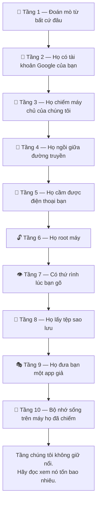
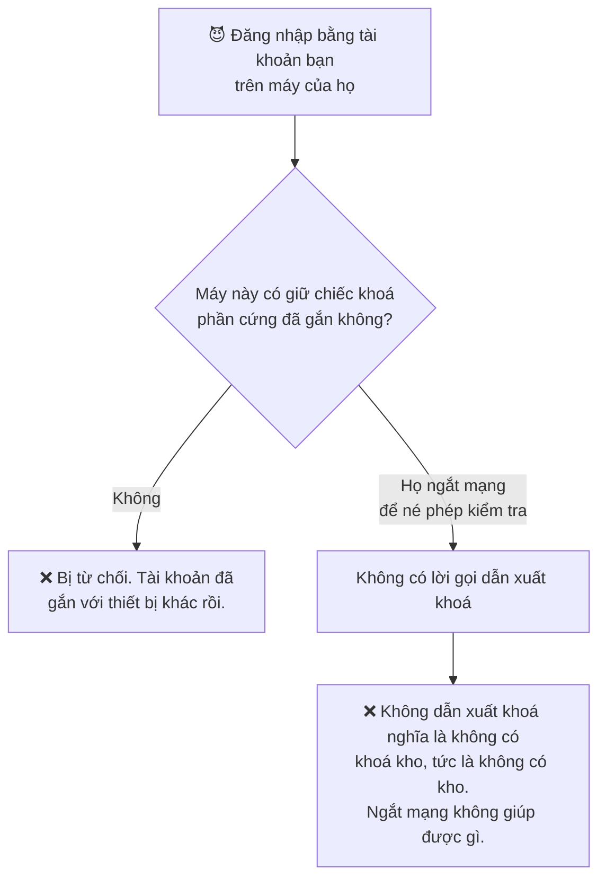
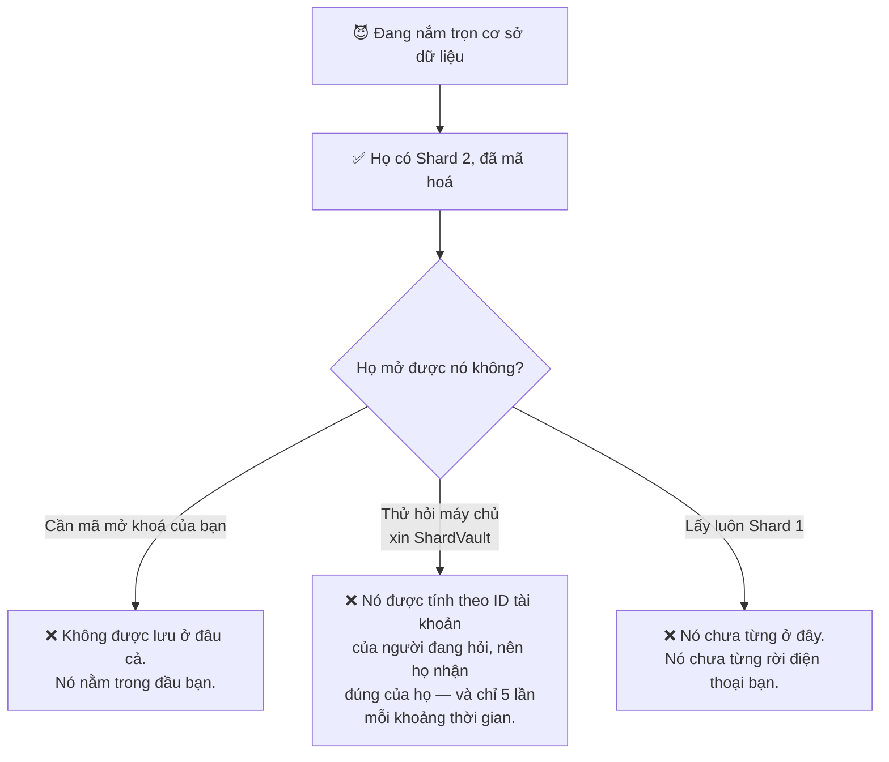
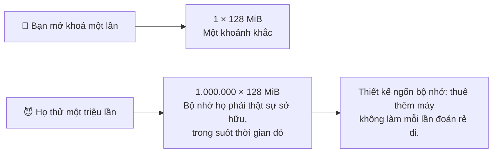
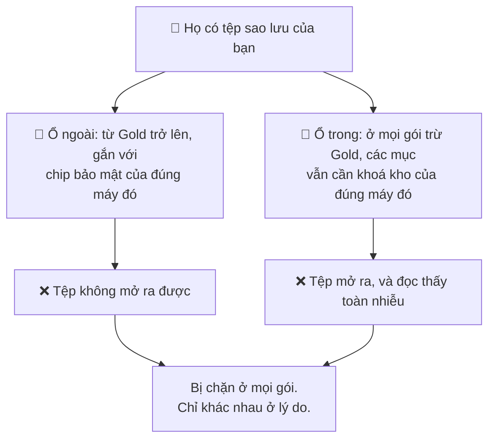
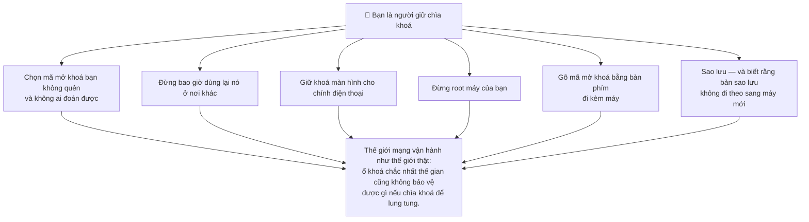

# Nếu có người nhắm vào kho của bạn

Phần lớn các trang bảo mật liệt kê sản phẩm *có* những gì. Trang này làm ngược
lại: đặt một kẻ tấn công ngay trước cửa và cho họ leo lên, từng tầng một. Mỗi
tầng — họ thử gì, cái gì chặn họ, và đi tiếp thì tốn bao nhiêu.

Toà nhà này có một tầng trên cùng mà chúng tôi **không giữ nổi**. Tầng đó cũng
nằm trên trang này, kèm theo cái giá thật sự để leo tới đó. Một trang nói ngược
lại thì không đáng đọc.

## Tầng 1 — Đoán mò, từ bất cứ đâu trên thế giới

**Họ thử gì.** Email của bạn xuất hiện trong một vụ rò rỉ dữ liệu kèm một mật
khẩu bạn từng dùng ở nơi khác. Một đoạn script thử nó ở đây, cùng vài nghìn biến
thể, trên vài nghìn tài khoản.

**Cái gì chặn họ.** Mỗi lần đăng nhập đều được chấm điểm ngầm về khả năng là hành
vi tự động, và còn bị giới hạn tần suất bên trên nữa. Bạn không thấy gì cả trừ
khi có điều bất thường.

**Họ tốn bao nhiêu.** Gần như không tốn gì để thử, và thu về cũng gần như không
có gì. Ngay cả khi đăng nhập thành công, họ cũng chỉ mới lên tới Tầng 2 — nơi
không có kho mật khẩu nào chờ sẵn.

## Tầng 2 — Họ đã đăng nhập với danh nghĩa của bạn

**Họ thử gì.** Họ có tài khoản Google của bạn. Họ cài PasswordEpic lên máy của họ
và đăng nhập.

**Cái gì chặn họ.** Ở các gói trả phí, tài khoản của bạn gắn với một thiết bị, và
danh tính không phải là một mã định danh mà ứng dụng có thể tự khai — đó là việc
sở hữu một chiếc khoá được sinh bên trong chip bảo mật của *chính điện thoại bạn*,
và không thể xuất ra. Lần đăng nhập thứ hai bị từ chối thẳng.

**Họ nhận được gì.** Một kho rỗng của riêng họ. Các mục của bạn chưa từng nằm
trên máy chủ nào để phiên của họ tải về, và chiếc khoá giải mã chúng không thể
dựng được trên một thiết bị không giữ Shard 1.

## Tầng 3 — Họ chiếm trọn chúng tôi

**Họ thử gì.** Không phải điện thoại bạn — mà là chúng tôi. Họ lấy trọn cơ sở dữ
liệu.

**Họ lấy được gì.** Hồ sơ tài khoản, và Shard 2 ở dạng đã mã hoá. Toàn bộ chiến
lợi phẩm chỉ có vậy. Các mục trong kho được mã hoá ngay trên điện thoại bạn và
không bao giờ được tải lên, nên trong đó không có gì của bạn để mà lấy.

**Cái gì chặn họ đi tiếp.** Ba thứ, và họ cần đủ cả ba:

**Họ tốn bao nhiêu.** Chiếm trọn hạ tầng của chúng tôi — và thu về không có gì mở
được dù chỉ một kho mật khẩu. Đó chính là khác biệt giữa một dịch vụ *hứa* không
nhìn và một dịch vụ *không thể* nhìn.

## Tầng 4 — Họ ngồi giữa bạn và chúng tôi

**Họ thử gì.** Một hồ sơ công ty, một chứng chỉ gốc cài thêm, một mạng Wi-Fi độc
hại. Bất cứ thứ gì cho phép họ đưa ra một chứng chỉ mà điện thoại bạn sẽ tin, rồi
đọc lời gọi trả về một phần khoá của bạn.

**Cái gì chặn họ.** Ở Platinum và Titanium, lời gọi đó **chỉ chấp nhận một tập cố
định các chứng chỉ gốc của chính Google**. Chứng chỉ mà điện thoại bạn được bảo là
phải tin thì vẫn bị từ chối.

**Một lời nói thật.** Ghim chứng chỉ là biện pháp có thể làm hỏng chính ứng dụng
của mình nếu tổ chức cấp chứng chỉ xoay vòng mà bạn không theo kịp. Bộ ghim của
chúng tôi được kiểm tra với các endpoint thật **trước mỗi lần phát hành** chứ
không phải đoán — vì một bộ ghim không ai kiểm rồi sẽ khoá cửa đúng những người
nó sinh ra để bảo vệ.

## Tầng 5 — Họ cầm được điện thoại bạn, máy đang khoá

**Họ thử gì.** Mã mở khoá. Hàng triệu lần đoán, ngoại tuyến, thong thả.

**Cái gì chặn họ.** Mỗi lần đoán tốn 128 MiB bộ nhớ và thời gian thật, bởi đó
đúng bằng cái giá bạn trả khi mở khoá. Ứng dụng cũng không cho bạn đặt mã dưới 45
bit entropy, nên không có mục tiêu nào ngắn dễ nhắm.

**Họ tốn bao nhiêu.** Phần cứng thật, chạy trong thời gian dài, cho từng nạn nhân
một. Đó chính là điểm của một hàm ngốn bộ nhớ — không thể làm nó rẻ đi bằng cách
mua thêm.

## Tầng 6 — Họ root máy

**Họ thử gì.** Gỡ bỏ các hạn chế của điện thoại và đọc thẳng bộ nhớ lưu trữ của
PasswordEpic.

**Cái gì chặn họ.** Shard 1 được sinh ra *bên trong* chip bảo mật và không có
thao tác nào trả nó ra. Không cho ứng dụng, không cho root, không cho ai cả. Root
giúp họ có chiếc điện thoại; nó không giúp họ có mảnh khoá đó.

Ở Platinum và Titanium, root, đóng gói lại, trình gỡ lỗi và các bộ công cụ hook
phổ biến còn bị phát hiện, và thao tác khoá từ chối chạy hẳn.

**Họ tốn bao nhiêu.** Phải cầm được máy, cộng với một bản root chạy được cho đúng
dòng máy đó — và cuối cùng vẫn dừng ở một con chip không chịu trả lời.

## Tầng 7 — Có thứ gì đó rình lúc bạn gõ

Tầng này khác hẳn. Nó bỏ qua toàn bộ phần mã hoá bằng cách tiếp cận mã mở khoá
*ngay lúc bạn gõ nó*, trước khi mọi thứ ở trên kịp có tác dụng.

| Họ thử gì | Cái gì chặn nó |
| --- | --- |
| Bàn phím nhập mã giả vẽ đè lên cái thật | Bất cứ thứ gì vẽ đè lên bàn phím nhập mã đều làm dừng việc mở khoá |
| Một lớp vô hình thu lại thao tác chạm | Cùng cơ chế đó — đây là "tapjacking" |
| Một app có quyền trợ năng đọc màn hình | Thao tác khoá dừng lại khi có dịch vụ như vậy đang chạy |
| Chụp ảnh màn hình | Bị từ chối thẳng, cho toàn màn hình |
| Quay màn hình trong ứng dụng | Ra toàn màu đen — cả ứng dụng lẫn bàn phím phủ lên |
| Quay màn hình khi hộp thoại tự động điền nằm trên app khác | Từ chối hẳn việc nhập mã (Android 15+) |
| **Một bàn phím ghi lại phím bạn gõ** | **Chúng tôi chỉ có thể cảnh báo bạn** |

Dòng cuối không phải một lỗ hổng chúng tôi giấu đi. Bàn phím được trao thẳng từng
phím bạn gõ, trước cả khi có gì được vẽ lên màn hình, nên không lớp bảo vệ màn
hình nào chạm tới được. Ứng dụng báo cho bạn khi bàn phím đang dùng không đi kèm
máy, và thật sự đó là tất cả những gì nó làm được.

## Tầng 8 — Họ lấy được tệp sao lưu của bạn

**Họ thử gì.** Bản sao lưu nằm trong Google Drive của bạn. Họ vào được Drive và
lấy nó.

**Cái gì chặn họ.** Hai ổ khoá, và ổ nào bắt được họ thì tuỳ vào gói của bạn:

**Họ tốn bao nhiêu.** Không có gì họ tiêu được. Cũng chính đặc tính đó khiến *bạn*
không chuyển được kho sang máy mới — cái giá này cả hai phía cùng trả.

## Tầng 9 — Họ đưa bạn một ứng dụng giả

**Họ thử gì.** Một bản PasswordEpic đã bị sửa, cài từ ngoài hoặc từ một kho ứng
dụng bên thứ ba. Mọi thứ ở trên đều giả định ứng dụng là ứng dụng thật; đòn này
tấn công thẳng vào chính giả định đó.

**Cái gì chặn họ.** Trước các thao tác khoá, máy chủ của chúng tôi hỏi Google xem
đây có phải ứng dụng thật, chưa bị sửa, trên một thiết bị thật hay không. Kết luận
được kiểm tra **trên máy chủ của chúng tôi**, không phải trên điện thoại — một ứng
dụng đã bị vá có thể bỏ qua phép kiểm tra nó tự chạy lên chính mình, nhưng không
giả mạo được chữ ký của Google gửi cho một bên khác.

## Tầng 10 — Bộ nhớ sống, trên một thiết bị họ đã kiểm soát

Đây là tầng chúng tôi không giữ nổi.

**Họ thử gì.** Root trên điện thoại bạn *trong lúc bạn đang dùng*, rồi đọc các giá
trị đã giải mã ra khỏi bộ nhớ đúng khoảnh khắc chúng tồn tại.

**Chúng tôi làm gì với nó.** Thu khoảnh khắc đó xuống gần bằng không hết mức có
thể:

- Khoá kho được dẫn xuất mới cho từng thao tác một và xoá sạch ngay sau đó. Không
  bao giờ lưu đệm, không ghi ra đĩa, không ghi log.
- Các mục được giải mã từng cái một, cho đúng một lần điền hoặc một lần xem.
- Ở Titanium, những giá trị quan trọng nằm trong lõi Rust, thứ có thể ghi đè bộ
  nhớ và chắc chắn là chúng đã biến mất.

**Chúng tôi không làm được gì.** Làm cho một hệ điều hành đã bị chiếm trở nên an
toàn. Nếu kẻ tấn công sở hữu thiết bị trong lúc nó đang mở khoá, họ đã đứng bên
trong ranh giới tin cậy mà mọi tầng phía dưới đều dựa vào. Không ứng dụng nào sửa
được điều đó từ bên trong.

**Leo tới tầng này thật ra tốn bao nhiêu.** Đây không phải tấn công từ xa và nó
không nhân rộng được. Nó cần thiết bị vật lý của bạn, một bản root chạy được cho
máy đó, và hoặc mã mở khoá của bạn hoặc một phiên đang mở khoá — tất cả cùng lúc,
cho đúng một người. Đó là công việc của kẻ tấn công có chủ đích, với mức giá của
kẻ tấn công có chủ đích.

Và điều đó dẫn tới câu hỏi trung thực duy nhất còn lại: **kho mật khẩu của bạn có
đáng với ngân sách đó của ai đó không?** Với gần như tất cả mọi người, câu trả lời
là không, và những tầng phía dưới mới là thứ thật sự quan trọng. Với một số ít
người, câu trả lời là có — và những người đó nên biết rằng không trình quản lý mật
khẩu nào, trên bất kỳ nền tảng nào, thay đổi được điều đó.

## Vì sao dùng OPAQUE, và vì sao dùng Rust

Cả hai tồn tại vì Tầng 10, và không cái nào là trang trí.

**OPAQUE** loại bỏ chính thứ mà kẻ tấn công lẽ ra sẽ đánh cắp rồi mang về tấn công
thong thả. Ở các gói khác, có một giá trị được lưu để mở kho; nó được bọc bằng mã
mở khoá của bạn, nhưng nó *tồn tại trên đĩa*. Ở Titanium thì không có gì để lấy —
bằng chứng được tính lại từ mã mở khoá của bạn và không bao giờ được ghi xuống
dưới bất kỳ dạng nào.

**Rust** tồn tại vì JavaScript không dám hứa là một bí mật đã biến mất. Runtime
của nó sao chép và di chuyển chuỗi khắp nơi, và không có cách nào ghi đè đáng tin
cậy. Rust đặt giá trị vào đúng một chỗ mà bạn kiểm soát, nên có thể xoá sạch nó.
Khi toàn bộ câu hỏi là *một bí mật sống trong bộ nhớ bao lâu*, thì đó không phải
chuyện thích ngôn ngữ nào.

## Nửa phần việc của bạn

Mọi tầng ở trên là phía chúng tôi. Đây là phía bạn, và không phần nào là tuỳ chọn
— giữ chìa khoá là một công việc.

Còn một điều nữa, và đó là biện pháp rẻ nhất trên cả trang này: **đổi mã mở khoá
thì nhanh và không mất gì.** Nó chỉ bọc lại bí mật do máy sinh ra mà không đụng
tới một mật khẩu nào đã lưu — nên nếu có lúc bạn nghi ngờ ai đó đã nhìn thấy mình
gõ, hãy đổi nó, và mọi thứ ở trên vẫn nguyên giá trị. Xem
[Mã mở khoá của bạn](./your-passcode.md#đổi-mã-mở-khoá).

## Cách đánh giá bất kỳ trình quản lý mật khẩu nào, kể cả cái này

Chúng tôi sẽ không nói với bạn rằng chúng tôi hơn những sản phẩm mà chúng tôi
không kiểm toán được. Thay vào đó, đây là những câu nên hỏi — hỏi chúng tôi, và
hỏi bất kỳ ai khác:

1. **Họ có thể đặt lại mật khẩu cho bạn mà vẫn trả lại đủ dữ liệu không?** Nếu có,
   thì họ đọc được. Không có câu trả lời thứ ba.
2. **Chiếc khoá nằm ở đâu, và họ có gọi tên được nơi đó không?** "Mã hoá khi lưu
   trữ" là nói về ổ đĩa của họ, không phải về chiếc khoá của bạn.
3. **Mất điện thoại thì sao?** Một dịch vụ khôi phục được kho của bạn từ hư không
   là một dịch vụ chưa bao giờ thật sự cần tới bạn.
4. **Họ thừa nhận mình không làm được gì?** Một trang bảo mật không có mục giới
   hạn là một trang quảng cáo.

Câu trả lời của chúng tôi nằm trên chính trang web này, kể cả câu cuối — đó là
Tầng 10, ở ngay phía trên.

## Đọc tiếp

- [Cách hoạt động](./how-it-works.md) — bốn nơi mà chiếc khoá được ghép lại từ đó
- [Những từ này nghĩa là gì](./plain-words.md) — mọi thuật ngữ ở đây, nói bằng lời thường
- [Mã mở khoá của bạn](./your-passcode.md) — phần duy nhất thuộc về bạn
- [Các gói bảo mật](./security-tiers.md) — gói của bạn phòng thủ những tầng nào
