# Cuộc chiến giành kho mật khẩu

Hãy tưởng tượng có người muốn lấy mật khẩu của bạn.

Không phải một mật khẩu. **Tất cả.**

Phần lớn các trang bảo mật trả lời chuyện đó bằng cách liệt kê sản phẩm *có* gì:
thuật toán này, chứng chỉ kia, một hàng logo. Trang này làm một việc thú vị hơn.

**Hãy thử tấn công nó.**

## Vòng 0 — Luật chơi

Hai người chơi. Cả hai đều nghiêm túc. Nhưng chỉ một bên cần may mắn.

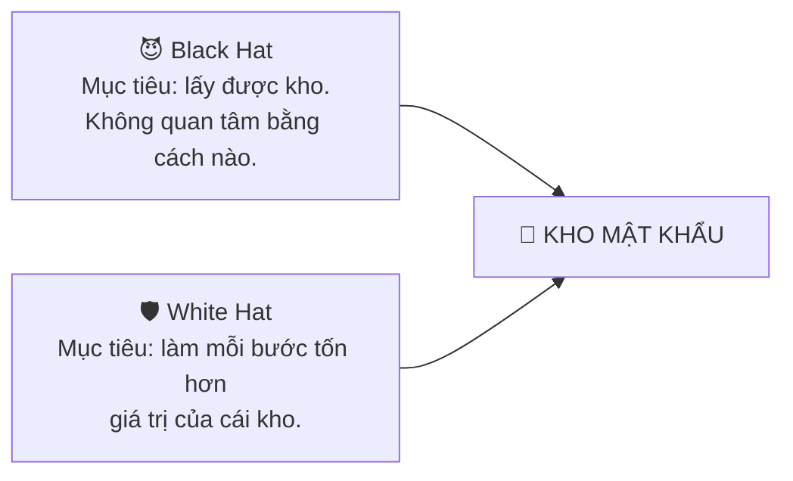

**Black Hat được dùng mọi thứ.** Đoán mật khẩu. Chiếm tài khoản Google. Đánh vào
máy chủ. Ngồi giữa đường truyền. Lấy điện thoại. Root nó. Nhìn màn hình. Nhìn bàn
phím. Trộm tệp sao lưu. Đưa bạn một app giả. Đọc bộ nhớ trong lúc bạn đang dùng.

**White Hat không cố dựng một bức tường không thể phá.** Thứ đó không tồn tại, và
tuyên bố có nó chính là cách các trang bảo mật đánh mất người đọc hiểu chuyện. Mục
tiêu hẹp hơn nhiều, nhưng hữu ích hơn nhiều:

> **Chúng tôi không hứa một bức tường không thể phá.
> Chúng tôi xây một cầu thang mỗi bậc một đắt hơn.**

Mười tầng. Hãy xem cái giá leo lên thế nào.

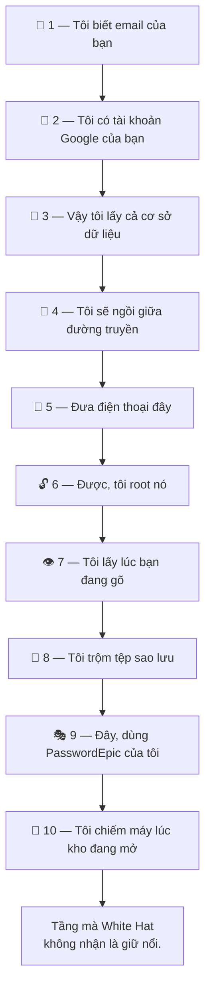

---

## Tầng 1 — "Tôi biết email của bạn"

> 😈 **Black Hat.** *"Tôi không cần điện thoại của bạn. Không cần máy tính của
> bạn. Thậm chí không cần biết bạn là ai. Địa chỉ của bạn nằm trong một vụ rò rỉ
> dữ liệu, ngay cạnh một mật khẩu bạn từng dùng ở đâu đó năm 2019. Tôi thử nó ở
> đây. Và chín nghìn biến thể. Trên mười nghìn tài khoản. Tốn của tôi một buổi
> tối."*

Anh ta nói đúng, nó gần như không tốn gì. Đó chính là lý do ai cũng bắt đầu từ
đây.

> 🛡️ **White Hat.** *"Cứ thử."*

Mỗi lần đăng nhập đều được chấm điểm ngầm về khả năng là hành vi tự động, và còn
bị giới hạn tần suất bên trên nữa. Bạn không thấy gì cả trừ khi có điều bất
thường.

Và đây mới là phần quan trọng hơn cả giới hạn tần suất:

> **Đăng nhập thành công không có nghĩa là chạm được vào kho.**

Ngay cả khi đoán trúng, anh ta cũng chưa tới được đâu cả. Anh ta chỉ mới lên tới
Tầng 2.

**Hoá đơn tới lúc này:** một buổi tối.

---

## Tầng 2 — "Tôi có tài khoản Google của bạn"

> 😈 *"Được thôi. Tôi không đoán — tôi trộm luôn. Phishing, session token, gì
> cũng được. Tôi có tài khoản Google của bạn. Tôi chỉ việc cài PasswordEpic lên
> máy của tôi rồi đăng nhập bằng danh nghĩa của bạn."*

Anh ta cài. Anh ta đăng nhập. Màn hình đang tải.

> 🛡️ **TỪ CHỐI.**

Ở các gói trả phí, tài khoản của bạn gắn với một thiết bị — và danh tính ở đây
không phải một mã định danh mà ứng dụng chỉ cần khai là có. Đó là việc **sở hữu
một chiếc khoá được sinh ra bên trong chip bảo mật của điện thoại bạn**, và không
thể xuất ra ngoài.

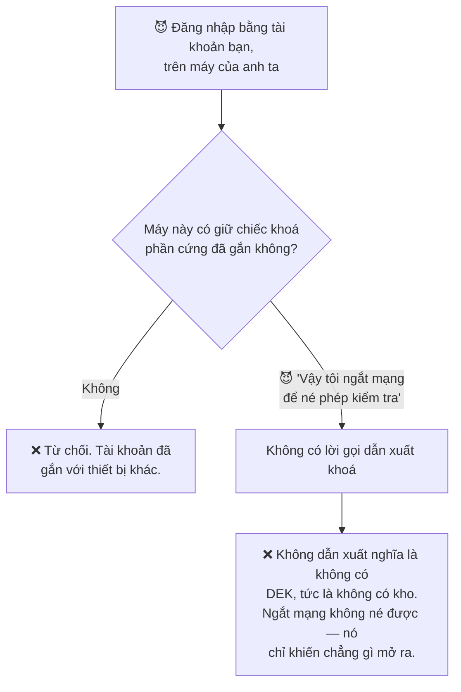

> **Anh ta có danh tính của bạn. Anh ta không có thiết bị của bạn.**

Thứ anh ta nhận được là một cái kho rỗng của chính mình. Các mục của bạn chưa từng
nằm trên máy chủ nào để phiên của anh ta tải về, và chiếc khoá giải mã chúng không
thể ghép lại trên một thiết bị không giữ Shard 1.

**Hoá đơn tới lúc này:** một tài khoản Google bị đánh cắp — và nó chẳng mua được
gì.

---

## Tầng 3 — "Vậy tôi lấy cả cơ sở dữ liệu"

> 😈 *"Quên điện thoại đi. Tôi quay sang các anh. Máy chủ, cơ sở dữ liệu, tất cả.
> Cứ cho là tôi thắng hoàn toàn."*

Cứ cho là vậy. Chiếm trọn. Mọi bản ghi.

Phần lớn mọi người nghĩ câu chuyện kết thúc ở đây. Đây là chiến lợi phẩm thật sự:

```
ANH TA CÓ:                    ANH TA KHÔNG CÓ:
✓ Hồ sơ tài khoản             ✗ Dù chỉ một mục trong kho
✓ Shard 2, đã mã hoá          ✗ Shard 1
                              ✗ Mã mở khoá của bạn
                              ✗ Bất kỳ DEK nào
```

> 🛡️ *"Anh ta chiếm được máy chủ. Anh ta vẫn không có cái kho."*

Các mục trong kho được mã hoá ngay trên điện thoại bạn và không bao giờ được tải
lên, nên trong đó không có gì của bạn để mà lấy. Còn Shard 2 mà anh ta lấy được
thì sao?

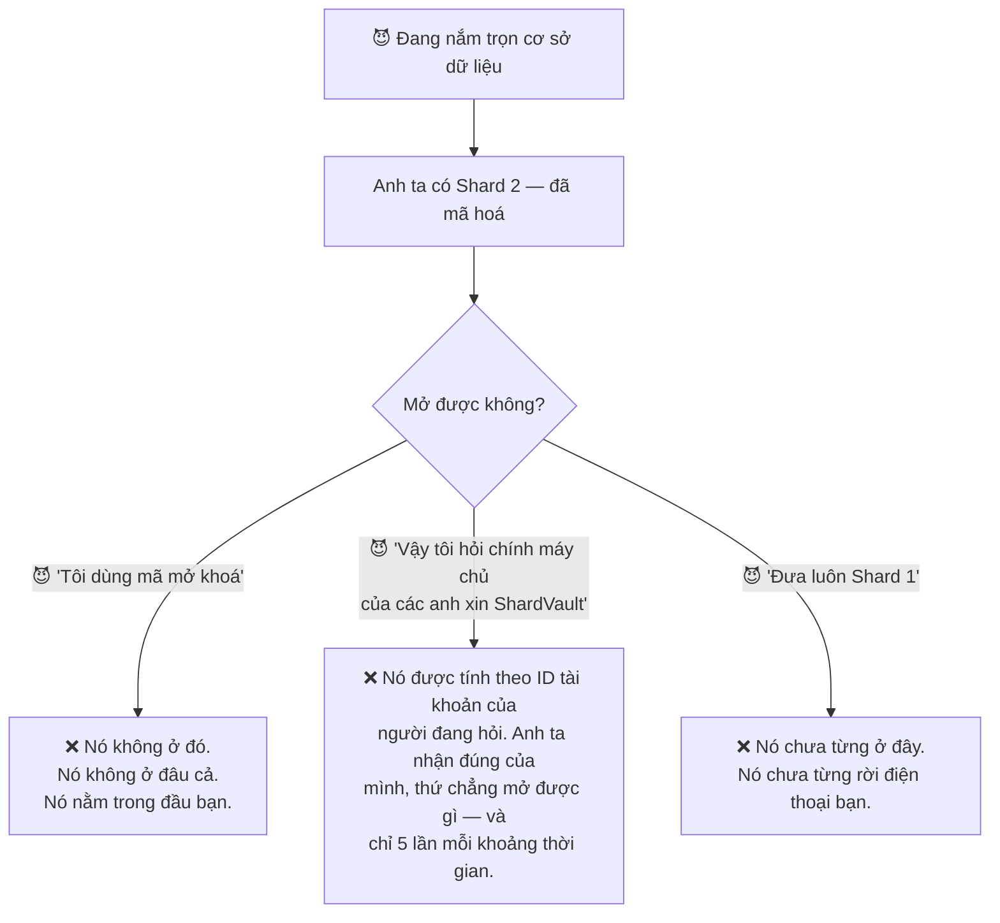

**Hoá đơn tới lúc này:** chiếm trọn hạ tầng của cả một công ty — đổi lấy hồ sơ tài
khoản và một mẩu ciphertext.

Đó chính là khác biệt giữa một dịch vụ **hứa không nhìn** và một dịch vụ **không
thể nhìn**.

---

## Tầng 4 — "Tôi sẽ ngồi giữa đường truyền"

> 😈 *"Kế hoạch mới. Tôi không cần máy chủ nếu tôi có thể *là* máy chủ. Một hồ sơ
> công ty. Một chứng chỉ gốc tôi dụ bạn cài vào. Một mạng Wi-Fi quán cà phê độc
> hại. Tôi sẽ đọc lời gọi trao cho bạn một phần chiếc khoá."*

Đây là đòn tấn công có thật, và với phần lớn ứng dụng thì nó ăn — vì phần lớn ứng
dụng tin bất cứ chứng chỉ nào mà điện thoại tin.

> 🛡️ *"Điện thoại bạn tin thêm một chứng chỉ, nhưng PasswordEpic thì không buộc
> phải tin."*

Ở Platinum và Titanium, lời gọi trả về một phần DEK **chỉ chấp nhận một tập
cố định các chứng chỉ gốc của chính Google**. Mọi thứ khác đều bị từ chối — kể cả
những chứng chỉ mà chính thiết bị coi là hoàn toàn hợp lệ.

**Và đây là phần mà một trang quảng cáo sẽ bỏ qua.** Ghim chứng chỉ có thể làm
hỏng chính ứng dụng của mình. Nếu tổ chức cấp chứng chỉ xoay vòng chứng chỉ gốc mà
bạn không theo kịp, người dùng không kết nối được nữa và không bản cập nhật nào từ
bên trong ứng dụng cứu được. Nên bộ ghim được kiểm tra với các endpoint thật
**trước mỗi lần phát hành**, chứ không phải đoán.

> Một biện pháp phòng thủ không ai kiểm tra rồi sẽ khoá cửa đúng những người nó
> sinh ra để bảo vệ.

**Hoá đơn tới lúc này:** một vị trí trên đường truyền — và một lời từ chối.

---

## Tầng 5 — "Đưa điện thoại đây"

Hãy để ý ngân sách của anh ta vừa thay đổi thế nào. Mọi thứ tới lúc này đều làm
được từ bất cứ đâu trên trái đất. Từ giờ thì không.

> 😈 *"Vậy tôi lấy luôn cái điện thoại. Máy đang khoá à? Không sao. Tôi sẽ dò cạn
> mã mở khoá. Tôi có cả thế giới thời gian và không cần phải im lặng."*

> 🛡️ *"Cứ tự nhiên. Để tôi tính giá cho anh."*

Biến mã mở khoá của bạn thành một chiếc khoá tốn **128 MiB bộ nhớ và tính toán
thật — mỗi lần một.** Bạn trả cái giá đó một lần, lúc mở khoá. Anh ta trả nó cho
từng lần đoán.

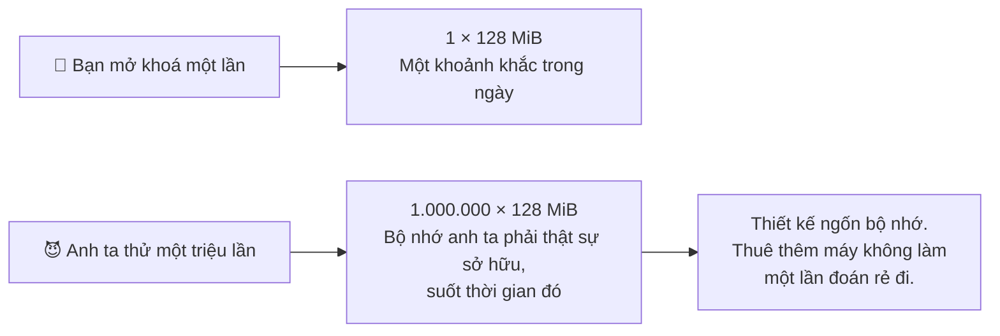

Ứng dụng cũng không cho bạn *đặt* mã mở khoá dưới 45 bit entropy, nên không có mục
tiêu nào ngắn ngủn chờ sẵn.

**Hoá đơn tới lúc này:** phải cầm được điện thoại của bạn, cộng phần cứng thật
chạy trong thời gian dài, **cho từng nạn nhân một**. Đòn này không nhân rộng được.
Đó chính là toàn bộ ý nghĩa của một hàm ngốn bộ nhớ.

---

## Tầng 6 — "Được, tôi root nó"

> 😈 *"Thôi không đoán nữa. Giờ tôi sở hữu cái máy này. Root. Gắn debugger. Cắm
> Frida vào. Tôi sẽ đọc thẳng bộ nhớ lưu trữ của PasswordEpic và lấy chiếc khoá
> ra."*

> 🛡️ *"Đọc gì tuỳ anh. Shard 1 không nằm trong bộ nhớ lưu trữ."*

Shard 1 được sinh ra **bên trong** chip bảo mật, và con chip đó không có thao tác
nào trả nó ra. Không cho ứng dụng. Không cho root. Không cho ai cả. Bạn có thể nhờ
nó *dùng* chiếc khoá; bạn không thể xin nó chiếc khoá.

> **Root cho anh ta quyền kiểm soát hệ điều hành.
> Nó không cho anh ta Shard 1.**

Ở Platinum và Titanium, root, đóng gói lại, debugger đang gắn vào và các bộ công
cụ hook phổ biến còn bị phát hiện — và thao tác khoá từ chối chạy hẳn.

**Hoá đơn tới lúc này:** điện thoại của bạn, một bản root chạy được cho đúng dòng
máy đó — và cuối cùng vẫn là một con chip không chịu trả lời.

---

## Tầng 7 — "Vậy tôi lấy lúc bạn đang gõ"

Ở đây Black Hat đổi chiến thuật, và đó là nước đi khôn nhất của anh ta.

> 😈 *"Nãy giờ tôi đánh nhầm chỗ. Tôi không cần phá mã hoá. Không cần máy chủ. Tôi
> sẽ lấy mã mở khoá ra khỏi tay bạn trước khi mọi thứ đó kịp bắt đầu. **Tôi tấn
> công con người.**"*

| 😈 Anh ta thử | 🛡️ Cái gì đáp lại |
| --- | --- |
| Bàn phím nhập mã giả vẽ đè đúng lên cái thật | ❌ Bất cứ thứ gì vẽ đè lên đều làm dừng việc mở khoá |
| Một lớp vô hình thu lại thao tác chạm | ❌ Cùng cơ chế — đây là "tapjacking" |
| Một app có quyền trợ năng đọc màn hình | ❌ Thao tác khoá dừng khi có dịch vụ như vậy chạy |
| Chụp ảnh màn hình | ❌ Từ chối thẳng, cho toàn màn hình |
| Quay màn hình trong ứng dụng | ❌ Ra toàn màu đen — cả app lẫn bàn phím |
| Quay lúc hộp thoại tự động điền nằm trên app khác | ❌ Từ chối hẳn việc nhập mã (Android 15+) |
| **Một bàn phím ghi lại từng phím** | ⚠️ **Chỉ có thể cảnh báo** |

Hãy đọc lại dòng cuối.

> 🛡️ *"Đây là chỗ tôi không tuyên bố chiến thắng."*

Bàn phím được trao thẳng từng phím bạn gõ, **trước khi** có bất cứ thứ gì được vẽ
lên màn hình, nên không lớp bảo vệ màn hình nào chạm tới được. PasswordEpic báo cho
bạn khi bàn phím đang dùng không đi kèm máy. Thật sự đó là tất cả những gì nó làm
được.

Vì sao lại nói ra, khi cả cột còn lại đều là ❌?

> **Vì kỹ thuật bảo mật không phải là việc giả vờ rằng mọi đòn tấn công đều chặn
> được.** Một trang tuyên bố thắng sạch ở đây là một trang hoặc chưa nhìn kỹ, hoặc
> đang mong bạn không nhìn kỹ.

**Hoá đơn tới lúc này:** đưa được mã độc lên máy bạn, hoặc dụ được bạn cài một bàn
phím.

---

## Tầng 8 — "Tôi trộm tệp sao lưu"

> 😈 *"Bạn sao lưu lên Google Drive. Mà tôi đã ở trong tài khoản Google của bạn
> rồi — nhớ Tầng 2 chứ. Tôi chỉ việc tải tệp sao lưu về rồi mở ở nhà, nơi không có
> thứ gì các anh xây được chạm tới tôi."*

Anh ta lấy được tệp. Nó đúng là kho của bạn. Và nó là một cục gạch.

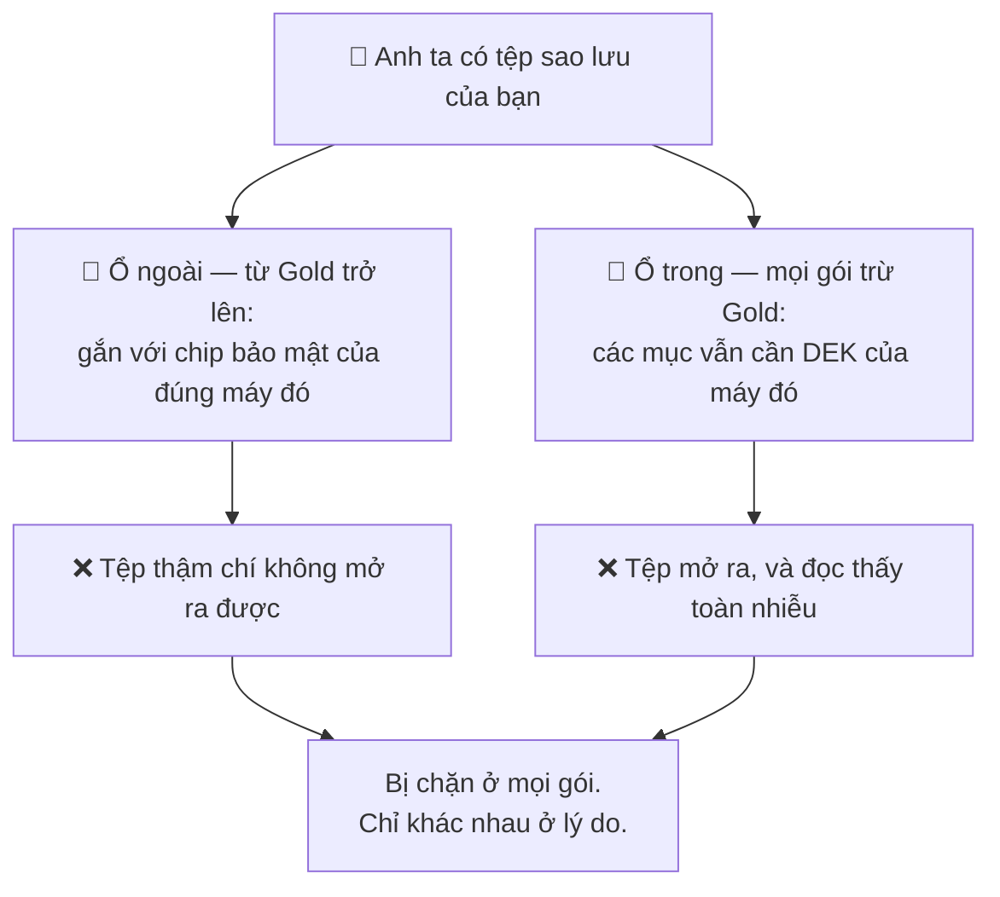

Và giờ là nửa còn lại của sự thật:

> **Chính cơ chế bảo vệ tệp sao lưu của bạn cũng là thứ khiến bạn không chuyển
> được kho sang máy mới.**

Chúng tôi sẽ không giả vờ rằng đó chỉ là một tính năng chứ không phải một cái giá.
Nó là cả hai.

> 🛡️ *"Bảo mật luôn có giá của nó. Giá của chúng tôi là chúng tôi cũng không cứu
> được bạn."*

**Hoá đơn tới lúc này:** Drive của bạn — đổi lấy một tệp mã hoá không mở được ở
đâu.

---

## Tầng 9 — "Đây, dùng PasswordEpic của tôi"

> 😈 *"Kế hay: tôi thôi tấn công ứng dụng của các anh, tôi sẽ *trở thành* ứng dụng
> đó. Cùng icon. Cùng giao diện. Cài từ ngoài, hoặc từ một kho ứng dụng bên thứ ba
> mà bạn tìm thấy vì kho thật không có ở nước bạn. Bạn sẽ gõ mã mở khoá thẳng vào
> tôi."*

Đây là ý tưởng nguy hiểm nhất trên trang này, bởi vì **mọi tầng ở trên đều giả
định ứng dụng là ứng dụng thật.**

> 🛡️ *"Vậy thì đừng tin lời ứng dụng."*

Trước các thao tác khoá, máy chủ của chúng tôi hỏi Google xem đây có phải ứng dụng
thật, chưa bị sửa, đang chạy trên một thiết bị thật hay không. Kết luận được kiểm
tra **trên máy chủ**, không phải trên điện thoại.

Chính khác biệt đó là toàn bộ biện pháp phòng thủ:

> **Đừng bao giờ tin client tự nói rằng client đáng tin.**

Một ứng dụng đã bị vá có thể xoá phép kiểm tra mà nó tự chạy lên chính mình. Nó
không giả mạo được câu trả lời có chữ ký của Google gửi cho một bên khác.

**Hoá đơn tới lúc này:** một bản giả rất thuyết phục — mà máy chủ từ chối phục vụ.

---

## Tầng 10 — "Tôi chiếm máy lúc kho đang mở"

Hết trò từ xa. Đây là trận đánh trùm cuối, và Black Hat bước vào với đầy đủ mọi
thứ:

```
✓ Thiết bị vật lý của bạn
✓ Root trên nó
✓ Một phiên đang mở khoá
✓ Khả năng đọc bộ nhớ trong lúc bạn dùng
```

> 😈 *"Rồi cũng phải có lúc bạn giải mã chứ. Đúng khoảnh khắc đó, nó nằm trong
> RAM. Mà tôi thì đã ở sẵn trong RAM rồi."*

Anh ta nói đúng.

> 🛡️ *"Tôi không thể làm cho một hệ điều hành đã bị chiếm trở nên an toàn."*

Đó là câu trung thực, và nó nằm trên trang này một cách có chủ đích.

**White Hat làm gì thay vào đó — thu khoảnh khắc ấy xuống gần bằng không:**

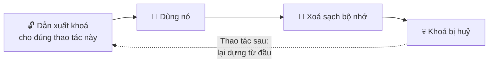

- DEK được dẫn xuất mới cho **từng thao tác một** và xoá sạch ngay sau đó.
  Không bao giờ lưu đệm. Không ghi ra đĩa. Không ghi log.
- Các mục được giải mã **từng cái một**, cho đúng một lần điền hoặc một lần xem.
- Ở Titanium, những giá trị quan trọng nằm trong lõi Rust, thứ có thể ghi đè bộ
  nhớ và chắc chắn là chúng đã biến mất.

**Cái giá để leo tới đây:** thiết bị vật lý của bạn, một bản root chạy được cho
nó, *và* hoặc mã mở khoá của bạn hoặc một phiên đang mở khoá — tất cả cùng lúc,
cho đúng một người. Không phải từ xa. Không nhân rộng được. Không có script nào
làm được.

---

## Câu hỏi cuối cùng

Tới lúc này, câu hỏi không còn là *"PasswordEpic có bị phá được không?"* Tất nhiên
là được, trong những điều kiện phù hợp. Cái gì cũng vậy.

Câu hỏi là câu mà cả cầu thang này được xây ra để ép người ta phải hỏi:

> ## Leo tới đó tốn bao nhiêu?

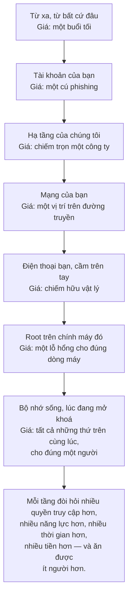

Tầng 1 nhân rộng tới hàng triệu người với giá một buổi tối. Tầng 10 nhân rộng tới
**một người**, và chỉ khi người đó đáng với ngân sách đó.

> **Không phải là không thể tấn công.
> Nhưng mỗi bước một đắt hơn để đánh bại.**

---

## 🎁 Một món quà miễn phí: soi chiếc điện thoại bạn sắp mua \{#used-phone-gift}

Mọi thứ ở trên tồn tại để bảo vệ kho mật khẩu của bạn. Nhưng hãy nhìn xem nó được
làm từ gì — phép kiểm tra tính toàn vẹn của chính Google, phát hiện root, phát
hiện can thiệp, xác minh bootloader. Tất cả đều nhắm tới đúng một câu hỏi:

> **Chiếc máy này có đúng là thứ nó tự nhận không?**

Câu hỏi đó đáng tiền với bạn trong một tình huống hoàn toàn khác: **khi bạn đi mua
điện thoại cũ.**

Vậy thì cứ dùng chúng tôi. Bạn không cần trả tiền, không cần đăng ký, và cũng
không cần giữ lại ứng dụng sau đó.

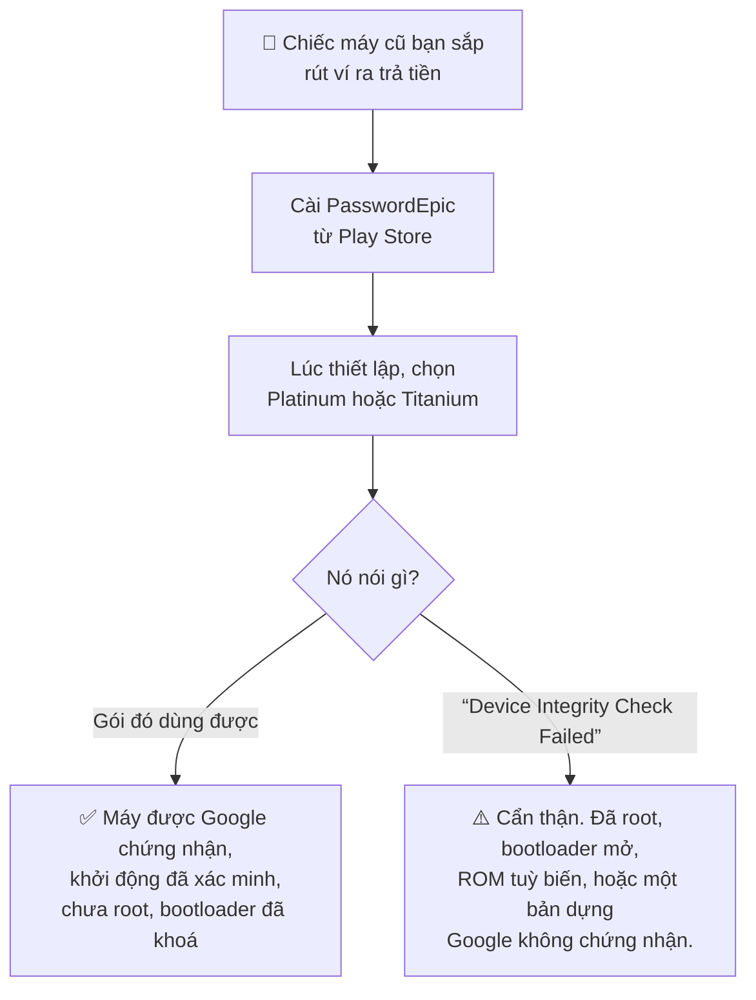

**Hãy cài từ Play Store, đừng cài từ file.** Một bản cài ngoài không thể đạt kết
quả đạt dù chiếc máy có lành lặn tới đâu, nên chữ "thất bại" trên một file APK
chép tay chẳng nói lên điều gì cả.

### Kết quả đạt thật sự chứng minh điều gì

- Máy là **thiết bị được Google chứng nhận** — không phải hàng nhái, không phải
  máy ảo.
- Nó khởi động bằng một **hệ thống đã được xác minh, chưa bị sửa**.
- Nó **chưa bị root**, và bootloader **đang khoá**.
- Ứng dụng trên máy chưa bị can thiệp.

Đó là một bộ câu trả lời thật sự hữu ích, đổi lấy vài phút thao tác — và phần lớn
người mua không có cách nào kiểm tra được những điều đó.

### Kết quả đạt *không* chứng minh điều gì

Chúng tôi sẽ không thổi phồng một mẹo miễn phí:

- **Không nói gì về việc máy có phải đồ trộm cắp hay không.** Hãy kiểm tra IMEI
  riêng.
- **Không nói gì về phần cứng.** Màn hình thay, linh kiện nhái và pin chai đều
  vượt qua phép kiểm tra toàn vẹn một cách vui vẻ.
- **Không nói gì về những thứ người bán đã cài** trước khi khoá máy lại.

Nó trả lời đúng câu *"phần mềm của chiếc máy này có bị can thiệp không?"* — chính
xác, và chỉ vậy thôi.

> 🛡️ *"Chúng tôi xây thứ này để quyết định có nên giao mật khẩu của bạn cho một
> chiếc điện thoại hay không. Bạn cũng có thể dùng nó để quyết định có nên giao
> tiền của mình cho một chiếc điện thoại hay không."*

---

## Vì sao dùng OPAQUE?

Mọi quyết định thiết kế trên trang này đều tồn tại để trả lời một nước đi cụ thể.
Đây là nước đi mà OPAQUE trả lời.

> 😈 *"Đưa tôi cái giá trị dùng để xác minh mật khẩu. Tôi không cần phá nó ở đây —
> tôi mang về nhà nghiền ngoại tuyến, mãi mãi, không giới hạn tần suất, không ai
> nhìn."*

Đó là đòn đánh vào mọi hệ thống có giữ *một thứ gì đó* dùng để kiểm tra mật khẩu.
Dù có bọc, dù có mã hoá: nếu nó tồn tại thì nó đánh cắp được, và một cuộc tấn công
ngoại tuyến thì kiên nhẫn vô hạn.

Ở Silver, Gold và Platinum, có một giá trị được lưu để mở kho. Nó được bọc bằng mã
mở khoá của bạn — nhưng nó *tồn tại trên đĩa*.

**Ở Titanium thì không có gì để lấy.**

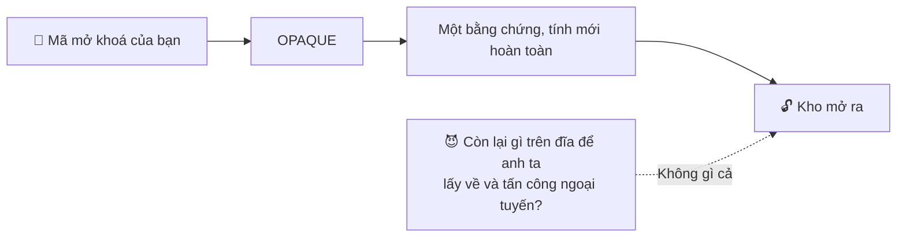

> 🛡️ *"OPAQUE ở đây vì tôi không muốn tồn tại bất cứ thứ gì có thể bị lấy đi rồi
> đem về tấn công thong thả."*

---

## Vì sao dùng Rust?

Tầng 10 hoàn toàn là câu hỏi về **một bí mật sống trong bộ nhớ bao lâu**. Nên ngôn
ngữ giữ bí mật đó không phải chuyện sở thích.

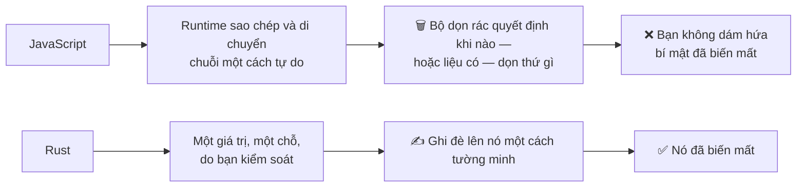

> 🛡️ *"Rust ở đây không phải vì Rust đang thời thượng. Rust ở đây vì tôi quan tâm
> một bí mật sống trong bộ nhớ bao lâu."*

---

## Và nếu bạn nghĩ có người đã nhìn thấy mình gõ

> 😈 *"Tôi đứng sau bạn trong hàng đợi. Tôi có camera. Tôi có sự kiên nhẫn."*

Nhìn trộm qua vai không cần lỗ hổng nào và không tốn ngân sách nào cả, nên cách
phòng thủ cũng phải rẻ đúng như vậy.

**Đổi mã mở khoá thì nhanh, và không mã hoá lại thứ gì.** Nó chỉ bọc lại bí mật do
máy sinh ra; bản thân DEK không đổi, nên không một mật khẩu nào bạn đã lưu bị
đụng tới và các bản sao lưu hiện có vẫn còn giá trị.

> 🛡️ *"Khắc phục một mã mở khoá có thể đã bị nhìn thấy thì phải rẻ. Nên nó rẻ."*

Xem [Mã mở khoá của bạn](./your-passcode.md#đổi-mã-mở-khoá).

---

## Nửa phần việc của bạn

Mọi tầng ở trên là phần của White Hat trong giao kèo. Đây là phần của bạn, và
không phần nào là tuỳ chọn.

Bởi vì White Hat có thể xây tất cả những thứ này —

```
StrongBox · Play Integrity · OPAQUE · Rust · Argon2id
chống lớp phủ · chống tapjacking · chống ghi màn hình
gắn thiết bị · giới hạn tần suất · xác minh phía máy chủ
sao lưu hai lớp · khoá riêng cho từng thao tác · xoá sạch bộ nhớ
```

— và tất cả bảo vệ được **không gì cả** nếu mã mở khoá là `123456`, hoặc là cái mã
bạn dùng ở mười trang khác, hoặc được ghi lên tờ giấy dán sau lưng điện thoại.

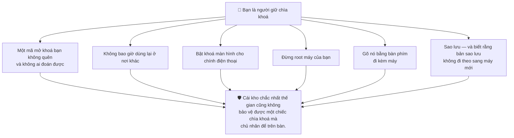

**Thế giới thật vận hành y hệt như vậy.**

Bạn có thể xây cái két sắt kiên cố nhất từng có. Cửa thép, chuông báo động,
camera, bảo vệ. Nhưng nếu bạn để chìa khoá trên bàn, chẳng ai cần phá két cả.

Họ chỉ việc cầm chìa khoá đi.

Bảo mật mật khẩu không khác gì. PasswordEpic có thể bảo vệ cái kho. **Bạn vẫn phải
bảo vệ chiếc chìa khoá.**

---

## Cách đánh giá bất kỳ trình quản lý mật khẩu nào, kể cả cái này

Chúng tôi sẽ không nói với bạn rằng PasswordEpic hơn những sản phẩm mà chúng tôi
chưa kiểm toán. Lời khẳng định đó đáng giá đúng bằng những lời bạn đã đọc trên các
trang khác.

Hãy hỏi những câu này thay vào đó — hỏi chúng tôi, và hỏi tất cả những bên còn
lại:

1. **Họ có thể đặt lại mật khẩu cho bạn mà vẫn trả lại đủ dữ liệu không?** Nếu có,
   thì họ đọc được. Không có câu trả lời thứ ba.
2. **Chiếc khoá nằm ở đâu, và họ có gọi tên được nơi đó không?** "Mã hoá khi lưu
   trữ" là nói về ổ đĩa của họ, không phải về chiếc khoá của bạn.
3. **Mất điện thoại thì sao?** Một dịch vụ khôi phục được kho của bạn từ hư không
   thì ngay từ đầu đã chẳng cần tới bạn.
4. **Nếu ngày mai máy chủ của họ bị chiếm, kẻ tấn công cầm được gì?** Bắt họ nói
   cụ thể.
5. **Nếu chính ứng dụng bị sửa thì sao?**
6. **Nếu kẻ tấn công có thiết bị vật lý thì sao?**
7. **Họ có công bố những thứ họ không bảo vệ được không?**

Câu trả lời của chúng tôi cho cả bảy đều nằm trên trang này. Câu thứ bảy là Tầng 7
và Tầng 10, và không câu nào bị giấu đi.

## Đọc tiếp

- [Cách hoạt động](./how-it-works.md) — bốn nơi mà chiếc khoá được ghép lại từ đó
- [Những từ này nghĩa là gì](./plain-words.md) — mọi thuật ngữ ở trên, nói bằng lời thường
- [Các gói bảo mật](./security-tiers.md) — gói của bạn phòng thủ những tầng nào
- [Mã mở khoá của bạn](./your-passcode.md) — phần duy nhất thuộc về bạn
