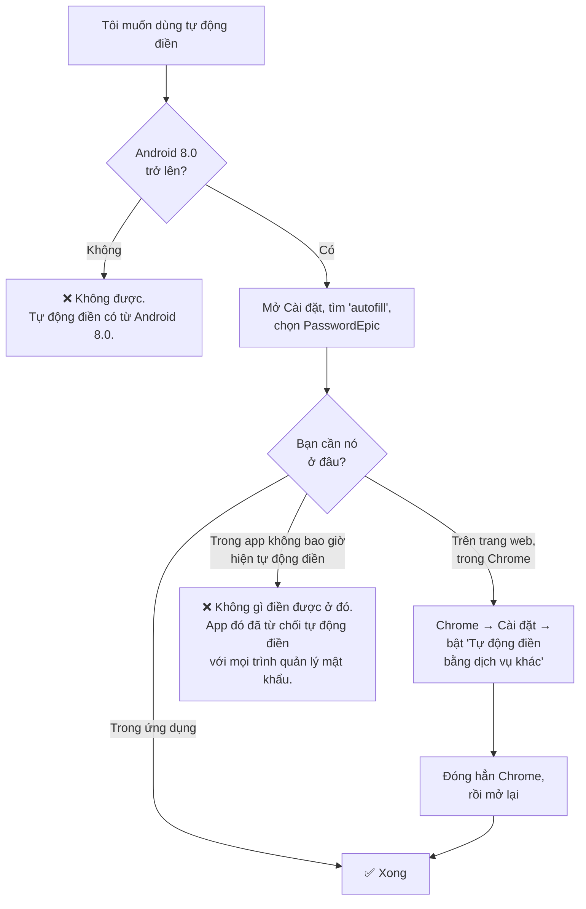
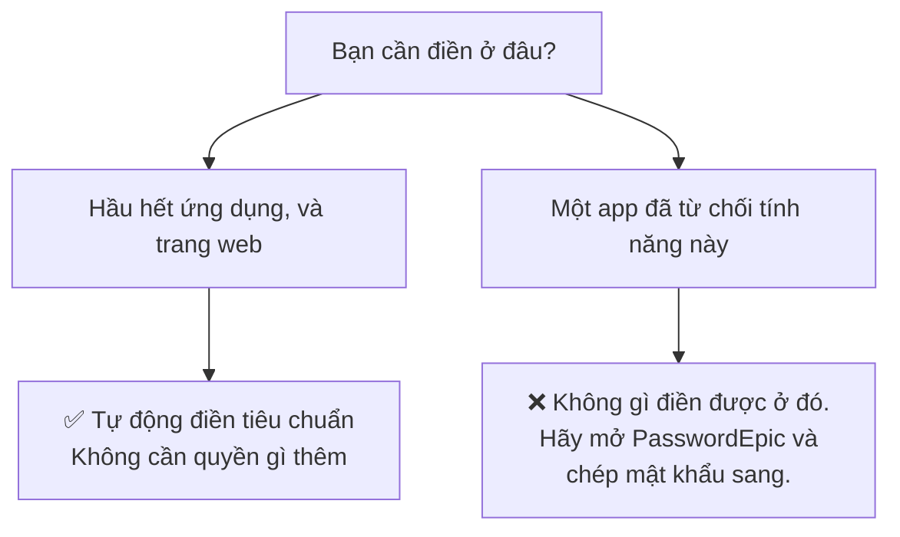
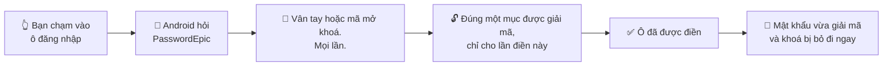

# Cài đặt tự động điền

PasswordEpic điền thông tin đăng nhập thông qua khung Autofill của chính Android.
Nó không theo dõi màn hình của bạn, và phần cài đặt cơ bản không cần quyền trợ
năng.

**Tự động điền cần Android 8.0 trở lên.** Trên máy cũ hơn, tuỳ chọn này sẽ không
xuất hiện — đó là do Android, không phải do ứng dụng.

## Cách nhanh nhất

Ứng dụng có thể đưa bạn thẳng tới đó: **Cài đặt → Quản lý tự động điền → Bật tự
động điền**. Trên phần lớn máy, thao tác này mở đúng màn hình hệ thống cần tới.

Nếu nó mở nhầm màn hình, hoặc không có gì xảy ra, hãy dùng đường dẫn thủ công
theo hãng máy ở dưới. Biết đường dẫn này vẫn có ích, vì Android đã dời mục cài
đặt này vài lần và mỗi hãng lại đặt một cái tên khác nhau.

## Mục cài đặt nằm ở đâu

Dù đường menu có khác nhau thế nào, màn hình bạn cần tìm là màn hình này — danh
sách mọi ứng dụng có thể điền mật khẩu, và bạn chọn đúng một:

Để ý những cái tên còn lại trong danh sách. Mỗi lúc chỉ một dịch vụ được ưu tiên,
nên chọn PasswordEpic đồng nghĩa với bỏ chọn Samsung Pass hay Google.

<h3 id="samsung">Samsung</h3>

**Cài đặt → Quản lý chung → Ngôn ngữ và bàn phím → Dịch vụ tự động điền →
PasswordEpic**

:::caution Samsung Pass hay cản đường

Máy Samsung mặc định đặt Samsung Pass làm dịch vụ tự động điền. Có thể bạn phải
chọn **Không có** trước, rồi mới chọn được PasswordEpic. Nếu PasswordEpic không
hiện trong danh sách, hãy thoát ra màn hình trước rồi vào lại.

:::

<h3 id="huawei">Huawei và Honor</h3>

**Cài đặt → Hệ thống → Ngôn ngữ và nhập liệu → Cài đặt nhập liệu khác → Dịch vụ
tự động điền → PasswordEpic**

<h3 id="pixel">Pixel và Android gốc</h3>

**Cài đặt → Mật khẩu và tài khoản → Dịch vụ tự động điền → PasswordEpic**

Trên Android 14 trở lên, mục này thường là **Cài đặt → Mật khẩu, mã khoá và tài
khoản → Nhà cung cấp bổ sung**.

<h3 id="other">Xiaomi, Oppo, Vivo, và các máy khác</h3>

Tên màn hình thì đổi, nhưng cụm "dịch vụ tự động điền" thì không. Hãy mở Cài đặt,
dùng **ô tìm kiếm ở trên cùng** và gõ `autofill` hoặc `tự động điền`. Cách này
nhanh hơn nhiều so với mò từng menu.

Nếu bạn muốn tự đi theo menu, một trong hai đường sau thường đúng:

- **Cài đặt → Hệ thống → Ngôn ngữ và nhập liệu → Dịch vụ tự động điền**
- **Cài đặt → Ứng dụng → Ứng dụng mặc định → Dịch vụ tự động điền**

## Làm cho nó chạy trong Chrome

Đây là bước hầu hết mọi người bỏ sót, và là lý do tự động điền thường chạy được
trong ứng dụng nhưng không chạy trên trang web.

**Chrome có trình quản lý mật khẩu riêng, và mặc định nó không giao biểu mẫu web
cho ai khác.** Chỉ đặt PasswordEpic làm dịch vụ tự động điền của máy là chưa đủ.

1. Đặt PasswordEpic làm dịch vụ tự động điền của hệ thống trước, theo các bước ở
   trên.
2. Mở **Chrome → ⋮ (ba chấm) → Cài đặt**.
3. Tìm mục **Dịch vụ tự động điền** và bật **"Tự động điền bằng dịch vụ khác"**.
4. Xác nhận, rồi **đóng hẳn Chrome và mở lại**. Chrome chỉ nhận thay đổi này sau
   khi khởi động lại.

:::note Tên menu thay đổi theo phiên bản Chrome

Tuỳ phiên bản Chrome, mục này nằm trong **Dịch vụ tự động điền**, trong **Mật
khẩu**, hoặc bên trong **Tự động điền và mật khẩu**. Cụm từ cần tìm là *"Tự động
điền bằng dịch vụ khác"* hoặc *"Dùng dịch vụ khác"*.

Nếu tìm mãi không thấy ở đâu, tức là Chrome của bạn thuộc phiên bản giữ riêng
biểu mẫu web cho Google Password Manager, và không trình quản lý mật khẩu bên thứ
ba nào được đề xuất trên trang web cả.

:::

Các trình duyệt khác — Firefox, Samsung Internet, Brave — hầu hết dùng thẳng dịch
vụ tự động điền của hệ thống và không cần bước thêm nào.

## Khi một ứng dụng từ chối hẳn tự động điền

Một số ứng dụng chủ động không dùng khung tự động điền. Đó là quyết định của họ và
không trình quản lý mật khẩu nào ghi đè được.

Không có cách nào lách được, và bạn nên nghi ngờ bất kỳ trình quản lý mật khẩu
nào nói ngược lại.

:::note Vì sao chúng tôi không lách

Chiêu thường thấy là dùng một **dịch vụ trợ năng** — quyền của Android cho phép
một ứng dụng đọc mọi ô trên màn hình. Cách đó chạy được, và PasswordEpic **cố ý
không** cài một dịch vụ như vậy.

Google không cho phép dùng API trợ năng theo kiểu đó, và lý do là chính đáng: đây
là quyền bị lạm dụng nhiều nhất trên Android, và cũng chính là quyền mà trang này
cảnh báo bạn ở những chỗ khác. Một trình quản lý mật khẩu đi xin quyền đó là đang
xin bạn cấp đúng thứ mà mã độc chuyên đánh cắp thông tin đăng nhập cần.

Với một app từ chối tự động điền, hãy mở PasswordEpic, sao chép mật khẩu rồi dán
vào. Chậm hơn, nhưng trung thực.

:::

## Thông báo bạn thấy ở lần đầu

Trước khi bật tự động điền, ứng dụng nói thẳng quyền đó cho phép làm gì: đọc được
các ô nhập liệu đang hiển thị trên màn hình. Và nói luôn giới hạn — mọi xử lý nằm
trên máy, không thu thập, không lưu, không gửi đi bất cứ thứ gì từ ứng dụng khác.

Hãy đọc nó thay vì bấm cho qua. Đây là quyền duy nhất trong ứng dụng này chạm tới
các ứng dụng khác, và bạn nên biết mình đang đồng ý điều gì.

## Mỗi lần nó chạy thì chuyện gì xảy ra

1. Bạn chạm vào một ô đăng nhập trong ứng dụng khác hoặc trên một trang web.
2. **Android** — chứ không phải PasswordEpic — nhận ra ô đó và hỏi dịch vụ tự
   động điền đang được chọn xem có gợi ý gì không.
3. PasswordEpic yêu cầu bạn xác nhận bằng **vân tay hoặc mã mở khoá**. Mọi lần,
   không ngoại lệ.
4. Đúng một mục được giải mã, chỉ cho lần điền đó. Phần còn lại của kho vẫn nằm
   nguyên ở dạng mã hoá.
5. Mật khẩu sau khi được giải mã, cùng với chiếc khoá, được giải phóng ngay khi ô
   đã được điền.

Không có khoảng thời gian nào mà việc điền diễn ra không cần bạn, và không có chế
độ "mở khoá trong năm phút".

### Ba bước đó, trên một màn đăng nhập thật

Bạn chạm vào ô; tên đăng nhập đã lưu hiện lên phía trên bàn phím, kèm biểu tượng
PasswordEpic. Chưa có gì được giải mã cả — dòng đó là một cái nhãn, không phải mật
khẩu.

Chọn nó thì ứng dụng hỏi mã mở khoá, và nói rõ nó sắp điền cho ứng dụng nào —
*Autofill for `fi.hsl.app`*. Hãy nhìn cái tên đó. Đấy là cách bạn phát hiện một
lần điền nhắm vào thứ chỉ trông giống ứng dụng bạn muốn.

Rồi cả hai ô được điền cùng lúc, và chiếc khoá lại biến mất.

## Ảnh chụp và bản ghi màn hình bắt được gì {#screen-capture}

Đây là hai chuyện khác nhau và Android xử lý chúng khác hẳn nhau. Một cái được xử
lý trọn vẹn; cái còn lại thì không, và chính khác biệt đó là lý do ứng dụng hành
xử như nó đang làm.

### Ảnh chụp màn hình bị từ chối thẳng

Khi một màn hình của PasswordEpic đang hiện trước mặt bạn — bản thân ứng dụng, hay
hộp thoại tự động điền nằm trên một app khác — Android sẽ **không chụp gì cả**.
Bạn nhận được thông báo "Không thể chụp màn hình do chính sách của ứng dụng" và
không có tấm ảnh nào: không có ứng dụng, không có bàn phím, không có bất cứ thứ gì
đang ở trên màn hình lúc đó.

### Quay màn hình trong ứng dụng thì ra toàn màu đen

Quay màn hình không bị từ chối thẳng. Nhưng thứ nó ghi lại được khi PasswordEpic
đang ở trước mặt bạn là **màu đen** — cả ứng dụng lẫn bàn phím phủ lên trên. Trong
khung hình không có gì để đọc cả.

### Hộp thoại tự động điền mới là trường hợp cần thêm biện pháp

Hộp thoại đó hiện lên trên một ứng dụng *khác*, và ứng dụng khác ấy vẫn đang bị
quay bình thường. Nên đây mới là chỗ một bản ghi có thể bắt được gì đó.

Từ **Android 15 trở lên**, ứng dụng phát hiện có bản ghi đang chạy và từ chối hẳn
việc nhập mã: ô nhập bị xoá và vô hiệu hoá, bàn phím bị đóng lại, và mọi thứ trở
lại bình thường khi bản ghi dừng.

Chỉ phát hiện thôi thì chẳng được gì. Từ chối cho nhập mới là phần có ích — tới
lúc bạn gõ xong thì đã muộn rồi.

Dưới Android 15 không có cách nào phát hiện bản ghi một cách đáng tin cậy, và ứng
dụng không giả vờ là có. Nếu điều đó quan trọng với bạn, trên máy cũ hãy điền từ
bên trong ứng dụng thay vì qua hộp thoại tự động điền.

Còn hai điều nữa đáng biết về khoảng hở trên máy Android cũ đó:

- **Bong bóng xem trước phím mới là chỗ có thể rò rỉ.** Bàn phím chỉ tắt cái chữ
  cái nhỏ nảy lên phía trên mỗi phím khi ô nhập là ô *mật khẩu* — nên ô nhập mã mở
  khoá luôn được giữ ở chế độ mật khẩu, kể cả khi bạn chạm vào hình con mắt để xem
  những gì mình vừa gõ. Hiển thị nội dung bên trong một cửa sổ được bảo vệ là an
  toàn; đưa bàn phím ra khỏi chế độ mật khẩu thì không.
- **Vị trí chạm không bị ghi lại**, trừ khi bạn đã bật tuỳ chọn nhà phát triển
  "Hiển thị thao tác chạm".

Nên ngay cả trong trường hợp đó cũng gần như không có gì để đọc. Nhưng "gần như"
không phải là "không có gì", và đó là lý do việc từ chối nhập tồn tại trên những
phiên bản hỗ trợ được nó.

:::caution Bàn phím của bạn có thể đọc những gì bạn gõ

Điều này đúng với mọi ứng dụng, không riêng ứng dụng này. Một bàn phím bạn cài đặt
nhìn thấy mọi phím bạn gõ cho nó.

Nếu điều đó quan trọng với bạn, hãy dùng bàn phím đi kèm máy. PasswordEpic sẽ cảnh
báo khi bàn phím đang dùng không phải bàn phím gốc.

:::

## Bên trong Quản lý tự động điền

**Cài đặt → Quản lý tự động điền** có ba tab.

**Service** là công tắc bật/tắt kèm một đoạn giải thích bằng lời thường. Câu đáng
nhớ nhất: *mật khẩu của bạn được mã hoá và luôn phải xác thực sinh trắc học trước
khi được điền.*

**Domains** là danh sách tên miền tin cậy, và nó không bắt đầu từ con số không —
ứng dụng đi kèm sẵn vài trăm tên miền đã được duyệt trước, nên các trang phổ biến
chạy được ngay từ ngày đầu. Bạn tìm kiếm được, tự thêm được, và xoá được bất kỳ
mục nào.

**Stats** đếm những gì đã thực sự xảy ra: tổng số lần điền, lần gần nhất là lúc
nào và cho ứng dụng nào, kèm hiệu quả theo từng tên miền và tình trạng dịch vụ.

Cái này hữu ích hơn vẻ ngoài của nó. Tự động điền là thứ bạn thôi để ý khi nó
chạy tốt, nên một con số đếm cứ đứng yên ở 0 là cách nhanh nhất để phát hiện ra
nó chưa từng chạy.

## Tắt đi

**Cài đặt → Quản lý tự động điền → Tắt tự động điền**, hoặc quay lại đúng màn hình
hệ thống bạn đã dùng ở trên rồi chọn **Không có** hoặc một dịch vụ khác.

Đăng xuất khỏi PasswordEpic cũng thu hồi tự động điền ngay lập tức — dịch vụ ngừng
trả lời các yêu cầu thay vì tiếp tục bằng một phiên đã cũ.

## Đọc tiếp

- [Sự cố thường gặp](./faq.md) — không thấy tự động điền, các thông báo lỗi, và ý nghĩa của chúng
- [Mã mở khoá của bạn](./your-passcode.md) — thứ bạn sẽ được hỏi ở mỗi lần điền
- [Cách hoạt động](./how-it-works.md) — những gì phải xảy ra trước khi một mục có thể được giải mã
