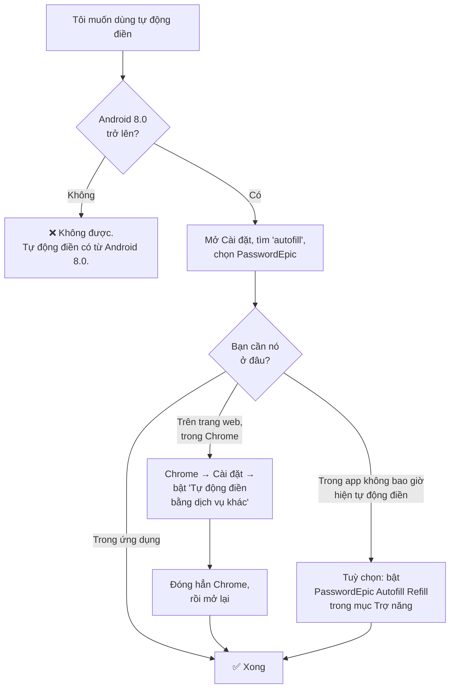
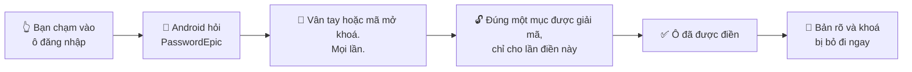

# Cài đặt tự động điền

PasswordEpic điền thông tin đăng nhập thông qua khung Autofill của chính Android.
Nó không theo dõi màn hình của bạn, và phần cài đặt cơ bản không cần quyền trợ
năng.

**Tự động điền cần Android 8.0 trở lên.** Trên máy cũ hơn, tuỳ chọn này sẽ không
xuất hiện — đó là do Android, không phải do ứng dụng.

## Cách nhanh nhất

Ứng dụng có thể đưa bạn thẳng tới đó: **Cài đặt → Quản lý tự động điền → Bật tự
động điền**. Trên phần lớn máy, thao tác này mở đúng màn hình hệ thống cần tới.

Nếu nó mở nhầm màn hình, hoặc không có gì xảy ra, hãy dùng đường dẫn thủ công
theo hãng máy ở dưới. Biết đường dẫn này vẫn có ích, vì Android đã dời mục cài
đặt này vài lần và mỗi hãng lại đặt một cái tên khác nhau.

## Mục cài đặt nằm ở đâu

<h3 id="samsung">Samsung</h3>

**Cài đặt → Quản lý chung → Ngôn ngữ và bàn phím → Dịch vụ tự động điền →
PasswordEpic**

:::caution Samsung Pass hay cản đường

Máy Samsung mặc định đặt Samsung Pass làm dịch vụ tự động điền. Có thể bạn phải
chọn **Không có** trước, rồi mới chọn được PasswordEpic. Nếu PasswordEpic không
hiện trong danh sách, hãy thoát ra màn hình trước rồi vào lại.

:::

<h3 id="huawei">Huawei và Honor</h3>

**Cài đặt → Hệ thống → Ngôn ngữ và nhập liệu → Cài đặt nhập liệu khác → Dịch vụ
tự động điền → PasswordEpic**

<h3 id="pixel">Pixel và Android gốc</h3>

**Cài đặt → Mật khẩu và tài khoản → Dịch vụ tự động điền → PasswordEpic**

Trên Android 14 trở lên, mục này thường là **Cài đặt → Mật khẩu, mã khoá và tài
khoản → Nhà cung cấp bổ sung**.

<h3 id="other">Xiaomi, Oppo, Vivo, và các máy khác</h3>

Tên màn hình thì đổi, nhưng cụm "dịch vụ tự động điền" thì không. Hãy mở Cài đặt,
dùng **ô tìm kiếm ở trên cùng** và gõ `autofill` hoặc `tự động điền`. Cách này
nhanh hơn nhiều so với mò từng menu.

Nếu bạn muốn tự đi theo menu, một trong hai đường sau thường đúng:

- **Cài đặt → Hệ thống → Ngôn ngữ và nhập liệu → Dịch vụ tự động điền**
- **Cài đặt → Ứng dụng → Ứng dụng mặc định → Dịch vụ tự động điền**

## Làm cho nó chạy trong Chrome

Đây là bước hầu hết mọi người bỏ sót, và là lý do tự động điền thường chạy được
trong ứng dụng nhưng không chạy trên trang web.

**Chrome có trình quản lý mật khẩu riêng, và mặc định nó không giao biểu mẫu web
cho ai khác.** Chỉ đặt PasswordEpic làm dịch vụ tự động điền của máy là chưa đủ.

1. Đặt PasswordEpic làm dịch vụ tự động điền của hệ thống trước, theo các bước ở
   trên.
2. Mở **Chrome → ⋮ (ba chấm) → Cài đặt**.
3. Tìm mục **Dịch vụ tự động điền** và bật **"Tự động điền bằng dịch vụ khác"**.
4. Xác nhận, rồi **đóng hẳn Chrome và mở lại**. Chrome chỉ nhận thay đổi này sau
   khi khởi động lại.

:::note Tên menu thay đổi theo phiên bản Chrome

Tuỳ phiên bản Chrome, mục này nằm trong **Dịch vụ tự động điền**, trong **Mật
khẩu**, hoặc bên trong **Tự động điền và mật khẩu**. Cụm từ cần tìm là *"Tự động
điền bằng dịch vụ khác"* hoặc *"Dùng dịch vụ khác"*.

Nếu tìm mãi không thấy ở đâu, tức là Chrome của bạn thuộc phiên bản giữ riêng
biểu mẫu web cho Google Password Manager, và không trình quản lý mật khẩu bên thứ
ba nào được đề xuất trên trang web cả.

:::

Các trình duyệt khác — Firefox, Samsung Internet, Brave — hầu hết dùng thẳng dịch
vụ tự động điền của hệ thống và không cần bước thêm nào.

## Khi một ứng dụng từ chối hẳn tự động điền

Một số ứng dụng chủ động không dùng khung tự động điền. Đó là quyết định của họ và
không trình quản lý mật khẩu nào ghi đè được.

Cho những trường hợp đó, PasswordEpic có một dịch vụ **riêng và không bắt buộc**
tên là **PasswordEpic Autofill Refill**, dùng quyền trợ năng của Android để điền
vào những biểu mẫu mà khung tiêu chuẩn không với tới.

**Cài đặt → Trợ năng → PasswordEpic Autofill Refill → Bật**

:::warning Cái này đáng để bạn cân nhắc một chút

Trợ năng là một quyền rất mạnh — đó đúng là quyền mà trang này cảnh báo bạn ở
những chỗ khác, vì mã độc hay lợi dụng nó để đọc màn hình.

Ứng dụng dùng nó để làm gì: đọc các ô trên màn hình chỉ nhằm tìm biểu mẫu đăng
nhập và điền thông tin bạn đã lưu, và luôn sau khi bạn xác thực bằng vân tay hoặc
mã mở khoá. Mọi thứ diễn ra trên máy bạn; nội dung màn hình không bao giờ được
thu thập, lưu trữ hay truyền đi.

Nó **không bắt buộc**. Nếu tự động điền tiêu chuẩn đã phủ hết các ứng dụng bạn
dùng thì cứ để tắt. Bạn có thể tắt nó bất cứ lúc nào ở cùng màn hình đó.

:::

## Mỗi lần nó chạy thì chuyện gì xảy ra

1. Bạn chạm vào một ô đăng nhập trong ứng dụng khác hoặc trên một trang web.
2. **Android** — chứ không phải PasswordEpic — nhận ra ô đó và hỏi dịch vụ tự
   động điền đang được chọn xem có gợi ý gì không.
3. PasswordEpic yêu cầu bạn xác nhận bằng **vân tay hoặc mã mở khoá**. Mọi lần,
   không ngoại lệ.
4. Đúng một mục được giải mã, chỉ cho lần điền đó. Phần còn lại của kho vẫn nằm
   nguyên ở dạng mã hoá.
5. Bản rõ và chiếc khoá được giải phóng ngay khi ô đã được điền.

Không có khoảng thời gian nào mà việc điền diễn ra không cần bạn, và không có chế
độ "mở khoá trong năm phút".

## Một bản ghi màn hình thấy được gì

Các cửa sổ của chính ứng dụng — bao gồm cả hộp thoại tự động điền — được loại khỏi
ảnh chụp và bản ghi màn hình. Khi bị quay, chúng hiện ra màu đen.

**Bàn phím không nằm trong số đó.** Nó do ứng dụng bàn phím bạn đang dùng vẽ ra,
trong tiến trình riêng của nó, và không ứng dụng nào có thể mở rộng lớp bảo vệ ấy
sang cửa sổ của ứng dụng khác. Vì vậy một bản ghi sẽ cho thấy hộp thoại tối đen
với một bàn phím hiện rõ bên dưới.

Hai điều rút ra từ đó, và cả hai đều đáng lưu ý:

- **Bong bóng xem trước phím mới là chỗ rò rỉ thật sự.** Bàn phím chỉ tắt cái chữ
  cái nhỏ nảy lên phía trên mỗi phím khi ô nhập là ô mật khẩu — nên ô nhập mã mở
  khoá luôn được giữ ở chế độ mật khẩu, kể cả khi bạn chạm vào hình con mắt để xem
  những gì mình vừa gõ. Hiển thị nội dung bên trong một cửa sổ được bảo vệ là an
  toàn; đưa bàn phím ra khỏi chế độ mật khẩu thì không.
- **Vị trí chạm không bị ghi lại**, trừ khi bạn đã bật tuỳ chọn nhà phát triển
  "Hiển thị thao tác chạm".

Phần rủi ro còn lại là nhỏ, nhưng không phải bằng không. Loại bỏ nó hoàn toàn sẽ
cần một bàn phím số dựng sẵn trong ứng dụng, đồng nghĩa với việc từ bỏ những mã mở
khoá có chữ cái và ký hiệu.

:::caution Bàn phím của bạn có thể đọc những gì bạn gõ

Điều này đúng với mọi ứng dụng, không riêng ứng dụng này. Một bàn phím bạn cài đặt
nhìn thấy mọi phím bạn gõ cho nó.

Nếu điều đó quan trọng với bạn, hãy dùng bàn phím đi kèm máy. PasswordEpic sẽ cảnh
báo khi bàn phím đang dùng không phải bàn phím gốc.

:::

## Tắt đi

**Cài đặt → Quản lý tự động điền → Tắt tự động điền**, hoặc quay lại đúng màn hình
hệ thống bạn đã dùng ở trên rồi chọn **Không có** hoặc một dịch vụ khác.

Đăng xuất khỏi PasswordEpic cũng thu hồi tự động điền ngay lập tức — dịch vụ ngừng
trả lời các yêu cầu thay vì tiếp tục bằng một phiên đã cũ.

## Đọc tiếp

- [Sự cố thường gặp](./faq.md) — không thấy tự động điền, các thông báo lỗi, và ý nghĩa của chúng
- [Mã mở khoá của bạn](./your-passcode.md) — thứ bạn sẽ được hỏi ở mỗi lần điền
- [Cách hoạt động](./how-it-works.md) — những gì phải xảy ra trước khi một mục có thể được giải mã
