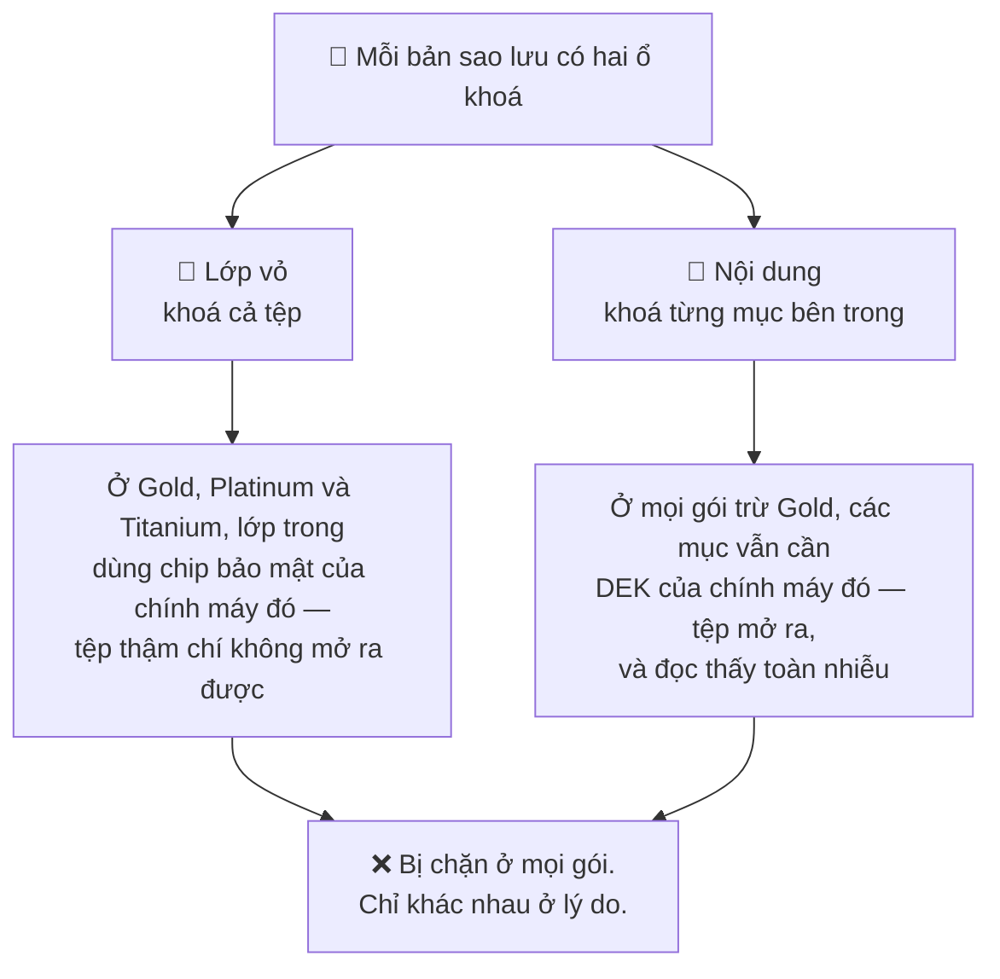
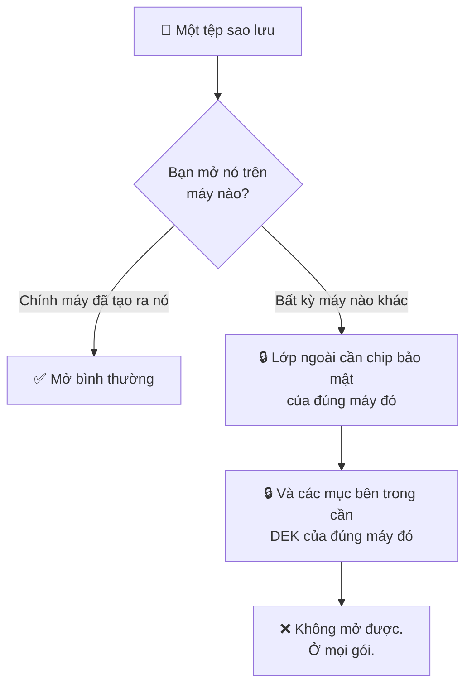
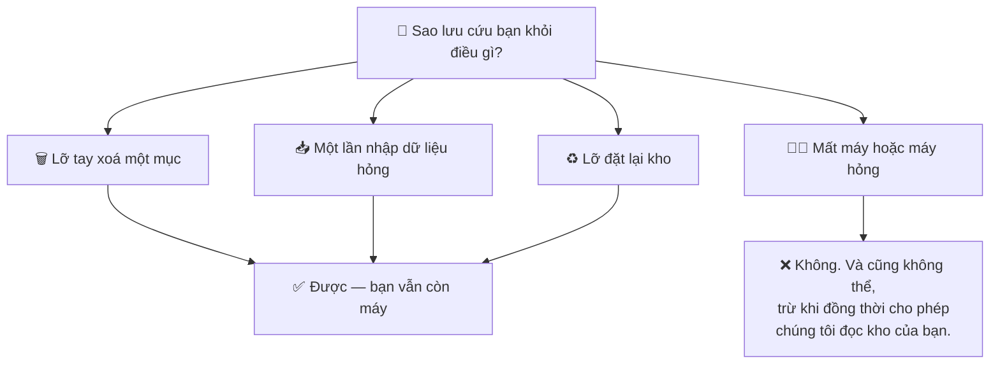

# Sao lưu và xuất dữ liệu

Có một câu chi phối cả trang này, và đó cũng là câu mà người ta hay cho rằng không
đúng nhất:

:::danger Không bản sao lưu hay bản xuất nào mở được trên thiết bị khác với thiết bị đã tạo ra nó

Ở mọi gói. Sản phẩm này không có đường chuyển dữ liệu sang thiết bị khác.

:::

Nếu bạn đang tìm cách chuyển kho mật khẩu sang điện thoại mới thì không có cách
nào cả. Nhưng đọc hết trang này vẫn đáng, vì *lý do* của điều đó chính là lý do
khiến mật khẩu của bạn an toàn.

## Vì sao tệp không di chuyển được

Một tệp có **lớp vỏ** — phần mã hoá bao trùm cả tệp — và **nội dung**, là các mục
bên trong nó. Cả hai đều có thể bị gắn với một thiết bị, và cái nào gắn thì tuỳ
vào gói của bạn.

**Lớp vỏ.** Ở Gold, Platinum và Titanium, tệp được ghi với hai lớp mã hoá. Lớp
ngoài dẫn xuất từ mã mở khoá của bạn. Lớp trong dùng một chiếc khoá nằm trong
StrongBox hoặc TEE của chính chiếc điện thoại đó. Khi giải mã, lớp thiết bị được
gỡ *trước* — nên không có phần cứng bảo mật của máy đó thì tệp thậm chí không mở
ra được.

**Nội dung.** Ở mọi gói trừ Gold, các mục bên trong tệp vẫn được mã hoá bằng DEK — mà DEK cần Shard 1, thứ không bao giờ rời khỏi thiết bị.

| Gói | Lớp vỏ | Các mục bên trong | Mở được ở nơi khác? |
| --- | --- | --- | --- |
| 🥈 Silver | Di chuyển được | Mã hoá bằng DEK | ❌ không đọc được nội dung |
| 🥇 Gold | Gắn với thiết bị | Đã giải mã | ❌ không mở được lớp vỏ |
| 💎 Platinum | Gắn với thiết bị | Mã hoá bằng DEK | ❌ cả hai |
| 🛡️ Titanium | Gắn với thiết bị | Mã hoá bằng DEK | ❌ cả hai |

Mọi gói đều bị chặn. Chỉ khác nhau ở lý do — và đó chính là vì sao đọc lướt phần
này cứ liên tục dẫn tới những kết luận rất chắc chắn và rất sai.

## Sao lưu thật ra để làm gì

Chúng bảo vệ bạn khỏi việc **mất dữ liệu trên chiếc điện thoại bạn vẫn còn**:

- một mục bị xoá nhầm
- một lần nhập dữ liệu hỏng
- một lần đặt lại kho mà bạn không định làm

Chúng không bảo vệ bạn khỏi việc mất điện thoại. Không có gì trong sản phẩm này
làm được điều đó, và cũng không thể có, trừ khi đồng thời trao cho chúng tôi khả
năng đọc kho của bạn.

## Bản sao lưu đi vào Google Drive của bạn

Nếu bạn bật sao lưu, tệp được ghi vào tài khoản Google Drive **của chính bạn**,
không phải của chúng tôi. Chúng tôi không bao giờ nhận được chúng và có nhận cũng
không đọc được.

Cụ thể hơn, bản sao lưu đi vào một **vùng riêng trong Drive mà chỉ ứng dụng này mở
được** — nó không được liệt kê giữa các tệp của bạn, nên bạn không thể lỡ tay đổi
tên hay chia sẻ nhầm. *Xuất dữ liệu* thì khác: ở đó bạn tự chọn giữa bộ nhớ máy,
My Drive nhìn thấy được, hoặc chính vùng riêng đó.

Ứng dụng chỉ xin Google hai quyền hẹp: thư mục riêng của chính nó, và những tệp do
chính nó tạo ra. Không quyền nào cho phép nó nhìn phần còn lại trong Drive của
bạn.

## Nên làm gì thay vì trông chờ vào việc chuyển máy

Vì điện thoại mới sẽ bắt đầu với một kho rỗng, hãy tính trước cho điều đó:

- **Giữ mã mở khoá ở nơi mà một năm nữa bạn vẫn còn.** Mất điện thoại và mất luôn
  mã mở khoá là không thể cứu vãn; chỉ mất điện thoại thì vẫn còn nghĩa là làm lại
  từ đầu.
- **Đừng để PasswordEpic là bản lưu duy nhất của thứ bạn không thể mất.** Với vài
  thông tin thật sự quan trọng — chẳng hạn mã khôi phục email của bạn — hãy giữ
  thêm một bản ở chỗ khác.
- **Vẫn cứ sao lưu đều đặn.** Nó vẫn là câu trả lời cho mọi sự cố không phải là
  "chiếc điện thoại đã mất".

Chúng tôi thà nói thẳng điều này còn hơn để bạn phát hiện ra sau khi đã mất thiết
bị.

## Đọc tiếp

- [Cách hoạt động](./how-it-works.md) — vì sao Shard 1 không thể rời khỏi điện thoại
- [Một thiết bị cho mỗi tài khoản](./your-device.md) — chuyển sang máy mới, và bộ phận hỗ trợ làm được gì
- [Các gói bảo mật](./security-tiers.md) — gói nào ghi ra loại tệp nào
