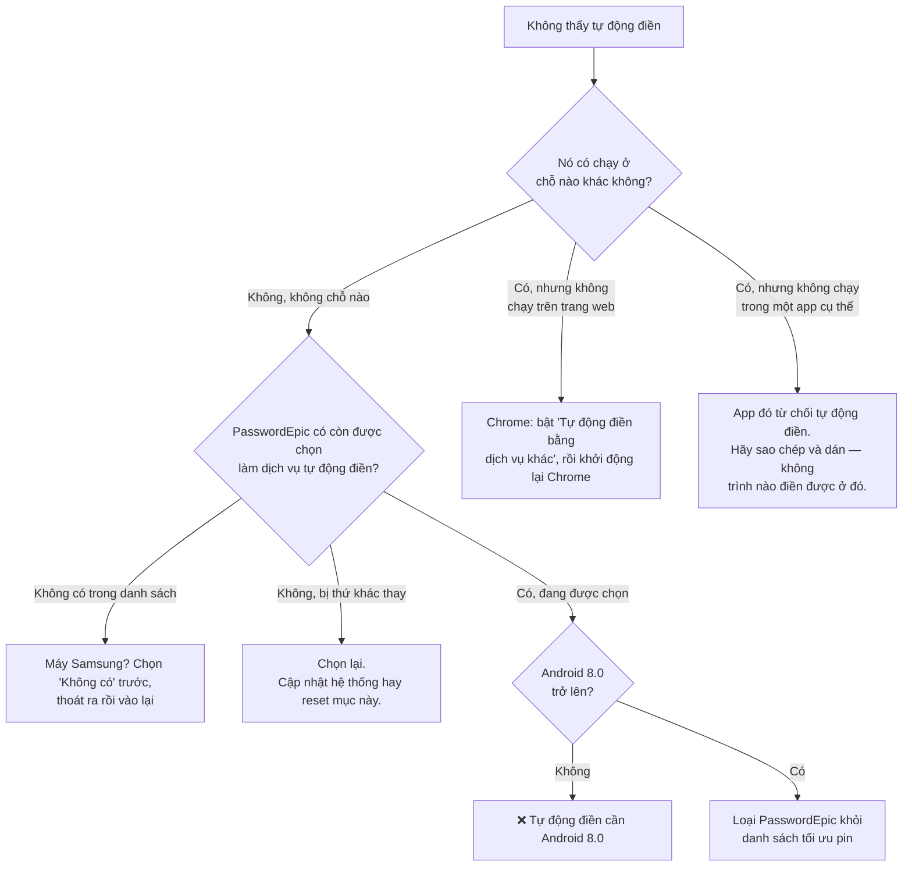
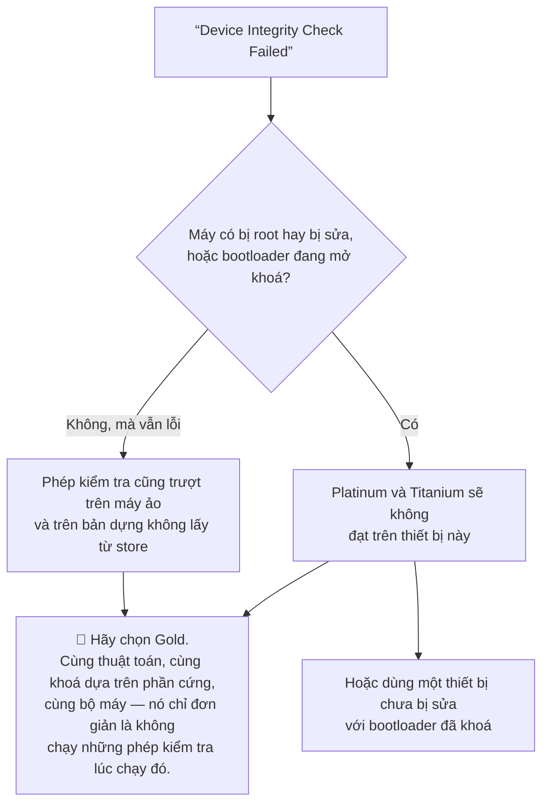
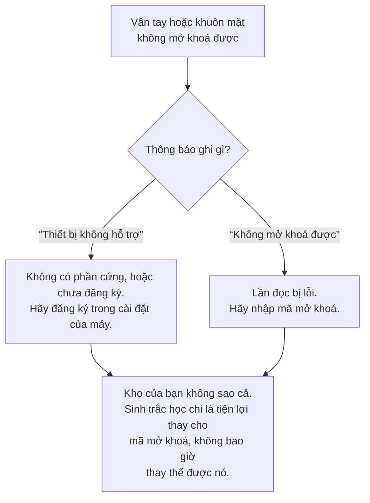

# Sự cố thường gặp

Nhóm theo nơi bạn gặp phải. Một số mục ở đây không phải lỗi — mà là ứng dụng đang
từ chối làm một việc không an toàn, và mỗi mục đều nói rõ là loại nào.

Nếu không có mục nào đúng với trường hợp của bạn, hãy gửi email tới
[support@passwordepic.com](mailto:support@passwordepic.com) kèm địa chỉ email bạn
dùng để đăng nhập. Đó là thứ chúng tôi tra cứu.

## Tự động điền

### Hoàn toàn không thấy tự động điền

Hãy làm lần lượt theo thứ tự — hai mục đầu chiếm phần lớn các trường hợp.

1. **PasswordEpic có đang thật sự được chọn làm dịch vụ tự động điền không?** Đặt
   một lần không có nghĩa là vĩnh viễn: một bản cập nhật hệ thống, hoặc việc cài
   thêm một trình quản lý mật khẩu khác, có thể lặng lẽ thay thế nó. Kiểm tra
   theo đường dẫn ở
   [Mục cài đặt nằm ở đâu](./autofill.md#mục-cài-đặt-nằm-ở-đâu).
2. **Máy bạn có chạy Android 8.0 trở lên không?** Trước phiên bản đó chưa có tự
   động điền. Ứng dụng sẽ cho bạn biết máy đang chạy Android mấy.
3. **Tính năng tối ưu pin có đang hạn chế ứng dụng không?** Hộp thoại tự động điền
   là một cửa sổ riêng, và một ứng dụng bị hạn chế gắt sẽ không mở được nó. Hãy
   loại PasswordEpic khỏi danh sách tối ưu pin.
4. **Bạn có vừa đăng xuất không?** Đăng xuất thu hồi tự động điền, và đó là cố ý.

### Chạy được trong ứng dụng nhưng không chạy trên trang web

Gần như chắc chắn bạn đang dùng Chrome, và Chrome giữ riêng biểu mẫu web cho trình
quản lý mật khẩu của chính nó cho tới khi bạn bảo nó làm khác đi.

Hãy bật **"Tự động điền bằng dịch vụ khác"** trong cài đặt của chính Chrome, rồi
khởi động lại Chrome. Các bước đầy đủ ở
[Làm cho nó chạy trong Chrome](./autofill.md#làm-cho-nó-chạy-trong-chrome).

### "Autofill Not Supported" / Không hỗ trợ tự động điền

Máy bạn đang chạy Android 7 hoặc cũ hơn. Tự động điền là tính năng của Android 8.0
và ứng dụng không làm gì được. Mọi thứ khác trong PasswordEpic vẫn hoạt động — bạn
sao chép và dán thay vì để nó điền.

### "Failed to open autofill settings" / Không mở được cài đặt tự động điền

Ứng dụng đã cố đưa bạn thẳng tới màn hình hệ thống cần tới và máy bạn từ chối.
Không nguy hại gì, và cách thủ công vẫn chạy: mở Cài đặt, tìm `autofill`, rồi chọn
PasswordEpic. Xem
[đường dẫn theo từng hãng](./autofill.md#mục-cài-đặt-nằm-ở-đâu).

### PasswordEpic không có trong danh sách dịch vụ tự động điền

Thường là máy Samsung, nơi **Samsung Pass** đang giữ chỗ. Hãy chọn **Không có**
trước, thoát khỏi màn hình, quay lại — lúc này PasswordEpic sẽ xuất hiện.

### Một ứng dụng cụ thể không bao giờ hiện tự động điền

Một số ứng dụng chủ động không dùng khung tự động điền. Đó là lựa chọn của họ và
không trình quản lý mật khẩu nào ghi đè được.

Hãy mở PasswordEpic, sao chép mật khẩu rồi dán vào ứng dụng đó. Chậm hơn, nhưng
đó là câu trả lời trung thực duy nhất — xem
[vì sao chúng tôi không lách](./autofill.md#khi-một-ứng-dụng-từ-chối-hẳn-tự-động-điền).

### Có gợi ý nhưng lại là mục sai

Tự động điền khớp theo tên miền. Hãy kiểm tra địa chỉ website đã lưu trong mục đó
— một thông tin đăng nhập lưu cho `example.com` sẽ không được đề xuất trên
`example.org`, và mặc định các tên miền con như `mail.example.com` chỉ khớp nếu
bạn đã bật khớp tên miền con (**Cài đặt → Quản lý tự động điền**).

## Đăng nhập và thiết bị

### "Tài khoản đang hoạt động trên thiết bị khác"

Tài khoản của bạn gắn với một điện thoại tại một thời điểm ở các gói trả phí. Đây
là cấp phép theo chỗ ngồi, không phải lỗi.

- **Bạn vẫn còn máy cũ:** mở PasswordEpic trên máy đó và chọn **Cài đặt → Đặt lại
  tài khoản**. Thao tác đó xoá dữ liệu trên thiết bị ấy và giải phóng tài khoản.
- **Bạn không còn máy cũ:** gửi email cho chúng tôi và chúng tôi sẽ giải phóng
  giúp. Đây là trường hợp duy nhất mà bộ phận hỗ trợ thật sự là lối đi duy nhất,
  vì bình thường việc giải phóng một thiết bị cần chữ ký phần cứng của chính thiết
  bị đó.

:::warning Giải phóng tài khoản không mang kho cũ đi theo

Bạn bắt đầu lại từ đầu trên máy mới. Kho cũ vẫn nằm nguyên ở dạng mã hoá, bằng một
chiếc khoá chỉ từng tồn tại bên trong chiếc điện thoại cũ. Xem
[Sao lưu và xuất dữ liệu](./backups.md).

:::

### "Device Integrity Check Failed" / Kiểm tra toàn vẹn thiết bị thất bại

Platinum và Titanium yêu cầu ứng dụng chứng minh nó là bản thật, chưa bị sửa, và
đang chạy trên một thiết bị chưa bị can thiệp. Một phần nào đó trong phép kiểm tra
đã không đạt — bootloader đã khoá là một yêu cầu phổ biến, và máy đã root hoặc đã
bị sửa thì chắc chắn không đạt.

Có hai hướng đi tiếp: dùng một thiết bị chưa bị sửa với bootloader đã khoá, hoặc
**chọn gói Gold**, gói này có phần mã hoá y hệt và không chạy những phép kiểm tra
lúc chạy đó.

Gold không phải là hạ cấp về mật mã học. Vẫn cùng bộ máy, cùng khoá dựa trên phần
cứng, cùng thuật toán. Xem [Các gói bảo mật](./security-tiers.md).

### "Rooted Device Detected" / Phát hiện thiết bị đã root

Ứng dụng phát hiện các hạn chế có sẵn của máy đã bị gỡ bỏ. Trên một chiếc máy đã
root, ứng dụng khác có thể đọc bộ nhớ của ứng dụng này — kể cả mã mở khoá lúc bạn
đang gõ, và khoá kho lúc đang được dùng.

Bản thân chiếc khoá nằm trong phần cứng thì vẫn được bảo vệ, nhưng mọi thứ xung
quanh nó thì không. Các gói trả phí từ chối thao tác khoá ở đây là có chủ đích.

### Mở khoá bằng sinh trắc học không chạy

- **"Thiết bị này không hỗ trợ xác thực sinh trắc học"** — máy không có phần cứng
  vân tay hoặc khuôn mặt, hoặc chưa đăng ký. Hãy đăng ký trong cài đặt của máy.
- **"Không mở khoá được bằng sinh trắc học"** — lần đọc bị lỗi. Hãy nhập mã mở
  khoá; sinh trắc học chỉ là tiện lợi thay cho mã mở khoá, không bao giờ thay thế
  được nó.

Lưu ý rằng đổi kiểu khoá màn hình của máy có thể làm mất hiệu lực sinh trắc học đã
đăng ký ở mức hệ điều hành. Kho của bạn không bị ảnh hưởng — bạn mở khoá bằng mã và
đăng ký lại vân tay.

### "Thông tin bạn nhập không khớp"

Mã mở khoá sai. Không có cơ chế khoá vĩnh viễn nào phá huỷ kho của bạn, nên cứ thử
lại cẩn thận.

Nếu bạn thật sự không nhớ nổi thì không có cách khôi phục — hãy đọc
[Mã mở khoá của bạn](./your-passcode.md#chọn-một-mã-bạn-sẽ-không-quên) trước khi
đặt mã tiếp theo.

## Những cảnh báo bạn có thể gặp

Đây là ứng dụng đang nói cho bạn biết điều gì đó về môi trường xung quanh. Không
cái nào có nghĩa là ứng dụng bị hỏng.

### "Phát hiện quay màn hình. Việc nhập mã đã bị khoá"

Có thứ gì đó đang quay màn hình của bạn, và ứng dụng đã khoá việc nhập mã cho tới
khi nó dừng.

Đây là cố ý. Nó quan trọng nhất với **hộp thoại tự động điền**, vì hộp thoại đó
nằm trên một ứng dụng khác đang bị quay bình thường — còn bên trong chính
PasswordEpic thì bản ghi vốn đã ra toàn màu đen, kể cả bàn phím. Hãy dừng bản ghi
rồi thử lại.

*Chụp ảnh màn hình* lại là chuyện khác: Android từ chối thẳng khi một màn hình của
PasswordEpic đang hiện, nên không bắt được gì cả.

Có từ Android 15 trở lên. Ở phiên bản cũ hơn, ứng dụng hoàn toàn không phát hiện
được bản ghi, và cũng không hề nói là phát hiện được.

### "Bàn phím bên thứ ba: …"

Bàn phím bạn đang dùng không đi kèm máy. Bàn phím nào cũng nhìn thấy mọi phím bạn
gõ cho nó, trong mọi ứng dụng.

Đây là một **cảnh báo có thể bỏ qua, không bao giờ là rào chặn** — cài Gboard hay
SwiftKey từ Play Store là chuyện hoàn toàn bình thường. Nếu bạn không muốn mạo hiểm
trong lúc gõ mã mở khoá, hãy tạm chuyển sang bàn phím đi kèm máy cho khoảnh khắc
đó.

Ứng dụng cố ý không giữ danh sách bàn phím "được duyệt", vì một ứng dụng có thể tự
khai bất kỳ tên nào, mà tên thì không phải bằng chứng về danh tính.

### Cảnh báo lớp phủ hoặc trợ năng chặn bạn mở khoá

Có thứ gì đó đang vẽ đè lên bàn phím nhập mã, hoặc có một dịch vụ trợ năng đang
chạy. Cả hai đều có thể bắt được mã mở khoá ngay lúc bạn gõ, trước khi phần mã hoá
kịp tham gia.

Hãy đóng ứng dụng đang vẽ đè lên màn hình — bộ lọc ánh sáng, bong bóng chat và ứng
dụng quay màn hình là những thủ phạm quen thuộc — hoặc tạm tắt dịch vụ trợ năng,
rồi thử lại.

Bản thân PasswordEpic không cài dịch vụ trợ năng nào, nên không có cảnh báo nào ở
đây là do chính nó gây ra.

## Sao lưu và khôi phục

### "Bản sao lưu này không khôi phục được trên thiết bị khác"

Đúng vậy, và đúng ở mọi gói. Bản sao lưu mang một lớp mã hoá gắn với phần cứng bảo
mật của chiếc điện thoại đã tạo ra nó.

Chúng bảo vệ bạn khỏi việc mất dữ liệu **trên chiếc điện thoại bạn vẫn còn** — xoá
nhầm, nhập dữ liệu hỏng, đặt lại kho. Chúng không phải đường chuyển máy, và không
có tuỳ chọn nào biến chúng thành như vậy. Xem
[Sao lưu và xuất dữ liệu](./backups.md).

### Bản sao lưu khôi phục được nhưng các mục bên trong không đọc được

Cùng một nguyên nhân. Tệp mở ra được vì bạn có mã mở khoá, nhưng các mục bên trong
vẫn đang được mã hoá bằng một khoá kho cần tới phần cứng của chiếc máy gốc.

### Tôi muốn chuyển sang điện thoại mới

Không có cách nào mang kho cũ theo. Hãy giải phóng tài khoản khỏi máy cũ (hoặc nhờ
chúng tôi làm), đăng nhập trên máy mới, và nhập lại mật khẩu.

Chúng tôi thà nói thẳng điều này còn hơn để bạn phát hiện ra sau khi đã mất thiết
bị.

## Xoá sạch mọi thứ

**Cài đặt → Đặt lại tài khoản.** Có hiệu lực ngay, không hàng đợi, không thời gian
lưu giữ, không phiếu hỗ trợ. Nó xoá kho mật khẩu và dữ liệu tài khoản của bạn khỏi
máy chủ của chúng tôi.

Không thể hoàn tác, và sau đó chúng tôi cũng không lấy lại được — đó chính là đặc
tính đã ngăn mọi người khác đọc kho của bạn.

## Đọc tiếp

- [Cài đặt tự động điền](./autofill.md) — hướng dẫn cài đặt đầy đủ
- [Mã mở khoá của bạn](./your-passcode.md) — chọn một mã bạn sẽ không đánh mất
- [Những từ này nghĩa là gì](./plain-words.md) — mọi thuật ngữ kỹ thuật, nói bằng lời thường
- [Hỗ trợ](/vi/support) — cách liên hệ với người thật
