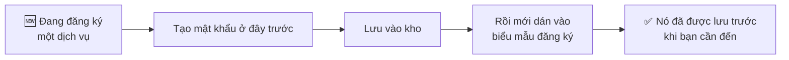

# Tạo mật khẩu

Tab **Generator** tạo ra những mật khẩu bạn không cần phải nhớ — và đó chính là
toàn bộ lý do một trình quản lý mật khẩu đáng dùng. Bạn chỉ nhớ đúng một bí mật,
và nó không phải bất kỳ cái nào trong số này.

## Màn hình

| Điều khiển | Nó làm gì |
| --- | --- |
| **Tạo** | Sinh một mật khẩu mới theo thiết lập hiện tại. Bấm bao nhiêu lần cũng được. |
| **Độ dài** | Thanh trượt. Dài hơn thì tốt hơn, và chẳng tốn gì khi bạn không bao giờ phải gõ nó. |
| **Chữ hoa (A–Z)** | |
| **Chữ thường (a–z)** | |
| **Chữ số (0–9)** | |
| **Ký hiệu (!@#)** | |
| **Loại ký tự dễ nhầm** | Bỏ những ký tự người ta hay đọc nhầm — `l` `1` `I`, `0` `O`. |
| **Sao chép** | Đưa nó vào clipboard. |
| **Lưu vào kho** | Tạo một mục với mật khẩu này đã điền sẵn. |

### Khi nào nên tắt bớt loại ký tự

Gần như không bao giờ — mỗi công tắc bạn tắt đi đều làm mật khẩu yếu hơn. Có đúng
một ngoại lệ thành thật: **một trang web không chấp nhận ký hiệu.** Vẫn còn những
trang như vậy. Hãy tắt ký hiệu và tăng thêm vài ký tự độ dài để bù lại.

**Loại ký tự dễ nhầm** thì khác. Nó gần như không làm bạn mất gì, và đáng bật với
bất kỳ mật khẩu nào có ngày bạn phải đọc to lên, gõ bằng điều khiển TV, hay đọc
qua điện thoại.

## Sáu preset

Preset đặt tất cả công tắc cùng lúc. Chúng tồn tại vì mật khẩu đúng cho ngân hàng
của bạn không phải mật khẩu đúng cho mạng Wi-Fi bạn đọc cho khách.

| Preset | Trông như | Chọn khi |
| --- | --- | --- |
| **Strong** | `K7#mQ2$vX9!pL4` | Bất cứ thứ gì quan trọng — email, ngân hàng, thứ có thể đặt lại tài khoản khác. **Câu trả lời mặc định.** |
| **Memory** | Dễ đọc thành tiếng | Thỉnh thoảng bạn vẫn phải gõ tay. |
| **PIN** | `483920` | Mã PIN thẻ, SIM, mã cửa. Chỉ chữ số. |
| **Phrase** | `BlueSky2024Fast` | Bạn cần nhớ hoặc nói ra, nhưng vẫn muốn đủ dài. |
| **WiFi** | `HomeNet2024` | Thứ khách sẽ gõ trên TV hoặc máy chơi game. |
| **Basic** | Đơn giản | Tài khoản dùng một lần, rủi ro thấp. Dùng dè chừng. |

:::tip Mỗi preset một việc

**Strong** cho mọi thứ bạn đăng nhập. **Phrase** hoặc **Memory** chỉ ở chỗ có
người phải tự tay tái tạo lại. **PIN** và **WiFi** dành cho đúng hai thứ tên
chúng nói.

Nếu bạn thấy mình đang chọn **Basic** cho một tài khoản thật, thì tài khoản đó
nhiều khả năng quan trọng hơn cảm giác của bạn — những tài khoản bị đánh giá thấp
lại thường là nơi chứa một liên kết đặt lại mật khẩu.

:::

Để ý cách đặt tên: preset **PIN** tạo ra mã PIN toàn số cho *thẻ ngân hàng hoặc
SIM*. Nó không liên quan gì tới mã mở khoá PasswordEpic của bạn — đó là
[một thứ hoàn toàn khác](./your-passcode.md) và không bị giới hạn ở chữ số.

## Lịch sử

Mọi thứ bạn tạo ra đều rơi vào **Lịch sử**, chia thành **Yêu thích** và **Gần
đây**, kèm mốc thời gian.

Nó tồn tại cho đúng một khoảnh khắc: bạn vừa tạo một mật khẩu, dán vào biểu mẫu
đăng ký, và biểu mẫu báo lỗi. Không có lịch sử thì mật khẩu đó mất, còn tài khoản
thì lơ lửng. Có lịch sử thì bạn bấm **Dùng** và đi tiếp.

**Xoá lịch sử** dọn sạch nó, và không thể hoàn tác.

## Thói quen đáng xây dựng

Hãy lưu **trước** khi gửi biểu mẫu, đừng lưu sau. Cùng số thao tác thôi, nhưng đó
là khác biệt giữa một mật khẩu bạn *đang có* và một mật khẩu bạn *đã từng có*.

## Đọc tiếp

- [Kho của bạn](./guide-vault.md) — nơi mật khẩu vừa tạo sẽ nằm
- [Mã mở khoá của bạn](./your-passcode.md) — bí mật duy nhất bạn *thật sự* phải nhớ
- [Cài đặt](./guide-settings.md) — mọi công tắc trong ứng dụng
