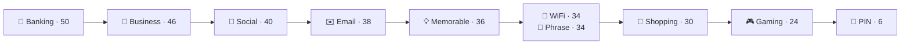
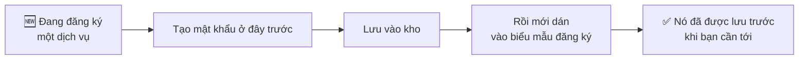

# Tạo mật khẩu

Tab **Generate** tạo ra những mật khẩu bạn không phải nhớ — và đó chính là lý do
một trình quản lý mật khẩu đáng có. Bạn chỉ nhớ đúng một bí mật, và nó không phải
bất kỳ mật khẩu nào trong số này.

## Màn hình

Ba phần, từ trên xuống:

1. **Ô xem trước.** Trước khi bạn bấm gì, nó ghi *Tap Generate to create a secure
   password*, và tiêu đề của nó cho biết template đang dùng — *Generated Custom
   Template* cho tới khi bạn chọn một cái.
2. **Generate New Password.** Bấm bao nhiêu lần tuỳ bạn. Mỗi lần bấm là một lần
   bốc mới, và không có gì được giữ lại trừ khi bạn lưu.
3. **Choose Template**, rồi **Settings**.

## Mười template

Template không phải một bộ tạo mật khẩu khác. Nó là **một bộ thiết lập được lưu
sẵn của phần Settings bên dưới** — độ dài và những loại ký tự được dùng — chọn cho
một kiểu tài khoản cụ thể.

| Template | Độ dài | A–Z | a–z | 0–9 | !@# | Ghi chú |
| --- | --- | --- | --- | --- | --- | --- |
| 🏦 **Banking** | 50 | ✓ | ✓ | ✓ | ✓ | Bỏ ký tự dễ nhìn nhầm |
| 💼 **Business** | 46 | ✓ | ✓ | ✓ | ✓ | Bỏ ký tự dễ nhìn nhầm |
| 👥 **Social** | 40 | ✓ | ✓ | ✓ | — | Đọc lên được |
| ✉️ **Email** | 38 | ✓ | ✓ | ✓ | ✓ | Bỏ ký tự dễ nhìn nhầm |
| 💡 **Memorable** | 36 | ✓ | ✓ | ✓ | — | Ghép từ |
| 📶 **WiFi** | 34 | ✓ | ✓ | ✓ | ✓ | Bỏ ký tự dễ nhìn nhầm |
| 📄 **Phrase** | 34 | ✓ | ✓ | ✓ | — | Kiểu `BlueSky2024Fast` |
| 🛒 **Shopping** | 30 | ✓ | ✓ | ✓ | ✓ | |
| 🎮 **Gaming** | 24 | ✓ | ✓ | ✓ | — | |
| 🔢 **PIN** | 6 | — | — | ✓ | — | Chỉ chữ số |

Hãy đọc bảng đó như một cái thang, chứ không phải một thực đơn. **Độ dài mới là
khác biệt thật sự**, và nó chạy từ 50 xuống 6.

### Cách chọn mà không phải suy nghĩ

Những cái tên nói về **chuyện gì sẽ xảy ra với mật khẩu đó**, chứ không nói tài
khoản quý tới đâu:

- **Không ai bao giờ gõ nó** → Banking, Business, Email, Shopping. Bật ký tự đặc
  biệt, để dài. Tự động điền không quan tâm nó xấu tới mức nào.
- **Có người phải đọc hoặc nói ra** → WiFi, Phrase, Memorable, Social. Những cái
  này bỏ ký tự đặc biệt hoặc dùng từ, vì một người khách gõ mật khẩu Wi-Fi của bạn
  vào cái tivi phải gõ đúng ngay lần đầu.
- **Bàn phím số, không phải bàn phím chữ** → PIN. Sáu chữ số, vì đó là thứ mà thẻ
  ngân hàng hay SIM chấp nhận.

Chỗ nào hai điều đó kéo về hai hướng, hãy chọn cái dài hơn. Một mật khẩu bạn không
bao giờ gõ thì để dài chẳng tốn gì.

:::tip Những template bỏ ký tự dễ nhìn nhầm

Banking, Business, Email và WiFi loại bỏ các ký tự người ta hay đọc nhầm —
`l` `1` `I`, `0` `O`. Nó tốn một chút entropy và trả lại nhiều hơn thế ngay lần
đầu có người phải đọc to hoặc chép lại từ màn hình.

:::

Lưu ý cách đặt tên: template **PIN** tạo mã PIN số cho *thẻ ngân hàng hoặc SIM*.
Nó không liên quan gì tới mã mở khoá PasswordEpic của bạn — đó
[là một thứ hoàn toàn khác](./your-passcode.md) và không bị giới hạn ở chữ số.

## Settings

Chọn một template sẽ điền sẵn những ô này. Sau đó bạn vẫn chỉnh được, và đó là
lúc tiêu đề ô xem trước chuyển thành **Custom**.

| Điều khiển | Nó làm gì |
| --- | --- |
| **Length** | Thanh trượt. Dài hơn thì tốt hơn, và chẳng tốn gì khi bạn không bao giờ gõ nó. |
| **A–Z** · **a–z** · **0–9** · **!@#** | Những bộ ký tự được dùng để bốc. |

### Khi nào nên tắt một loại ký tự

Gần như không bao giờ — mỗi ô bạn bỏ tick đều làm mật khẩu yếu đi. Có đúng một
ngoại lệ thành thật: **một trang web không chấp nhận ký tự đặc biệt.** Vẫn còn
những trang như vậy. Hãy bỏ `!@#` và kéo thanh độ dài lên để bù lại.

Đổi chác đó gần như hoà. Bỏ ký tự đặc biệt tốn xấp xỉ bằng việc rút ngắn mật khẩu
đi bốn ký tự, nên thêm năm ký tự là bạn có lời.

## Sau khi tạo xong

Mật khẩu vừa tạo tự nó không được lưu ở đâu cả. Bạn làm gì với nó:

- **Copy** — đưa vào clipboard, để dán vào biểu mẫu đăng ký.
- **Save to Vault** — tạo một mục với mật khẩu đã điền sẵn.
- **History** — mọi thứ bạn từng tạo, mới nhất trước, chia thành **Favorites** và
  **Recent**, mỗi dòng có nút **Use**. **Clear History** xoá sạch và không hoàn
  tác được.

Lịch sử tồn tại vì đúng một tình huống: bạn tạo một mật khẩu, dán vào biểu mẫu
đăng ký, rồi biểu mẫu báo lỗi. Không có lịch sử thì mật khẩu đó mất luôn và tài
khoản treo lơ lửng. Có nó, bạn chạm **Use** rồi đi tiếp.

## Thói quen đáng tập

Hãy lưu **trước** khi bấm gửi biểu mẫu, đừng lưu sau. Số lần chạm là như nhau, và
đó là khác biệt giữa một mật khẩu bạn đang có và một mật khẩu bạn đã từng có.

## Đọc tiếp

- [Kho của bạn](./guide-vault.md) — nơi mật khẩu vừa tạo sẽ nằm
- [Mã mở khoá của bạn](./your-passcode.md) — bí mật duy nhất bạn *có* nhớ
- [Cài đặt](./guide-settings.md) — mọi công tắc trong ứng dụng
