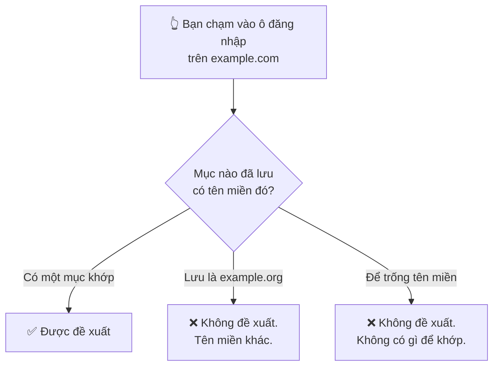

# Kho của bạn

**Vault** là màn hình đầu tiên bạn nhìn thấy. Mọi thứ bạn đã lưu đều nằm ở đây,
và mọi thao tác đều bắt đầu từ tám nút chạy ngang phía trên.

## Tám nút

Từ trái sang phải:

| # | Nút | Nó làm gì |
| --- | --- | --- |
| 1 | 🔍 **Tìm kiếm** | Mở ô tìm kiếm. Khớp theo tiêu đề, tên đăng nhập và website. |
| 2 | ⇅ **Sắp xếp** | Tên A–Z hoặc Z–A, mới nhất hoặc cũ nhất, vừa dùng, hoặc theo độ mạnh. |
| 3 | ▽ **Lọc** | Thu hẹp danh sách: yếu, dùng lại, cũ, không 2FA, đã rò rỉ, yêu thích, theo nhóm. |
| 4 | ➕ **Thêm** | Tạo một mục mới. |
| 5 | ↗ **Xuất** | Ghi các mục ra một tệp. |
| 6 | ⭳ **Nhập** | Đọc các mục vào từ một tệp trên máy này. |
| 7 | ☁ **Sao lưu** | Sao lưu lên, hoặc khôi phục từ, Google Drive của chính bạn. |
| 8 | ☑ **Chọn** | Chế độ chọn nhiều, để làm một việc cho nhiều mục cùng lúc. |

Hai trong số đó cần một lời cảnh báo trước khi dùng, và nó nằm ở cuối trang:
[tệp xuất và tệp sao lưu không bao giờ mở được trên máy khác](./backups.md).

### 2 · Sắp xếp

| Tuỳ chọn | Dùng khi |
| --- | --- |
| Tên (A–Z) / (Z–A) | Bạn nhớ mục đó tên gì |
| Ngày (mới nhất) / (cũ nhất) | Bạn tìm thứ vừa thêm gần đây |
| Vừa dùng | Vài mục bạn thật sự dùng hằng ngày |
| Độ mạnh mật khẩu | **Bắt đầu từ đây khi muốn dọn dẹp** — yếu nhất nổi lên đầu |

### 3 · Lọc

Bộ lọc là cách tìm ra *việc cần làm*, chứ không phải tìm một mục cụ thể:

- **Mật khẩu yếu** — những cái đáng tạo lại trước tiên.
- **Mật khẩu dùng lại** — một vụ rò rỉ ở đâu đó trở thành rò rỉ ở khắp nơi.
  Thường gấp hơn cả loại chỉ đơn thuần là yếu.
- **Mật khẩu cũ** — không tự động là vấn đề, nhưng đáng xem lại.
- **Không 2FA** — những tài khoản mà mất mật khẩu là mất tất cả.
- **Đã rò rỉ** — từng xuất hiện trong một vụ rò rỉ đã biết.
- **Yêu thích** và **Nhóm** — cách sắp xếp của riêng bạn.

Có thể kết hợp nhiều bộ lọc, và **Xoá tất cả** đưa mọi thứ về ban đầu.

## Thêm một mục

**Tiêu đề** và **Mật khẩu** là bắt buộc. Những ô còn lại không bắt buộc, nhưng có
một ô thay đổi hẳn mức độ hữu dụng của ứng dụng với bạn — xem phần ngay sau.

| Ô | Ghi chú |
| --- | --- |
| **Tiêu đề** ✱ | Thứ bạn sẽ tìm sau này. "Gmail", chứ không phải "Tài khoản Google 2019". |
| **Tên đăng nhập / Email** | Thứ sẽ được điền vào ô tên đăng nhập. |
| **Mật khẩu** ✱ | Gõ vào, hoặc tạo một cái — xem [Tạo mật khẩu](./guide-generator.md). |
| **Loại tên miền** | **Web** hoặc **Ứng dụng di động**. Đây mới là ô quan trọng. |
| **Tên miền website** | Với Web: `example.com`. |
| **Chọn ứng dụng** | Với ứng dụng: chọn từ danh sách app đã cài trên máy. |
| **Nhóm** | Để sắp xếp, và để dùng bộ lọc theo nhóm. |
| **Thêm vào yêu thích** | Ghim nó vào bộ lọc Yêu thích. |
| **Ghi chú** | Mọi thứ khác. Được mã hoá như phần còn lại của mục. |

### Vì sao ô tên miền quan trọng hơn vẻ ngoài của nó

Tự động điền khớp theo **tên miền**. Nếu tên miền sai hoặc để trống, ứng dụng
không có cách nào biết mục đó thuộc về ô đăng nhập bạn đang nhìn, và nó sẽ không
đề xuất.

Hai thói quen giúp bạn đỡ bối rối sau này:

- **Điền tên miền ngay lúc tạo mục**, đừng đợi tới lúc tự động điền không chạy.
- Nếu là ứng dụng chứ không phải website, hãy chọn **Ứng dụng di động** và lấy từ
  danh sách. Ứng dụng tự ghi đúng mã định danh cho bạn; gõ tay chính là cách nó
  sai một cách khó nhận ra.

Các tên miền con như `mail.example.com` chỉ khớp nếu bạn đã bật khớp tên miền con
trong **Cài đặt → Quản lý tự động điền**.

## Mở một mục

Chạm vào mục bất kỳ để mở. Để **hiện** mật khẩu, bạn sẽ được hỏi vân tay hoặc mã
mở khoá — mọi lần, và đó là cố ý. Không có chế độ "mở khoá trong năm phút".

Từ một mục đang mở, bạn có thể:

- **Sao chép** tên đăng nhập, mật khẩu hoặc website.
- **Hiện** mật khẩu trên màn hình (sau khi xác thực).
- **Đánh dấu yêu thích** bằng ngôi sao.
- **Sửa** hoặc **Xoá**.

Thanh độ mạnh dưới mỗi mục chạy từ **Yếu → Trung bình → Khá → Mạnh → Rất mạnh**.
Nó chấm bản thân mật khẩu, không chấm mức độ quan trọng của tài khoản — phần đó
bạn tự cân nhắc.

## Làm nhiều mục cùng lúc

Nút **8** bật chế độ chọn. Tick các mục bạn muốn, rồi:

| Thao tác | Ghi chú |
| --- | --- |
| **Chuyển sang nhóm** | Xếp lại nhiều mục trong một lần. |
| **Quản lý thẻ** | Thêm thẻ, hoặc gỡ thẻ đang có. |
| **Thêm / bỏ yêu thích** | |
| **Xuất** | Chỉ các mục đang chọn. |
| **Xoá** | Có hỏi xác nhận, và **không thể hoàn tác**. |

## Xuất, nhập và sao lưu

Nút **5**, **6** và **7** — và một điều bạn buộc phải biết về cả ba:

:::danger Tệp sao lưu hay tệp xuất chỉ mở được trên chính chiếc máy đã tạo ra nó

Ở mọi gói. Những tệp này bảo vệ bạn khỏi việc mất dữ liệu **trên chiếc điện thoại
bạn vẫn còn** — lỡ tay xoá, nhập dữ liệu hỏng, đặt lại kho. Chúng không phải cách
chuyển sang máy mới, và không tuỳ chọn nào biến chúng thành như vậy.

Hãy đọc [Sao lưu và xuất dữ liệu](./backups.md) trước khi trông cậy vào một tệp.

:::

- **Xuất** ghi ra một tệp mà bạn tự chọn nội dung: siêu dữ liệu, nhóm, thẻ, ghi
  chú, lịch sử, tệp đính kèm.
- **Nhập** đọc các mục vào lại từ một tệp trên máy này.
- **Sao lưu** dùng Google Drive **của chính bạn**. Chúng tôi không bao giờ nhận
  được tệp đó.

## Nếu có gì đó không ổn

Một mục không mở được, hay danh sách trông kỳ lạ, đều nằm trong
[Sự cố thường gặp](./faq.md).

## Đọc tiếp

- [Tạo mật khẩu](./guide-generator.md) — bộ tạo mật khẩu, và nên chọn preset nào
- [Cài đặt](./guide-settings.md) — từng công tắc một, và nó đổi cái gì
- [Cài đặt tự động điền](./autofill.md) — để bạn thôi hẳn việc gõ mật khẩu
