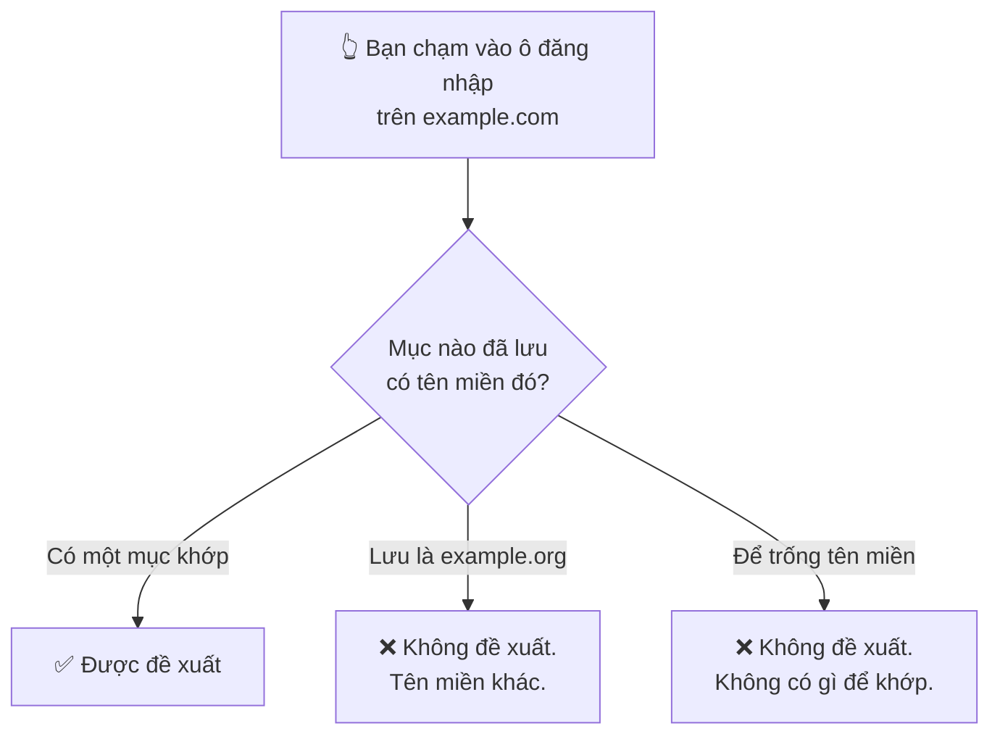
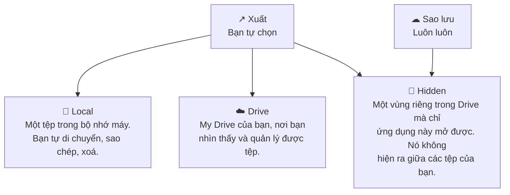

# Kho của bạn

**Vault** là màn hình đầu tiên bạn nhìn thấy, và là một trong ba tab ở dưới cùng:
**Passwords**, **Generate**, **Settings**. Mọi thứ bạn đã lưu đều nằm ở đây.

Khi chưa có gì, ứng dụng nói thẳng như vậy, kèm đúng một nút đáng bấm.

## Tám nút

Chúng nằm ở góc trên bên phải, **hai hàng bốn nút**, và thứ tự đó cũng chính là
thứ tự bạn sẽ dùng tới.

| Hàng | | | | |
| --- | --- | --- | --- | --- |
| **Trên** | 🔍 Tìm kiếm | ⇅ Sắp xếp | ▽ Lọc | ➕ **Thêm** |
| **Dưới** | ↗ Xuất | ⭳ Nhập | ☁ Sao lưu | ✓✓ Chọn |

**Thêm** là nút duy nhất được tô tím đặc. Đó là cố ý: nó là nút bạn cần ở lần mở
đầu tiên, còn bảy nút kia chỉ bắt đầu có nghĩa khi trong danh sách đã có gì đó.

| # | Nút | Nó làm gì |
| --- | --- | --- |
| 1 | 🔍 **Tìm kiếm** | Mở ô tìm kiếm phía trên danh sách. |
| 2 | ⇅ **Sắp xếp** | Đổi thứ tự danh sách. |
| 3 | ▽ **Lọc** | Thu hẹp còn mật khẩu yếu, mục yêu thích, hoặc một nhóm. |
| 4 | ➕ **Thêm** | Tạo một mục mới. |
| 5 | ↗ **Xuất** | Ghi các mục ra một tệp — trên máy, hoặc lên Drive của bạn. |
| 6 | ⭳ **Nhập** | Đọc các mục vào lại, từ chính ba nơi đó. |
| 7 | ☁ **Sao lưu** | Sao lưu lên, hoặc khôi phục từ, một vùng riêng trong Drive của bạn. |
| 8 | ✓✓ **Chọn** | Chế độ chọn, để xoá nhiều mục cùng lúc. |

Hai trong số đó cần một lời cảnh báo trước khi dùng, và nó nằm ở cuối trang:
[tệp xuất và tệp sao lưu không bao giờ mở được trên máy khác](./backups.md).

## Một mục trong danh sách

Mọi thứ đều nằm trên tấm thẻ — không có màn hình chi tiết riêng để mở ra.

| Trên thẻ | |
| --- | --- |
| Biểu tượng và tên nhóm | Đặt lúc bạn tạo mục |
| ❤️ Trái tim | Tô đầy nếu bạn đã đánh dấu yêu thích |
| 👤 Tên đăng nhập, 🌐 tên miền | Mỗi dòng có nút **sao chép** riêng |
| 🔒 Mật khẩu | Che đi, kèm **con mắt** để hiện và một nút sao chép |
| Thời gian | Lần thay đổi gần nhất — "Just now" |
| Huy hiệu độ mạnh | Một điểm số trên 100 kèm một chữ: **86 Strong** |
| ✏️ / 🗑️ | Sửa và xoá |

Huy hiệu độ mạnh là **một con số, không phải thang năm mức bằng chữ**. Nó chấm
bản thân mật khẩu, không chấm mức độ quan trọng của tài khoản — phần đó bạn tự
cân nhắc.

## Tìm kiếm

Nút **1** mở một ô phía trên danh sách. Nó khớp theo tiêu đề, tên đăng nhập và
tên miền ngay khi bạn gõ, còn dấu ✕ thì xoá sạch.

## Sắp xếp

Năm mục, và bốn mục đầu mới là sắp xếp thật sự:

| Tuỳ chọn | Dùng khi |
| --- | --- |
| **Name (A–Z)** | Bạn nhớ mục đó tên gì |
| **Date** | Bạn tìm thứ vừa thêm gần đây |
| **Categories** | Bạn muốn gom những thứ cùng loại lại với nhau |
| **Password Strength** | **Bắt đầu từ đây khi muốn dọn dẹp** — yếu nhất nổi lên đầu |
| **Refresh** | Không phải sắp xếp. Đọc lại danh sách từ bộ nhớ |

Mỗi kiểu sắp xếp đều có chiều ngược: chọn lại đúng cái đang dùng thì nó đảo
chiều, nên **Name** cho bạn A–Z rồi Z–A, còn **Date** cho mới nhất rồi cũ nhất.

## Lọc

Bộ lọc là cách tìm ra *việc cần làm*, chứ không phải tìm một mục cụ thể:

- **Weak Passwords** — những cái đáng tạo lại trước tiên.
- **Favorites** — danh sách rút gọn của riêng bạn.
- **Categories** — phần dưới đường kẻ chỉ liệt kê những nhóm bạn đã thực sự dùng,
  nên nó lớn dần theo kho của bạn thay vì bày ra một menu toàn ô rỗng.

Có thể kết hợp nhiều bộ lọc, và **Clear All** đưa mọi thứ về ban đầu.

## Thêm một mục

**Tiêu đề** và **Mật khẩu** là bắt buộc — chúng mang dấu ✱. Những ô còn lại không
bắt buộc, nhưng có một ô thay đổi hẳn mức độ hữu dụng của ứng dụng với bạn.

Ô mật khẩu có ba nút: một **con mắt** để hiện thứ bạn vừa gõ, một **↻** để tạo
lại, và một **⚡** để tạo nhanh một mật khẩu mà không phải rời khỏi biểu mẫu.

Bên dưới, thanh độ mạnh làm một việc hữu ích hơn là tự tô xanh. Nó nói cho bạn
biết *vì sao*:

> • Built around the common word "test". Wordlists try it with every ordinary
> prefix and suffix, so those characters add almost nothing.

Lời nhận xét đó nằm dưới một mật khẩu mà thanh vẫn chấm là **Strong**. Hãy đọc
câu chữ, đừng đọc màu.

| Ô | Ghi chú |
| --- | --- |
| **Title** ✱ | Thứ bạn sẽ tìm sau này. "Gmail", chứ không phải "Tài khoản Google 2019". |
| **Username / Email** | Thứ sẽ được điền vào ô tên đăng nhập. |
| **Password** ✱ | Gõ vào, hoặc tạo một cái — xem [Tạo mật khẩu](./guide-generator.md). |
| **Domain Type** | **Web** hoặc **Mobile App**. Đây mới là ô quan trọng. |
| **Website domain** | Với Web: `example.com`. |
| **Select App** | Với ứng dụng: chọn từ danh sách app đã cài trên máy. |
| **Category** | Để sắp xếp, và để dùng bộ lọc theo nhóm. |
| **Add to Favorites** | Ghim nó vào bộ lọc Favorites. |
| **Notes** | Mọi thứ khác. Được mã hoá như phần còn lại của mục. |

### Vì sao ô tên miền quan trọng hơn vẻ ngoài của nó

Tự động điền khớp theo **tên miền**. Nếu tên miền sai hoặc để trống, ứng dụng
không có cách nào biết mục đó thuộc về ô đăng nhập bạn đang nhìn, và nó sẽ không
đề xuất.

Hai thói quen giúp bạn đỡ bối rối sau này:

- **Điền tên miền ngay lúc tạo mục**, đừng đợi tới lúc tự động điền không chạy.
- Nếu là ứng dụng chứ không phải website, hãy chọn **Mobile App** và lấy từ danh
  sách. Ứng dụng sẽ tự ghi mã định danh cho bạn và cho bạn thấy nó chọn cái gì —
  *Domain will be set to: `fi.hsl.app`*. Gõ tay chính là cách nó sai một cách khó
  nhận ra.

Các tên miền con như `mail.example.com` chỉ khớp nếu bạn đã bật khớp tên miền con
trong **Cài đặt → Quản lý tự động điền**.

### Lưu lại thì phải nhập mã mở khoá

Ghi vào kho nghĩa là mã hoá, mà mã hoá thì phải dựng khoá — nên ứng dụng hỏi mã
mở khoá ngay lúc bạn lưu, chứ không phải mỗi phiên một lần.

Không có chế độ "mở khoá trong năm phút". Đó cũng chính là tính chất khiến cái
kho này đáng có.

## Xoá nhiều mục cùng lúc

Nút **8** bật chế độ chọn. Thanh hiện ra có **Select All** và **Delete**, kèm bộ
đếm số mục bạn đã tick.

Chỉ có vậy — chế độ chọn là để xoá. Chuyển mục sang nhóm khác, hay đổi yêu thích,
làm từng mục một ngay trên thẻ.

:::danger Xoá rồi không lấy lại được

Không có thùng rác để khôi phục. Với một cái kho chỉ mình bạn mở được, một mục đã
xoá thì bên chúng tôi cũng không còn.

:::

## Xuất, nhập và sao lưu

Nút **5**, **6** và **7** — và một điều bạn buộc phải biết về cả ba:

:::danger Tệp sao lưu hay tệp xuất chỉ mở được trên chính chiếc máy đã tạo ra nó

Ở mọi gói. Những tệp này bảo vệ bạn khỏi việc mất dữ liệu **trên chiếc điện thoại
bạn vẫn còn** — lỡ tay xoá, nhập dữ liệu hỏng, đặt lại kho. Chúng không phải cách
chuyển sang máy mới, và không tuỳ chọn nào biến chúng thành như vậy.

Hãy đọc [Sao lưu và xuất dữ liệu](./backups.md) trước khi trông cậy vào một tệp.

:::

### Xuất

Bạn đặt tên tệp và chọn một trong ba nơi. Tên được điền sẵn theo dạng
`PasswordEpic_<ngày>_<giờ>.json`, với phần ngày đã được bôi sẵn để bạn gõ đè lên.

| Nơi lưu | Ai nhìn thấy tệp |
| --- | --- |
| **Local** | Bạn, và mọi thứ trên máy có quyền truy cập bộ nhớ |
| **Drive** | Bạn, trong My Drive, như mọi tệp khác bạn sở hữu |
| **Hidden** | Chỉ ứng dụng này. Nó không được liệt kê trong Drive của bạn |

### Nhập

Vẫn ba nơi đó, nên một tệp bạn xuất ra ở đâu cũng đưa về lại được theo đúng đường
đó.

### Sao lưu và khôi phục

Sao lưu không hỏi bạn cất tệp ở đâu — nó luôn dùng vùng ẩn, và đặt tên
`PasswordEpic_<ngày>_<giờ>.bak`. **What's Included** không phải một danh sách để
chọn, mà là một lời khẳng định phạm vi:

Toàn bộ mật khẩu · Nhóm và thẻ · Siêu dữ liệu và ghi chú · Tệp đính kèm · Lịch sử
thay đổi.

**Restore** cho bạn thấy tệp nó sắp dùng — tên, ngày, dung lượng — kèm nút
**Change** để chọn tệp khác, và vẫn danh sách đó dưới mục **Will Restore**, để
không còn mập mờ chuyện cái gì sắp bị ghi đè lên cái gì.

**Chúng tôi không bao giờ nhận được tệp nào trong số đó.** Chúng đi vào tài khoản
Google *của bạn*, không phải của chúng tôi. Ứng dụng chỉ xin Google hai quyền
hẹp: thư mục riêng của chính nó, và *những tệp do chính nó tạo ra*. Không quyền
nào cho phép nó nhìn vào phần còn lại trong Drive của bạn.

Vùng ẩn là mặc định cho sao lưu vì một bản sao lưu không phải tài liệu — nó không
phải thứ bạn muốn vấp phải khi duyệt thư mục, đổi tên nhầm, hay lỡ tay chia sẻ.

## Nếu có gì đó không ổn

Một mục không mở được, hay danh sách trông kỳ lạ, đều nằm trong
[Sự cố thường gặp](./faq.md).

## Đọc tiếp

- [Tạo mật khẩu](./guide-generator.md) — mười template, và nên chọn cái nào
- [Cài đặt](./guide-settings.md) — từng công tắc một, và nó đổi cái gì
- [Cài đặt tự động điền](./autofill.md) — để bạn thôi hẳn việc gõ mật khẩu
