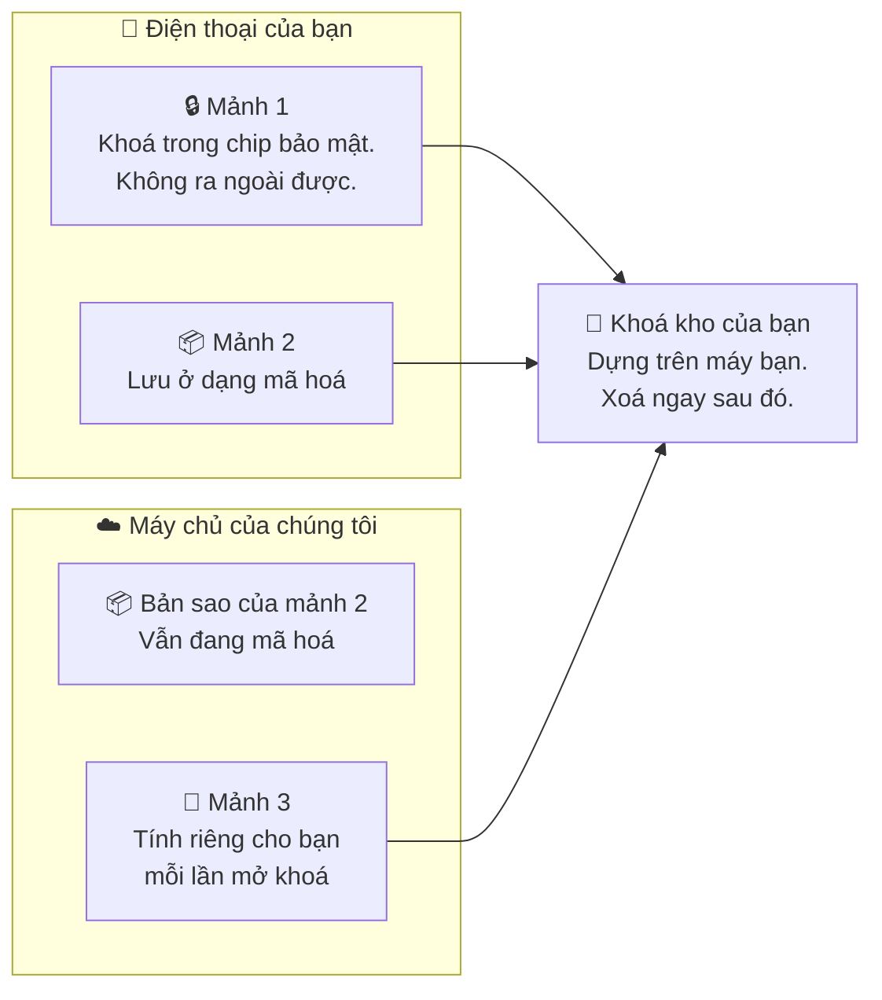
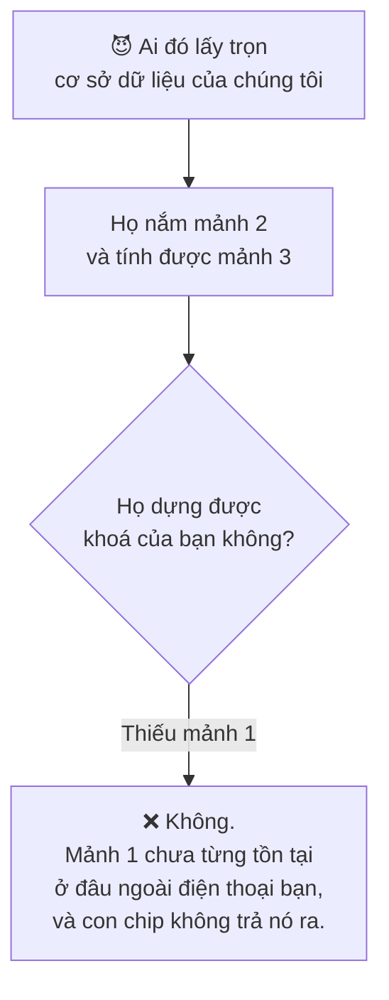

# Cách hoạt động

Trình quản lý mật khẩu nào cũng nói rằng chỉ mình bạn đọc được dữ liệu của bạn.
Trang này mô tả cấu trúc khiến điều đó là sự thật ở đây, để bạn có thể *thẩm định*
lời khẳng định ấy thay vì phải tin nó.

## Khoá không được lưu ở đâu cả

Chiếc khoá giải mã kho mật khẩu của bạn — gọi là **khoá kho** — không được lưu ở
bất cứ đâu. Không trên điện thoại, không trên máy chủ của chúng tôi, không trong
bản sao lưu. Nó được dựng lại từ những mảnh riêng biệt mỗi lần bạn mở khoá, dùng
cho đúng một thao tác, rồi bị xoá khỏi bộ nhớ ngay sau đó.

Những mảnh ấy gọi là **shard**, và chúng nằm ở bốn nơi khác nhau.



| Mảnh | Nằm ở đâu | Có rời đi được không? |
| --- | --- | --- |
| **Shard 1** | Bên trong StrongBox hoặc TEE của điện thoại bạn | **Không.** Không thể xuất ra, do thiết kế của phần cứng |
| **Shard 2** | Trên thiết bị của bạn, đã mã hoá — kèm một bản sao ciphertext được đồng bộ để phòng mất dữ liệu | Chỉ ở dạng ciphertext |
| **Pepper** | Một mô-đun bảo mật phần cứng của Google Cloud KMS | **Không bao giờ** — kể cả trong phản hồi gửi về máy chủ của chính chúng tôi |
| **Shard 4** | Google Cloud Secret Manager | Không bao giờ tới được điện thoại bạn |

Hai mảnh cuối không được ghép trực tiếp. Máy chủ của chúng tôi dùng chúng để tính
ra một giá trị thứ ba, **ShardVault**, rồi trả giá trị đó về. Sau đó, ngay trên
thiết bị của bạn, trong mã native:

```
khoá kho = Shard 1  ⊕  Shard 2  ⊕  ShardVault
```

Thiếu bất kỳ mảnh nào trong ba mảnh đó là không có khoá.

## Vì sao cấu trúc này quan trọng

Chúng tôi nắm hai trong ba. Chúng tôi tính được ShardVault, và chúng tôi giữ
Shard 2 ở dạng ciphertext. **Chúng tôi vẫn không mở được kho mật khẩu của bạn**,
bởi Shard 1 chưa từng tồn tại ở đâu khác ngoài phần cứng bảo mật trong điện thoại
bạn, và phần cứng đó sẽ không xuất nó ra — không cho chúng tôi, không cho bạn,
không cho kẻ tấn công đang nắm tài khoản của bạn.

Đó là toàn bộ lập luận. Nó dựa trên hành vi của phần cứng chứ không dựa vào thiện
chí của chúng tôi — và đó là phiên bản duy nhất của lời khẳng định này đáng để
đưa ra.



## Máy chủ của chúng tôi thật sự xử lý những gì

Ở đây, chính xác quan trọng hơn là nghe cho tuyệt đối.

- **Mã mở khoá của bạn không bao giờ được truyền đi.** Ở gói Titanium, nó thậm
  chí không bao giờ tồn tại ở dạng mà một máy chủ có thể đem đi thử: giao thức
  OPAQUE chứng minh bạn biết mã mở khoá mà không tiết lộ bất cứ thứ gì có thể bị
  tấn công ngoại tuyến.
- **Mật khẩu của bạn được mã hoá trước khi lưu, và không bao giờ được tải lên cơ
  sở dữ liệu của chúng tôi.** Bản sao lưu đi vào Google Drive *của bạn*.
- **Shard 2 có được máy chủ của chúng tôi xử lý** trong quá trình dẫn xuất khoá,
  và một bản sao được lưu ở dạng đã mã hoá. Tự nó thì không mở được gì cả.
- **ShardVault được tính cho bạn, mỗi lần mở khoá.** Pepper dùng làm khoá cho
  phép tính đó nằm nguyên bên trong mô-đun phần cứng Cloud KMS và không bao giờ
  xuất hiện trong phản hồi.
- Chúng tôi lưu những gì một tài khoản cần để tồn tại: email của bạn, gói bảo mật,
  tên mẫu máy và khoá công khai của thiết bị, cùng các sự kiện bảo mật như đăng
  nhập và đổi thiết bị.

### ShardVault gắn với tài khoản của bạn

Máy chủ không tính ShardVault chỉ từ Shard 2. Nó trộn thêm ID tài khoản của bạn
và một giá trị riêng cho từng tài khoản không bao giờ rời khỏi máy chủ — nên một
người dùng đã đăng nhập không thể gửi Shard 2 *của người khác* lên và nhận về
ShardVault của người đó.

Điều này quan trọng vì Shard 2 là mảnh duy nhất có thể di chuyển. Không có ràng
buộc ấy, bất kỳ ai lấy được bản sao Shard 2 của bạn đều có thể nhờ chính máy chủ
của chúng tôi biến nó thành hai phần ba chiếc khoá của bạn.

## Đổi mã mở khoá không mã hoá lại thứ gì

Đổi mã mở khoá chỉ bọc lại giá trị dùng để mở Shard 2. *Nội dung* của Shard 2
không đổi, nên ShardVault không đổi, nên khoá kho không đổi.

Trên thực tế: đổi mã mở khoá diễn ra nhanh, không đụng tới mật khẩu bạn đã lưu,
và các tệp sao lưu hiện có vẫn còn dùng được.

## Vì sao chúng tôi không giúp được nếu bạn quên mã mở khoá

Chúng tôi không có gì để đối chiếu một mã mở khoá, và không có đường nào tới
chiếc khoá nếu không có thiết bị của bạn. Không có liên kết đặt lại, không có câu
hỏi khôi phục, và không có quyền can thiệp nội bộ — điều đó cũng có nghĩa là
không có quyền can thiệp nào để người khác đòi ở chúng tôi.

Đó là cái giá phải đánh đổi. **Một dịch vụ có thể khôi phục kho mật khẩu của bạn
là một dịch vụ có thể đọc nó.**

## Những giới hạn thật lòng nằm ở đâu

- **Bản sao lưu và bản xuất chỉ mở được trên đúng thiết bị đã tạo ra chúng.**
  Chúng mang một lớp mã hoá gắn với phần cứng bảo mật của chiếc điện thoại đó, nên
  chép tệp sang máy khác cũng vô ích. Xem
  [Sao lưu và xuất dữ liệu](./backups.md).
- **Chống quay màn hình khi nhập mã mở khoá cần Android 15.** Ở phiên bản thấp
  hơn, các cửa sổ của chính ứng dụng vẫn được loại khỏi ảnh chụp và bản ghi màn
  hình, nhưng bàn phím trên màn hình thuộc về một ứng dụng khác nên không thể loại
  trừ được.
- **Bàn phím bạn cài đặt có thể đọc những gì bạn gõ**, trong mọi ứng dụng. Nếu
  điều đó quan trọng với bạn, hãy dùng bàn phím đi kèm máy; PasswordEpic sẽ cảnh
  báo khi bàn phím đang dùng không phải bàn phím gốc.
- **Silver, gói miễn phí, hoàn toàn bằng phần mềm.** Nó mã hoá bằng AES-256-CTR
  cộng thêm một thẻ xác thực riêng, chạy trong JavaScript, không dùng lưu trữ khoá
  bằng phần cứng. Xem [Các gói bảo mật](./security-tiers.md).

## Những gì bạn có thể làm bất cứ lúc nào

- **Cài đặt → Đặt lại tài khoản** xoá ngay kho mật khẩu và dữ liệu tài khoản của
  bạn khỏi máy chủ của chúng tôi.
- Sao lưu vào Google Drive **của chính bạn**, hoặc không sao lưu gì cả.
- Ở các gói trả phí, xem thiết bị nào đang giữ tài khoản, và giải phóng tài khoản
  khỏi thiết bị đó.

## Đọc tiếp

- [Các gói bảo mật](./security-tiers.md) — mỗi gói thật sự thay đổi điều gì
- [Mã mở khoá của bạn](./your-passcode.md) — bí mật duy nhất bạn gõ, và nó phải mạnh tới đâu
- [Sao lưu và xuất dữ liệu](./backups.md) — chúng bảo vệ bạn khỏi điều gì, và không bảo vệ điều gì
- [Một thiết bị cho mỗi tài khoản](./your-device.md) — được thực thi ra sao, và nó *không* phải là gì
