# Những từ này nghĩa là gì

Sản phẩm bảo mật hay núp sau thuật ngữ. Trang này làm ngược lại: mọi từ được dùng
ở bất cứ đâu trên trang này, nói bằng lời thường và vẽ thành hình, kèm việc nó
thật sự đem lại gì cho bạn và nó dừng lại ở đâu.

Nếu có chỗ nào vẫn khó hiểu thì đó là lỗi của chúng tôi chứ không phải của bạn —
hãy viết cho [support@passwordepic.com](mailto:support@passwordepic.com) và chúng
tôi sẽ sửa lại cách diễn đạt.

## Những khái niệm cơ bản

### Mã mở khoá (passcode)

Bí mật duy nhất bạn gõ. Không phải mã PIN và cũng không phải mật khẩu chính —
trước kia đó là hai thứ riêng trong ứng dụng, và việc gộp chúng lại thành một là
một bước *tăng* bảo mật chứ không phải đơn giản hoá. Xem
[Mã mở khoá của bạn](./your-passcode.md).

### Kho (vault)

Toàn bộ những gì bạn đã lưu trong ứng dụng. Khi trang này nói "chúng tôi không mở
được kho của bạn", đó là nghĩa đen, chứ không phải "chúng tôi hứa sẽ không mở".

### Khoá kho

Chiếc khoá giải mã những mật khẩu bạn đã lưu. Nó không được lưu ở bất cứ đâu —
không trên điện thoại, không trên máy chủ. Nó được dựng lại mỗi lần bạn mở khoá,
dùng một lần, rồi bị xoá.

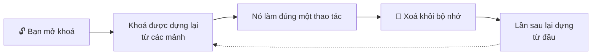

### Mảnh khoá (shard)

Một phần của khoá kho. Chiếc khoá được chia thành các mảnh nằm ở những nơi khác
nhau, nên không nơi nào — kể cả chúng tôi — nắm đủ để dựng lại nó.

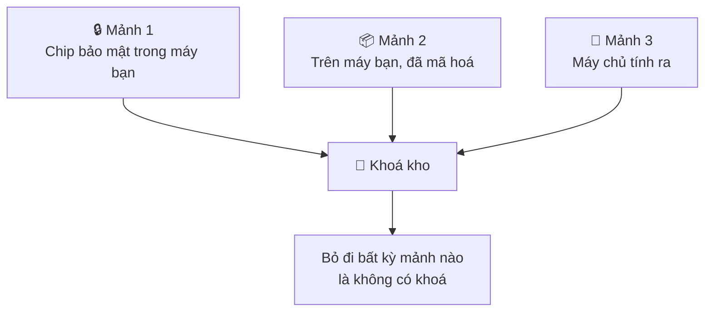

Cần đủ cả ba. Xem [Cách hoạt động](./how-it-works.md).

### Zero-knowledge

Một hệ thống được xây sao cho chính những người vận hành nó thật sự không đọc
được thứ bạn lưu, chứ không phải kiểu họ đọc được nhưng đã hứa là không đọc.

Có một phép thử rất đơn giản, và nó đúng với mọi dịch vụ:

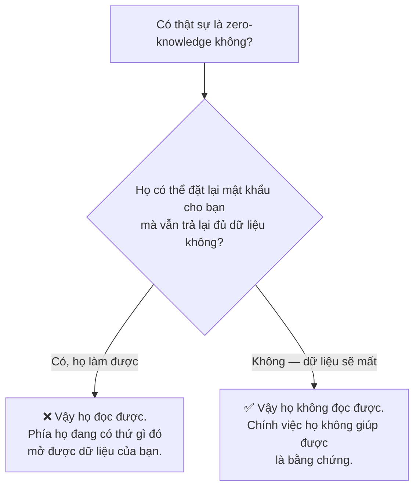

## Trên điện thoại của bạn

### StrongBox và TEE

Hai cái tên cho cùng một ý: **một con chip riêng, bị khoá chặt, nằm trong điện
thoại, dùng để giữ khoá và từ chối đưa khoá ra ngoài.**

Một chiếc khoá sinh ra bên trong nó có thể được *dùng* — bạn nhờ chip mã hoá hoặc
giải mã một thứ gì đó — nhưng không có lệnh nào nói "đưa chiếc khoá đó cho tôi".

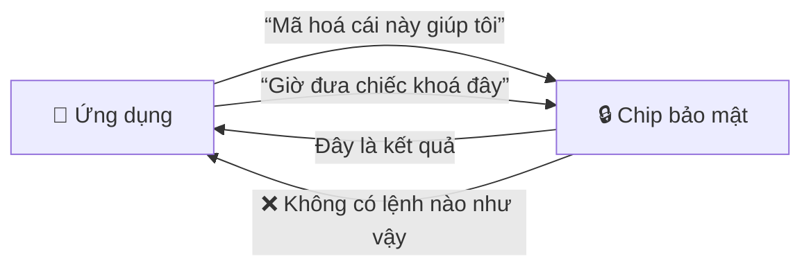

Không cho ứng dụng, không cho chúng tôi, không cho cả người đã root máy.

**TEE** (Trusted Execution Environment) là một vùng được bảo vệ nằm trong chính
bộ xử lý chính. **StrongBox** là một con chip tách rời hẳn, và mạnh hơn. Điện
thoại của bạn có cái này, cái kia, hoặc không có cái nào, tuỳ dòng máy. Đây là
thứ duy nhất mà mọi thứ còn lại trên trang này dựa vào.

### Argon2id

Một cách biến mã mở khoá của bạn thành một chiếc khoá, cố ý làm cho chậm và cố ý
ngốn bộ nhớ. Điểm mấu chốt là cái giá, và ai phải trả nó:

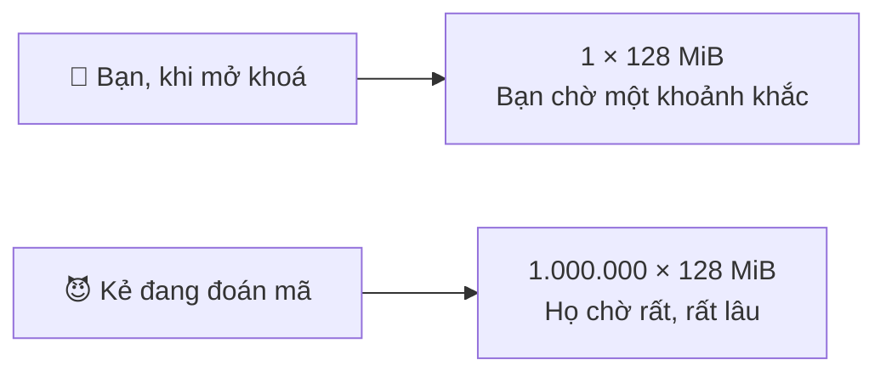

Bạn trả nó một lần, lúc mở khoá. Kẻ đang đoán mã của bạn phải trả nó *cho mỗi lần
đoán* — và đó là thứ biến "hàng triệu lần đoán mỗi giây" thành một việc chậm hơn
và tốn kém hơn rất nhiều.

### Entropy, và con số "45 bit"

Một cách đo độ khó đoán của mã mở khoá có tính đến bộ ký tự bạn chọn, chứ không
chỉ độ dài.

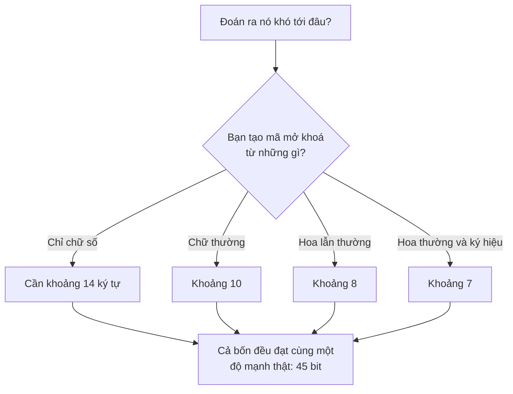

Tám chữ số và tám ký tự hoa-thường lẫn ký hiệu là hai chuyện hoàn toàn khác nhau —
cái sau có số khả năng nhiều hơn khoảng 40 triệu lần. Đếm ký tự không diễn đạt
được điều đó; đếm bit thì được. Xem [Mã mở khoá của bạn](./your-passcode.md).

### Chống chụp và quay màn hình

Android cho phép một ứng dụng đánh dấu cửa sổ của chính nó là được bảo vệ. Điều
đó có nghĩa gì thì phụ thuộc hoàn toàn vào *cách* màn hình đang bị ghi lại, và
hai trường hợp không giống nhau:

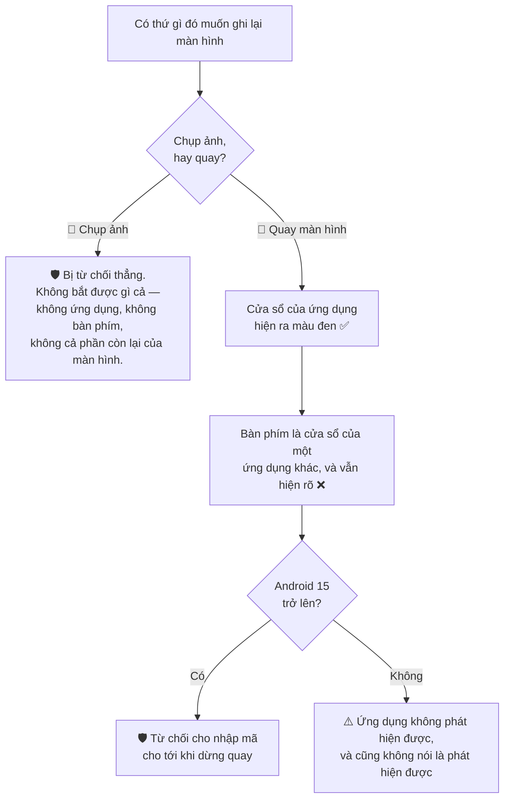

**Chụp ảnh màn hình** trong lúc một cửa sổ được bảo vệ đang hiện sẽ bị từ chối cho
toàn màn hình — bạn nhận được thông báo từ Android và không có tấm ảnh nào.

**Quay màn hình** thì không bị từ chối; mỗi cửa sổ được xử lý riêng. Cửa sổ của
ứng dụng hiện ra màu đen, nhưng bàn phím thuộc về một ứng dụng khác và không ứng
dụng nào bảo vệ được cửa sổ của ứng dụng khác. Chính khoảng hở đó là lý do ứng
dụng từ chối cho bạn gõ mã mở khoá trong lúc có bản ghi đang chạy.

### Độ tin cậy của bàn phím

Ứng dụng kiểm tra xem bàn phím bạn đang dùng có đi kèm máy hay được cài thêm về
sau, và cảnh báo nếu là cài thêm.

**Nó đáng giá tới đâu, nói chính xác:** một bàn phím đi kèm máy không mặc nhiên là
an toàn, và một bàn phím bạn cài từ Play Store gần như chắc chắn là bình thường.
Đây là một lời nhắc, không phải một phán quyết — cảnh báo bạn có thể bỏ qua, không
bao giờ là rào chặn. Ứng dụng cố ý không giữ danh sách bàn phím "được duyệt", vì
một ứng dụng có thể tự khai bất kỳ tên nào, mà tên thì không phải bằng chứng về
danh tính.

### Lớp phủ và cướp thao tác chạm

**Lớp phủ (overlay)** là cửa sổ một ứng dụng vẽ đè lên ứng dụng khác. Dùng tử tế
thì đó là bong bóng chat hay bộ lọc ánh sáng. Dùng xấu thì:

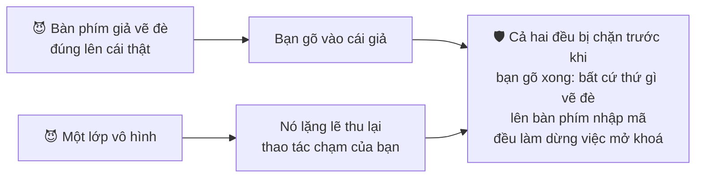

Cái thứ hai gọi là **cướp thao tác chạm** (tapjacking). Cả hai đều bỏ qua hoàn
toàn phần mã hoá, bằng cách tiếp cận bí mật của bạn ngay lúc bạn đang gõ nó.

### Dịch vụ trợ năng (accessibility)

Một quyền của Android sinh ra cho trình đọc màn hình và các công cụ tương tự.

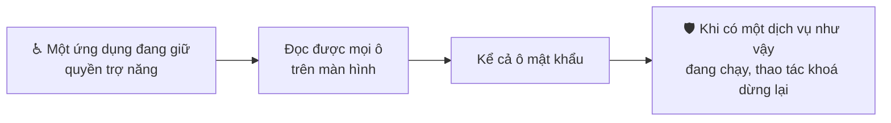

Rất nhiều ứng dụng hợp pháp cũng xin quyền này, và đó chính là lý do nó là món
được mã độc ưa lợi dụng.

### Root, can thiệp và hook

Ba cách khác nhau khiến ứng dụng thôi còn là ứng dụng bạn đã cài:

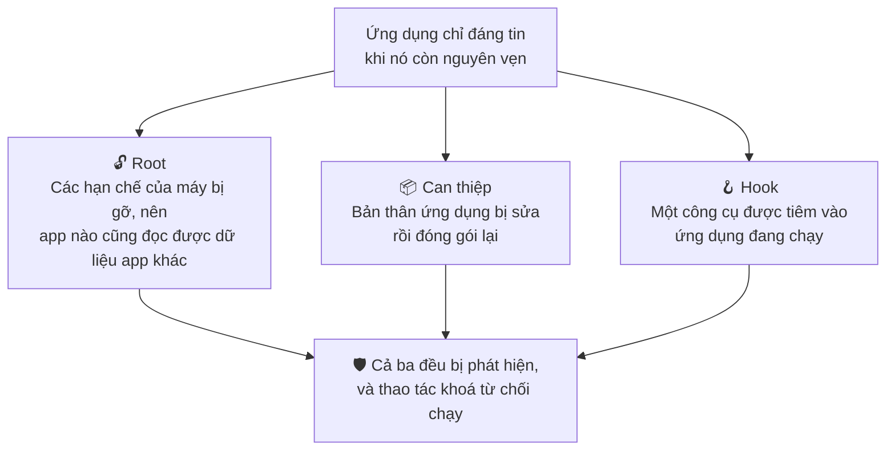

## Giữa điện thoại bạn và chúng tôi

### Ghim chứng chỉ (certificate pinning)

Bình thường điện thoại của bạn chấp nhận mọi chứng chỉ website do bất kỳ tổ chức
nào nó tin tưởng cấp — kể cả những chứng chỉ mà một hồ sơ công ty hay một chứng
chỉ gốc cài thêm đã đưa vào. Đó chính xác là cách các kết nối bị chặn bắt.

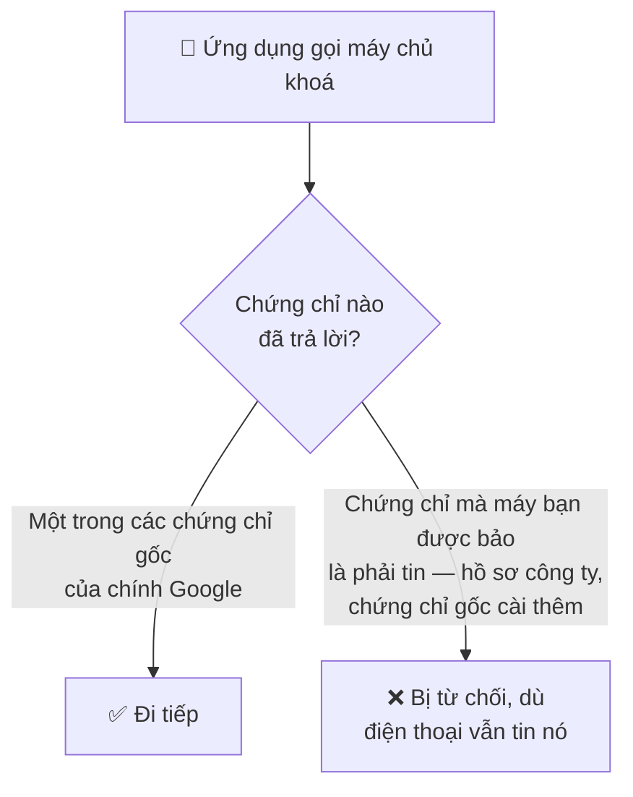

Ghim chứng chỉ thu hẹp lại: lời gọi trả về một phần khoá kho của bạn **chỉ chấp
nhận một tập cố định các chứng chỉ gốc của chính Google**.

### TLS 1.3

Phiên bản hiện hành của lớp mã hoá mà mọi kết nối `https://` đều dùng. Đáng nhắc
tên chỉ vì "chúng tôi dùng HTTPS" năm 2026 không phải một tính năng bảo mật — đó
là mức sàn.

### Google Play Integrity

Một dịch vụ của Google trả lời đúng một câu hỏi: *đây có phải ứng dụng thật, chưa
bị sửa, đang chạy trên một thiết bị Android thật và chưa bị xâm phạm không?*

Câu trả lời được kiểm tra **trên máy chủ của chúng tôi**, không phải trên điện
thoại — và đó chính là điểm mấu chốt:

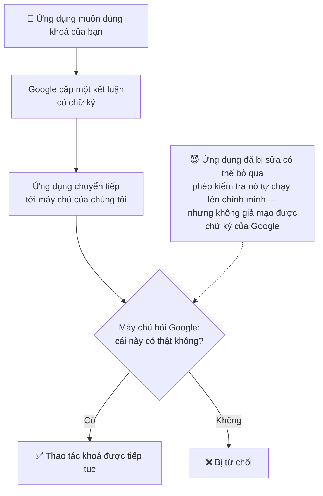

### Chấm điểm bot khi đăng nhập

Một phép kiểm tra vô hình ở mỗi lần đăng nhập, chấm điểm khả năng lần đăng nhập đó
là tự động. Bạn hoàn toàn không thấy gì trừ khi có điều bất thường. Nó tồn tại để
khiến các đợt tấn công hàng loạt, tự động, nhắm vào tài khoản trở nên tốn kém.

Nó chạy như một dịch vụ của Google, nên việc sử dụng nó chịu sự điều chỉnh của
[chính sách quyền riêng tư của Google](https://policies.google.com/privacy) bên
cạnh chính sách của chúng tôi.

## Ở phía chúng tôi

### Cloud KMS và "pepper"

**Cloud KMS** là dịch vụ quản lý khoá của Google. Một phần của nó chạy bên trong
**mô-đun bảo mật phần cứng** — bản sinh đôi phía máy chủ của con chip bảo mật
trong điện thoại bạn, và nó hành xử y hệt:

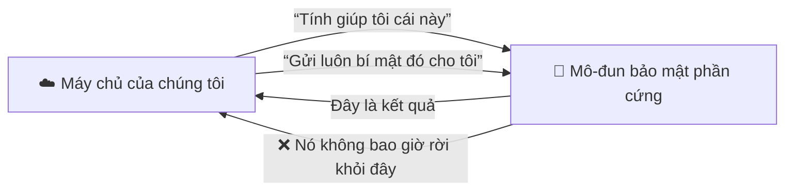

**Pepper** là một bí mật nằm trong một mô-đun như vậy. Máy chủ của chúng tôi dùng
nó để tính ra mảnh thứ ba của khoá kho. Bản thân pepper không bao giờ rời khỏi
mô-đun, và không bao giờ xuất hiện trong phản hồi — kể cả phản hồi gửi cho chính
mã của chúng tôi.

### Firestore

Cơ sở dữ liệu của Google mà máy chủ chúng tôi dùng.

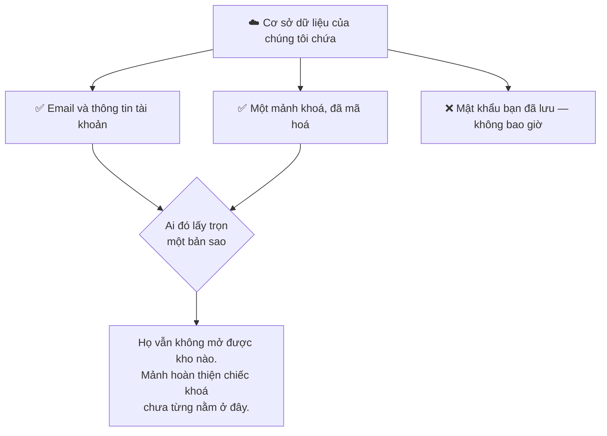

### OPAQUE

Một cách chứng minh rằng bạn biết một mật khẩu mà phía bên kia không hề học được
thứ gì để đem đi thử các phương án đoán, kể cả thử ngoại tuyến.

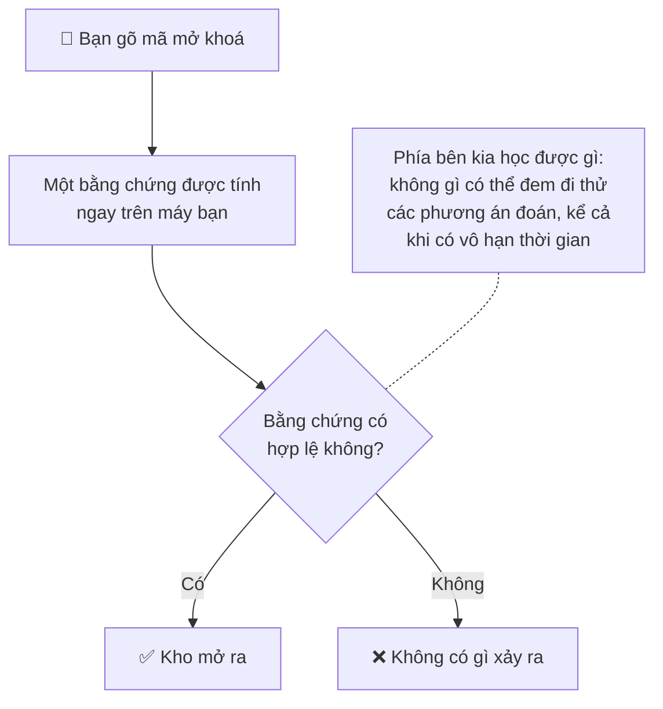

Ở gói Titanium, nó thay thế giá trị được lưu dùng để mở kho, nên không có thứ gì
mở được kho bị ghi ra đĩa dưới bất kỳ dạng nào. Xem
[Các gói bảo mật](./security-tiers.md).

### Lõi mã hoá Rust

Một phần của ứng dụng được viết bằng ngôn ngữ Rust, vì đúng một lý do: nó có thể
**xoá sạch bí mật khỏi bộ nhớ** và chắc chắn là chúng đã biến mất.

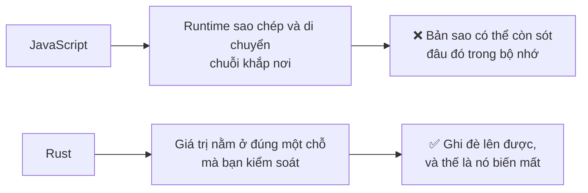

## Đọc tiếp

- [Cách hoạt động](./how-it-works.md) — các mảnh khoá, và vì sao việc chia nhỏ lại quan trọng
- [Các gói bảo mật](./security-tiers.md) — điều nào áp dụng cho gói nào
- [Mã mở khoá của bạn](./your-passcode.md) — bí mật duy nhất bạn thật sự gõ
- [Sự cố thường gặp](./faq.md) — các thông báo ứng dụng có thể hiện ra
