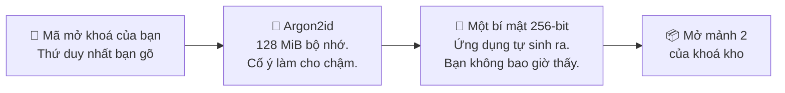

# Mã mở khoá của bạn

> **Bạn chỉ biết đúng một bí mật. Mọi thứ còn lại đều do máy sinh ra.**

Câu đó chi phối toàn bộ trang này. Không có chuyện vừa mật khẩu chính vừa mã PIN,
không có cụm từ khôi phục, không có câu hỏi bảo mật. Một mã mở khoá, ở mọi gói.

## Vì sao một bí mật chứ không phải hai

Ứng dụng từng hỏi hai thứ: một mật khẩu chính và một mã PIN. Nhìn thì tưởng là
hai lớp. Thực ra không phải.

Mật khẩu chính được lưu **bọc bằng mã PIN** — nên ai bẻ được PIN là có luôn mật
khẩu chính miễn phí. Độ dài và độ phức tạp của nó không đóng góp gì cho việc chống
tấn công ngoại tuyến. Cặp đôi ấy chỉ mạnh bằng nửa yếu hơn của nó, và nửa yếu hơn
là một mã PIN ngắn toàn chữ số.

Gộp lại thành một bí mật đã xoá bỏ ảo giác đó và nâng trần lên:

| | Trước | Bây giờ |
| --- | --- | --- |
| Số bí mật bạn gõ | 2 | **1** |
| Bộ ký tự | PIN chỉ có chữ số | **Ký tự bất kỳ** |
| Giới hạn độ dài | 12 | **Không giới hạn** |
| Trần độ mạnh | Cái yếu hơn trong hai | Mã mở khoá của bạn, theo một quy tắc entropy |

Thứ từng là mật khẩu chính không biến mất — nó chỉ thôi là thứ do con người chọn.
Giờ nó là 256 bit ngẫu nhiên do ứng dụng sinh ra, bạn không bao giờ thấy và không
bao giờ gõ.

## Mã mở khoá của bạn thật sự làm gì

```
mã mở khoá  →  Argon2id  →  một bí mật 256-bit  →  mở Shard 2
```

**Argon2id** là một hàm cố ý làm cho tốn kém: **128 MiB bộ nhớ và 10 lượt** cho
một lần tính. Bạn trả cái giá đó một lần, lúc mở khoá. Kẻ tấn công đã lấy được
điện thoại của bạn phải trả nó *cho mỗi lần đoán* — và đó là thứ biến một mã mở
khoá vừa phải thành một mục tiêu thật sự chậm chạp.

Ở gói Titanium, bước ở giữa là một khoá OPAQUE, được dẫn xuất theo cách tốn kém
tương tự nhưng không hề được lưu lại. Xem [Các gói bảo mật](./security-tiers.md).



## Độ mạnh đo bằng bit, không phải số ký tự

Quy tắc "tối thiểu 8 ký tự" không thể diễn tả được rằng tám chữ số và tám ký tự
hỗn hợp là hai chuyện hoàn toàn khác nhau:

| Mã mở khoá | Số khả năng | Thời gian dò hết, ước lượng |
| --- | --- | --- |
| 8 chữ số | 100 triệu | Vài giờ |
| 8 chữ thường và chữ số | 2,8 nghìn tỷ | Vài năm |
| 8 ký tự hỗn hợp có ký hiệu | 4,3 triệu tỷ | Hàng nghìn năm |

Nên yêu cầu được diễn đạt bằng **bit entropy**, và độ dài bạn cần là hệ quả của bộ
ký tự bạn chọn:

| Nếu bạn dùng | Bạn cần khoảng |
| --- | --- |
| Chỉ chữ số | 14 ký tự |
| Chữ thường | 10 ký tự |
| Chữ thường và chữ số | 9 ký tự |
| Chữ hoa lẫn chữ thường | 8 ký tự |
| Hỗn hợp có ký hiệu | 7 ký tự |

**45 bit là mức sàn** — dưới mức đó ứng dụng sẽ không cho bạn đặt mã mở khoá.
60 bit là mức ứng dụng khuyến khích bạn hướng tới.

Một mã mở khoá chỉ gồm chữ số buộc phải dài hơn. Một mã lấy từ bộ ký tự rộng thì
được quyền ngắn hơn. Cả hai đều đạt cùng một độ mạnh thật.

### Ước lượng này cố ý thô

Đếm ký tự trong một bộ ký tự giả định rằng bạn chọn chúng ngẫu nhiên. Người thật
thì chọn từ có nghĩa, ngày tháng và các dãy phím liền nhau. Ứng dụng trừ điểm
những trường hợp lộ liễu nhất — lặp lại và dãy tăng hoặc giảm — nên
`1111111111111` và `abcdefghij` không thể qua chỉ nhờ độ dài.

Đây không phải mô hình của một công cụ bẻ mật khẩu và cũng không nhằm làm việc đó.
Hãy xem 45 bit là mức sàn chặn những lựa chọn rõ ràng là tệ, chứ không phải lời
hứa về những lựa chọn rõ ràng là tốt.

## Chọn một mã bạn sẽ không quên

Đây mới là phần thật sự làm người ta mất kho mật khẩu. Không phải kẻ tấn công —
mà là quên.

- **Một cụm từ hơn hẳn một mật khẩu.** Bốn hoặc năm từ không liên quan tới nhau
  vượt 45 bit thoải mái và vẫn dễ gõ trên bàn phím điện thoại.
- **Đừng dùng lại mã bạn đã dùng ở nơi khác.** Nếu nó từng xuất hiện trong một vụ
  rò rỉ dữ liệu, mọi ước lượng entropy ở trên trở nên vô nghĩa.
- **Viết ra và cất ở nơi an toàn về mặt vật lý** nếu đó là cách duy nhất. Một mã
  mở khoá nằm trong ngăn kéo có khoá ở nhà là rủi ro nhỏ hơn nhiều so với một mã
  bạn trông chờ mình còn nhớ sau sáu tháng.

:::danger Không có khôi phục

Nếu bạn quên mã mở khoá, kho mật khẩu không thể mở được. Không phải bởi bộ phận hỗ
trợ, không phải bởi chúng tôi, không phải bởi ai cả. Mã mở khoá của bạn không bao
giờ đến được máy chủ của chúng tôi, nên chúng tôi không có gì để đối chiếu và
không có gì để đặt lại.

Đây là cái giá trực tiếp của một chiếc khoá mà chúng tôi thật sự không chạm tới
được. Xin hãy quyết định ngay từ bây giờ bạn sẽ nhớ nó bằng cách nào.

:::

## Đổi mã mở khoá

Đổi mã mở khoá diễn ra nhanh và an toàn. Nó chỉ bọc lại bí mật do máy sinh ra;
bản thân khoá kho không đổi, nên **không mật khẩu nào bạn đã lưu bị mã hoá lại**
và các tệp sao lưu hiện có vẫn còn dùng được.

## Một điểm bất đối xứng nhỏ, và là cố ý

Khi *đặt* mã mở khoá, quy tắc entropy được áp dụng. Khi *nhập*, ứng dụng chỉ kiểm
tra rằng nó không rỗng.

Điều đó là bắt buộc, không phải cẩu thả. Bất kỳ quy tắc lúc nhập nào chặt hơn quy
tắc lúc đặt đều có thể từ chối một mã mà màn hình thiết lập đã chấp nhận — và đó
đúng là cách một kho mật khẩu trở nên vĩnh viễn không mở được.

## Đọc tiếp

- [Cách hoạt động](./how-it-works.md) — rốt cuộc mã mở khoá mở ra cái gì
- [Các gói bảo mật](./security-tiers.md) — chuỗi này khác đi thế nào ở Titanium
- [Tự động điền](./autofill.md) — nơi bạn sẽ được hỏi mã mở khoá hằng ngày
